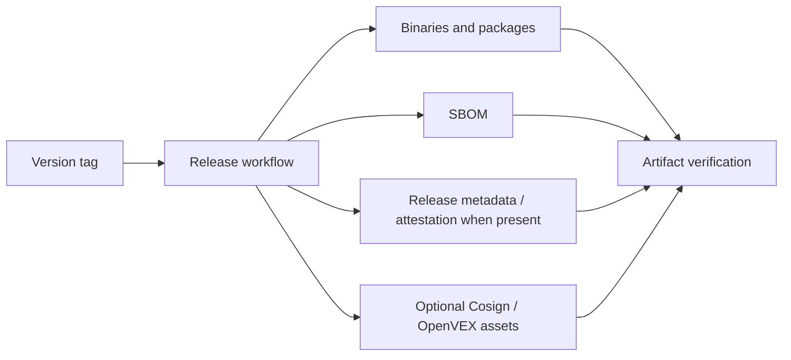

# HELM OSS Release and Security Evidence

This page collects the public release, vulnerability disclosure, supply-chain,
fuzzing, OpenSSF, VEX, SBOM, Cosign, and reproducibility material for HELM OSS.

## Audience

This page is for developers installing release artifacts, security reviewers,
package maintainers, and organizations validating HELM OSS before adoption.

## Outcome

You should know how a release is produced, how to verify it, where to report
vulnerabilities, and which evidence files support supply-chain review.

## Release Evidence Chain



Current public release: `v0.5.0`, published on 2026-05-13 at
<https://github.com/Mindburn-Labs/helm-oss/releases/tag/v0.5.0>. The release
assets visible on GitHub are Darwin/Linux/Windows binaries, `SHA256SUMS.txt`,
`sbom.json`, `v0.5.0.openvex.json`, `release-attestation.json`,
`evidence-pack.tar`, `release.high_risk.v3.toml`,
`sample-policy-material.tar`, `helm.mcpb`, `helm.rb`, and matching
`*.cosign.bundle` files for each primary asset.

## Public Release Material

| Need | Source path | Public route |
| --- | --- | --- |
| Release preparation | `RELEASE.md`, `VERSION`, `CHANGELOG.md` | `/helm-oss/publishing`, `/helm-oss/changelog` |
| Vulnerability reporting | `SECURITY.md` | This page and `/helm-oss/publishing` |
| OpenSSF mapping | `BEST_PRACTICES.md` | This page |
| SBOM and release metadata | `release/README.md`, `scripts/ci/generate_sbom.sh`, release asset `sbom.json`, release asset `release-attestation.json` | This page |
| OpenVEX policy source | `release/vex.openvex.json`, `release/vex/policies.yaml` | This page; only claim published VEX when attached to the GitHub release |
| Cosign and reproducible binaries | `.github/workflows/release.yml`, `scripts/release/`, `docs/VERIFICATION.md` | `/helm-oss/verification`, `/helm-oss/publishing`; Cosign verification requires attached `*.cosign.bundle` files |
| Fuzzing | `oss-fuzz/`, Go fuzz tests under `core/pkg/` | This page and `/helm-oss/execution-security-model` |

## Verification Commands

```bash
make release-binaries-reproducible
make release-smoke
make release-assets
make verify-cosign
make verify-fixtures
make docs-coverage docs-truth
```

Release artifacts should not be treated as trustworthy only because they are
downloaded from a release page. Verify checksums, release metadata,
receipt/evidence material, reproducible-build behavior, and signatures when
signature bundles are attached.

For `v0.5.0`, use checksum verification, SBOM inspection, OpenVEX inspection,
release metadata inspection, offline EvidencePack verification,
reproducible-build validation, and Cosign verification against the attached
bundles.

## Source Truth

- `SECURITY.md`
- `RELEASE.md`
- `BEST_PRACTICES.md`
- `release/README.md`
- `docs/PUBLISHING.md`
- `docs/VERIFICATION.md`

## Troubleshooting

| Problem | Check |
| --- | --- |
| Signature verification fails | Confirm the release actually includes `*.cosign.bundle` files, then check the expected workflow identity and Rekor entry documented in `SECURITY.md`. |
| Reproducible build hashes differ | Confirm `SOURCE_DATE_EPOCH`, `-trimpath`, and build-id settings match the release workflow. |
| VEX status is unclear | Inspect `release/vex/policies.yaml`; only rely on a release VEX file when it is attached to the GitHub release. |
| Kubernetes Helm validation runs the HELM OSS CLI | Set `KUBE_HELM_CMD` to a Kubernetes Helm v3 binary or run `make helm-chart-smoke`, which uses a pinned containerized Helm runner when needed. |
| A security issue needs disclosure | Use `security@mindburn.org`; do not open a public issue. |

<!-- docs-depth-final-pass -->

## Release Verification Path

A release security page should let a developer verify an artifact without trusting prose. Include the expected version, checksum file, SBOM location, signature or provenance command, and the receipt/verifier compatibility note for that release. If a release artifact is missing, mark the verification mode as unavailable rather than implying Cosign, SBOM, or reproducible-build coverage. The minimum public acceptance path is: download release artifact, verify checksum, inspect SBOM/provenance when present, run the binary or container health check, create one receipt, and verify that receipt offline.
