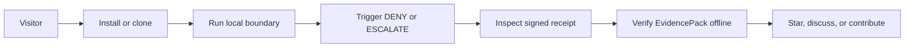

# HELM AI Kernel OSS Traction Plan

This page keeps public launch and community work tied to source-backed HELM AI Kernel behavior. The goal is not maximum attention; it is maximum verified Kernel adoption.

Primary objective: drive verified adoption of HELM AI Kernel as the local-first fail-closed execution boundary for AI agents.

Primary conversion: visitor -> install -> run boundary -> trigger DENY or ESCALATE -> inspect signed receipt -> verify EvidencePack offline -> star, follow, discuss, or contribute.

## Adoption Path



## Canonical Positioning

- Public OSS name: HELM AI Kernel.
- Repository: `Mindburn-Labs/helm-ai-kernel`.
- Binary: `helm-ai-kernel`.
- Disambiguation: Mindburn Labs' HELM execution kernel for AI agents, not the Kubernetes package manager.
- Short description: Fail-closed execution firewall for AI agents: quarantine MCP tools, proxy OpenAI-compatible requests, emit signed receipts, and verify EvidencePacks offline.
- Proof vocabulary: signed receipts, EvidencePack, ProofGraph, offline verification, ALLOW, DENY, ESCALATE.

Avoid stale product-family names, generic AI governance platform language, hosted-control-plane claims for Kernel, certification claims, or Enterprise features framed as Kernel features.

## GitHub Metadata

Repository topics should spend the 20 slots on the execution-boundary wedge:

```text
ai-agents
agent-security
mcp
model-context-protocol
tool-calling
execution-firewall
ai-security
llm-security
developer-tools
self-hosted
open-source
policy-engine
zero-trust
sandbox
signed-receipts
cryptographic-receipts
evidencepack
openai-compatible
llmops
security
```

Do not use `saas`, `compliance`, `ai-governance`, `generative-ai`, `agentic-ai`, `helm`, `openai`, or `proof-receipts` as OSS repo topics.

## README First Viewport

The README must lead with mechanism and proof:

```md
# HELM AI Kernel

HELM AI Kernel is the fail-closed execution firewall for AI agents.

Mindburn Labs' HELM execution kernel for AI agents, not the Kubernetes package manager.

HELM evaluates agent execution requests and records every ALLOW / DENY / ESCALATE decision as verifiable evidence.
```

The star CTA belongs after the local proof path:

```text
Star HELM AI Kernel if you want to follow fail-closed AI agent execution, MCP quarantine, signed receipts, and offline-verifiable EvidencePacks.
```

## Proof Assets

Public proof assets are executable artifacts, not just polished images. Each asset must name:

- asset name
- command to generate
- expected verdict: ALLOW, DENY, or ESCALATE
- receipt path
- EvidencePack path
- offline verification command
- expected verification output
- screenshot or GIF source
- last verified commit SHA

Canonical demo ladder:

1. Unknown MCP tool enters quarantine.
2. Sensitive action returns DENY or ESCALATE.
3. Signed receipt is produced.
4. EvidencePack verifies offline.
5. Tampered receipt fails verification.

Current assets:

- Real-use setup, DENY hook, and offline verification GIF:
  [helm-real-use-deny-verify.gif](assets/helm-real-use-deny-verify.gif).
  Generate it with `make real-use-assets`. Expected verdict: `DENY`; receipt
  path: `~/.helm-ai-kernel/receipts/hooks/<decision>.json`; offline verifier:
  `helm-ai-kernel workstation verify-decision --receipt <receipt>`; expected
  output: `signature: true`. Source transcript:
  [helm-real-use-deny-verify.transcript.txt](assets/helm-real-use-deny-verify.transcript.txt);
  provenance:
  [helm-real-use-deny-verify.provenance.json](assets/helm-real-use-deny-verify.provenance.json).
- MCP quarantine proof board source: [helm-mcp-quarantine-demo.svg](assets/helm-mcp-quarantine-demo.svg)
- Sanitized transcripts: [examples/launch/assets](../examples/launch/assets)

## Launch Sequence

Gate 1: GitHub readiness.
README, repo description, topics, social preview, release assets, proof demos, docs, issue templates, security policy, and Discussions are source-backed and coherent.

Gate 2: Technical launch.
Use Show HN and targeted security/devtools Reddit only after the local proof path is clean.

Gate 3: Ecosystem integration.
Submit upstream fixtures and listings only after the repo has concrete MCP, proxy, receipt, and EvidencePack examples.

Gate 4: Broader social.
Use LinkedIn, X, Product Hunt, DEV, and Hashnode only after technical audiences have a proof artifact to reference.

Show HN title: `Show HN: HELM AI Kernel, a fail-closed execution firewall for AI agents`

Short description: HELM AI Kernel quarantines unknown MCP tools before dispatch, governs OpenAI-compatible requests through ALLOW, DENY, and ESCALATE decisions, emits signed receipts, and verifies EvidencePacks offline.

## Phase Operating Checklist

Use this checklist to keep growth work evidence-gated. Each public ask should
point at a runnable local command, fixture, receipt, EvidencePack, or issue.

### Phase 2: High-Risk Demos

Demo targets must stay localhost, fixture, container, emulator, or staging-safe
until a maintainer explicitly approves external access. Track each demo as an
integration issue with expected verdicts, proof command, receipt path, and
offline verification command.

Initial demo targets:

- `helm-shell-mcp-demo`: `shell-mcp-server` behind HELM with safe read
  commands allowed and destructive shell/git/disk operations denied or
  escalated.
- `helm-pandoras-shell-demo`: unrestricted-terminal risk shown inside an
  isolated VM or disposable environment, with HELM as the execution boundary.
- `helm-kilntainers-demo`: container sandbox plus HELM policy boundary, clearly
  separating sandbox isolation from HELM receipts.
- `helm-container-mcp-demo` or `helm-diaMCP-demo`: capability-specific policies
  for filesystem write, shell, git, code execution, and HTTP actions.
- `helm-termux-mcp-demo`: Android emulator or mobile-like constraints behind
  HELM, with resource and UX limits noted.
- `helm-claude-shellfirm-demo`: shellfirm pre-tool verdict followed by HELM
  final decision and receipt.
- `helm-openai-agents-demo`: OpenAI Agents SDK or compatible runtime pointed at
  the HELM proxy, showing a denied mutating tool call.
- `helm-mcp-playwright-demo`: mcp-playwright around a sensitive admin UI
  fixture, with URL/action representation in receipts documented before public
  posting.

Policy-pack examples live under `examples/policy-packs/` and are examples only,
not production defaults. They should remain parseable by the serve-policy
runtime and describe their allow, deny, and escalation expectations.

### Phase 3: Targeted Outreach

Do not send broad launch messages before the local proof path is clean. For
each maintainer, framework author, security reviewer, or OSS list, prepare:

- a tailored HELM config or policy-pack example;
- a high-risk workflow they can test in under an hour;
- the exact expected verdict and receipt/EvidencePack inspection path;
- a concrete ask: break the proof, open an issue, or critique the threat model.

Target lanes:

- MCP server authors: Kilntainers, dynamic-shell-server, Pandoras-Shell,
  shell-mcp-server, container-mcp, diaMCP, and termux-mcp.
- Coding-agent builders: shellfirm, IDE/runtime maintainers, and prior
  incident-report authors.
- Security and governance reviewers: AgentGuard, Microsoft Agent Governance
  Toolkit, PromptShield/OpenClaw PromptShield, narthex, and agent-security
  lecture or research authors.
- OSS lists: awesome MCP lists and MCP marketplace/catalog surfaces only after
  a working fixture or reproducible example exists.

### Phase 4: Feedback-Driven Iteration

Triage feedback weekly through issues and Discussions. Adjust only source-backed
surfaces: policy defaults, EvidencePack fields, CLI messages, troubleshooting,
and copy-paste quickstart commands. Tag commercial signals when users ask for
shared policy repositories, retention/search, SIEM or observability
integrations, SSO, role-based approvals, or hosted evidence workflows.

Do not implement Basic or Enterprise layers in the OSS kernel. Record product
requirements separately and keep the kernel boundary, receipt, and verifier
contracts stable.

### Phase 5: Feedback Capture

Use `.github/ISSUE_TEMPLATE/feedback.yml` for structured public feedback.
Capture install friction, proof-demo friction, policy/security expectations,
production-readiness gaps, verdict observed, receipt and EvidencePack timing,
unexpected failures, missing integrations, and commercial signal. Do not ask
users to paste secrets, private endpoints, customer data, or unredacted
production receipts.

### Phase 6: Growth Targets

Track activity and usage only when tied to real proof:

- stars: +300 to +500;
- forks: +30 to +50;
- issues: 30 to 50 with integration, policy, receipt, or docs clarity signal;
- external PRs: 10 to 15 for docs, fixtures, policy examples, or small
  integrations;
- local proof runs: at least 100 self-reported runs through feedback issues;
- verified EvidencePacks: at least 30 unique user-referenced packs;
- ecosystem mentions: at least 10 external mentions in MCP, agent-security, or
  framework documentation.

Manual tracking is acceptable at first, but count only reports that reference a
command, receipt ID, EvidencePack path/hash, discussion, issue, PR, or external
URL.

## UTM Links

| Channel | Docs link |
| --- | --- |
| GitHub README | `https://helm.docs.mindburn.org/helm-ai-kernel?utm_source=github&utm_medium=readme&utm_campaign=oss-traction` |
| GitHub Discussions | `https://helm.docs.mindburn.org/helm-ai-kernel?utm_source=github&utm_medium=discussions&utm_campaign=oss-traction` |
| Hacker News | `https://helm.docs.mindburn.org/helm-ai-kernel?utm_source=hackernews&utm_medium=showhn&utm_campaign=oss-traction` |
| Reddit | `https://helm.docs.mindburn.org/helm-ai-kernel?utm_source=reddit&utm_medium=community&utm_campaign=oss-traction` |
| Product Hunt | `https://helm.docs.mindburn.org/helm-ai-kernel?utm_source=producthunt&utm_medium=launch&utm_campaign=oss-traction` |
| LinkedIn | `https://helm.docs.mindburn.org/helm-ai-kernel?utm_source=linkedin&utm_medium=social&utm_campaign=oss-traction` |
| X | `https://helm.docs.mindburn.org/helm-ai-kernel?utm_source=x&utm_medium=social&utm_campaign=oss-traction` |

## Discussions

Use Discussions for high-signal participation:

- Announcements
- Proof demo help
- MCP server quarantine proposals
- Receipt and EvidencePack schema questions
- Integration ideas
- First contribution help
- Show-and-tell

Triage flow: Discussion -> maintainer triage -> reproduction, fixture, or spec -> issue.

## Contributor Funnel

OSS-safe contribution streams:

- docs: quickstart clarity, troubleshooting, examples
- mcp: quarantine fixtures, server metadata, authorization examples
- proxy: OpenAI-compatible client examples
- receipts: offline verification examples, tamper tests
- evidence: EvidencePack examples
- sdk: small SDK polish and samples
- security: negative tests and threat-model examples
- ecosystem: factual integrations and listings

Every contributor issue should include context, exact file paths, expected output, validation command, acceptance criteria, and out-of-scope boundaries. Do not expose Enterprise implementation details in OSS issues.

## Measurement

Awareness:

- GitHub visitors, referrers, and popular content
- social, Hacker News, Reddit, and docs traffic

Evaluation:

- README and quickstart visits
- Homebrew install interest or available formula analytics
- clone count
- release asset downloads

Proof:

- boundary started
- proof demo run
- DENY or ESCALATE receipt generated
- EvidencePack exported
- EvidencePack verified offline

Engagement:

- stars
- watchers
- discussions
- issues
- PRs
- ecosystem mentions

Commercial bridge:

- HELM AI Enterprise Individual interest CTA clicks
- docs path from Kernel to Individual
- inbound team-use requests

GitHub traffic windows are short, so export private analytics daily, publish a weekly channel cohort report, keep a launch-post UTM map, and log README hook changes.

## Truth Gate

Run this checklist before publishing README edits, launch posts, diagrams, videos, social previews, and website copy:

- Uses HELM AI Kernel as the current public name.
- Mentions not Kubernetes Helm when context is introductory.
- Uses signed receipts, EvidencePack, and ProofGraph exactly.
- Uses ALLOW, DENY, and ESCALATE.
- Does not claim seccomp or eBPF unless current code proves it.
- Does not claim a hosted control plane for OSS Kernel.
- Does not claim certification unless certification exists.
- Does not describe Enterprise features as Kernel features.
- Does not imply Individual or Enterprise weakens or forks Kernel semantics.
- Does not mention robot fleets, AGI OS, OrgDNA compiler, Titan, or physical-world control in OSS copy.

## Diagram Doctrine

OSS hero diagrams should use this shape:

```text
Agent / Model / Orchestrator
  -> Action Proposal
  -> HELM AI Kernel Boundary
  -> ALLOW / DENY / ESCALATE
  -> Signed Receipt
  -> ProofGraph
  -> EvidencePack
  -> Offline Verification
```

Keep CompanyArtifactGraph, GeneratedSpec, and Enterprise loop diagrams on Enterprise bridge pages, not the OSS hero.

## Ecosystem Rule

No listing PR without a working integration, fixture, or reproducible example. Prioritize:

- MCP quarantine fixture
- OpenAI-compatible proxy example
- receipt verification fixture
- EvidencePack tamper-negative test
- policy DENY or ESCALATE example

Submit listings after the proof exists.

## Commercial Bridge

Use this bridge after local Kernel proof:

```text
Try HELM AI Kernel locally.
Use HELM AI Enterprise Individual for shared approvals, receipts, policies, and short-retention evidence.
Talk to Mindburn Labs about production execution authority.
```

HELM AI Enterprise Individual gives operators a shared control plane for governed AI actions: workspaces, approvals, receipts, API access, custom policies, and short-retention evidence, all built on HELM AI Kernel.

## Source Truth

- [Quickstart](QUICKSTART.md)
- [Developer journey](DEVELOPER_JOURNEY.md)
- [Execution security model](EXECUTION_SECURITY_MODEL.md)
- [Publishing runbook](PUBLISHING.md)
- [Version surfaces contract](../release/version-surfaces.yaml)
