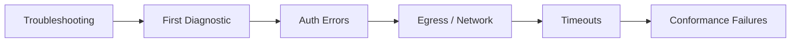

# Troubleshooting

## Audience

Operators and contributors diagnosing local HELM AI Kernel startup, proxy, Console, receipt, and verification failures.

## Outcome

After this page you should know what this surface is for, which source files own the behavior, which public route or adjacent page to use next, and which validation command to run before changing the claim.

## Source Truth

- Public route: `helm-ai-kernel/troubleshooting`
- Source document: `helm-ai-kernel/docs/TROUBLESHOOTING.md`
- Public manifest: `helm-ai-kernel/docs/public-docs.manifest.json`
- Source inventory: `helm-ai-kernel/docs/source-inventory.manifest.json`
- Validation: `make docs-coverage`, `make docs-truth`, and `npm run coverage:inventory` from `docs-platform`

Do not expand this page with unsupported product, SDK, deployment, compliance, or integration claims unless the inventory manifest points to code, schemas, tests, examples, or an owner doc that proves the claim.

## Troubleshooting

| Symptom | First check |
| --- | --- |
| The public page and source behavior disagree | Treat the source path in `Source Truth` as canonical, then update the docs and source-inventory row in the same change. |
| A link or route is missing from the docs website | Check `docs/public-docs.manifest.json`, `llms.txt`, search, and the per-page Markdown export before changing navigation. |
| A claim is not backed by code or tests | Remove the claim or add the missing code, example, schema, or validation command before publishing. |

## Diagram

This scheme maps the main sections of Troubleshooting in reading order.



Common issues and solutions for HELM.

---

## First Diagnostic

Run `helm-ai-kernel doctor --json` before deeper debugging when the CLI is installed but the runtime path is unclear. The doctor command checks local initialization, trust material, data directories, and common environment mistakes.

```bash
helm-ai-kernel doctor --json
```

---

## Auth Errors

### `HELM_UNREACHABLE` in adapters

The adapter cannot reach the HELM server.

```bash
# Check HELM is running
curl http://127.0.0.1:7714/healthz

# Check the URL in your adapter config
export HELM_URL=http://127.0.0.1:7714
```

`helm-ai-kernel server` still defaults to `127.0.0.1:8080`. The public quickstart uses `helm-ai-kernel serve --policy ./release.high_risk.v3.toml`, which defaults to `127.0.0.1:7714`.
The separate `helm-ai-kernel server` health endpoint uses `HELM_HEALTH_PORT` or `8081`;
`helm-ai-kernel health` checks that health endpoint, not the main API port.

### `401 Unauthorized` from proxy

```bash
# Set your upstream API key
helm-ai-kernel proxy --upstream https://your-upstream.example/v1 --api-key $OPENAI_API_KEY

# Or via environment
export OPENAI_API_KEY=sk-...
helm-ai-kernel proxy --upstream https://your-upstream.example/v1
```

For release smoke or customer-data-free debugging, use the local fixture instead:

```bash
python3 scripts/launch/mock-openai-upstream.py --port 19090
helm-ai-kernel proxy --upstream http://127.0.0.1:19090/v1
```

---

## Egress / Network

### Sandbox exec fails with "PREFLIGHT_DENIED"

The sandbox provider's egress policy is too restrictive or the provider is not configured.

```bash
# Check preflight details
helm-ai-kernel sandbox exec --provider e2b --json -- echo test | jq .preflight

# Ensure provider credentials
export E2B_API_KEY=your-key
```

### MCP server unreachable over HTTP/SSE

```bash
# Start with explicit transport
helm-ai-kernel mcp serve --transport http --port 9100

# Check firewall allows the port
curl http://localhost:9100/mcp
```

---

## Timeouts

### Proxy request timeout

```bash
# Increase wallclock limit (default: 120s)
helm-ai-kernel proxy --upstream http://127.0.0.1:19090/v1 --max-wallclock 300s
```

### Sandbox execution timeout

```bash
# Increase timeout (default: 30s)
helm-ai-kernel sandbox exec --provider opensandbox --timeout 60s -- long-running-command
```

---

## Conformance Failures

### `G0_JCS_CANONICALIZATION` fails

JCS canonicalization requires valid JSON. Check your tool arguments:

```bash
echo '{"b":2,"a":1}' | jq -S .   # sorted keys
```

### `G1_PROOFGRAPH` fails

ProofGraph requires at least one receipt in the evidence directory:

```bash
ls data/evidence/   # Should contain .json receipt files
```

### `G2A_EVIDENCE_PACK` fails

EvidencePack requires deterministic tar with epoch mtime:

```bash
# Export with HELM (ensures determinism)
helm-ai-kernel export --evidence ./data/evidence --out evidence.tar

# Verify
helm-ai-kernel verify evidence.tar
```

### `helm-ai-kernel verify --online` fails but offline verification passes

`--online` requires a reachable public proof API and matching ledger metadata in the pack.

```bash
export HELM_LEDGER_URL=https://mindburn.org/api/proof/verify
helm-ai-kernel verify evidence.tar --online
```

If the pack has no public anchor, use offline verification or regenerate the pack from a release asset with public proof metadata.

### `helm-ai-kernel receipts tail` does not print events

Confirm the local boundary is running and that receipts are being emitted for the same agent id:

```bash
helm-ai-kernel serve --policy ./release.high_risk.v3.toml
helm-ai-kernel receipts tail --agent agent.helm.demo --server http://127.0.0.1:7714
```

### release smoke fails locally

Run `make release-smoke` from the repository root and inspect the first failing
phase: reproducible binaries, SBOM JSON, OpenVEX JSON, or optional Cosign
bundle verification. The command writes generated evidence under ignored
release/build artifact paths, so rerun after fixing the source failure.

### Kubernetes Helm validation uses the HELM AI Kernel CLI

The local `helm` binary in this repository may be the HELM AI Kernel CLI, not the
Kubernetes Helm v3 binary. Set `KUBE_HELM_CMD` to a Kubernetes Helm v3 binary or
run `make helm-chart-smoke`, which uses the pinned containerized chart runner
when needed.

---

## Common Errors

| Error                   | Cause                     | Fix                              |
| ----------------------- | ------------------------- | -------------------------------- |
| `ERR_TOOL_NOT_FOUND`    | Unknown tool URN          | Register tool in policy manifest |
| `ERR_SCHEMA_MISMATCH`   | Args don't match schema   | Check tool argument types        |
| `PROXY_ITERATION_LIMIT` | Too many tool call rounds | Increase `--max-iterations`      |
| `PROXY_WALLCLOCK_LIMIT` | Session too long          | Increase `--max-wallclock`       |
| `HELM_UNREACHABLE`      | Server down or wrong URL  | Check `helm-ai-kernel health`              |
| `ESCALATE`              | Human approval or more evidence needed | Stop dispatch and complete the required approval/evidence path |
