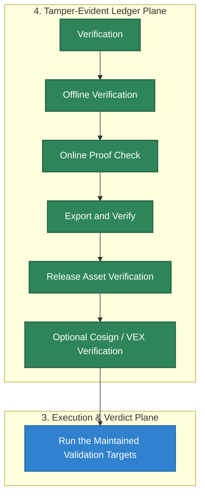

# Verification

Verification proves a HELM AI Kernel EvidencePack, boundary record, release artifact, or optional signature bundle from source-owned material instead of prose.

## Audience

This page is for release consumers, security reviewers, and integration owners who need to verify HELM AI Kernel outputs without trusting a hosted service or marketing claim.

## Outcome

You should be able to run local offline verification, distinguish release metadata from cryptographic evidence, and identify which release assets have enough material to verify before you execute or redistribute them.

## Source Truth

- Public route: `verification`
- Source document: `helm-ai-kernel/docs/VERIFICATION.md`
- Public manifest: `helm-ai-kernel/docs/public-docs.manifest.json`
- Source inventory: `helm-ai-kernel/docs/source-inventory.manifest.json`
- Validation: `make docs-coverage`, `make docs-truth`, and `npm run coverage:inventory` from `docs-platform`

Do not expand this page with unsupported product, SDK, deployment, compliance, or integration claims unless the inventory manifest points to code, schemas, tests, examples, or an owner doc that proves the claim.

## Troubleshooting

| Symptom | First check |
| --- | --- |
| Published output is stale or incomplete | Run `npm run helm-public:accuracy` in `docs-platform`, then check the source path and public manifest row for this page. |
| A claim needs implementation backing | Check the Source Truth files above and update the implementation, manifest, source inventory, or page in the same change. |

## Diagram

This scheme maps the main sections of Verification in reading order.




The verification path is local-first. `helm-ai-kernel verify <evidence-pack.tar|dir>`
performs offline checks by default; `--online` is optional and only runs after
offline checks pass.

Current source release target: `v0.5.18`:
<https://github.com/Mindburn-Labs/helm-ai-kernel/releases/tag/v0.5.18>. The
release is complete only when the page attaches platform binaries,
`SHA256SUMS.txt`, `sbom.json`, `v0.5.18.openvex.json`,
`release-attestation.json`, `evidence-pack.tar`,
`release.high_risk.v3.toml`, `sample-policy-material.tar`,
`helm-ai-kernel-launchpad-data.tar`, `helm-ai-kernel.mcpb`,
`helm-ai-kernel.rb`, `v0.5.18.json`, `version-status.json`, and matching
`*.cosign.bundle` files for each primary asset.

There is no public GitHub Release object for `v0.4.1`; use `v0.4.0` as the
actual baseline when auditing the `v0.5.0` delta.

## v0.5.18 Asset Contract

The `v0.5.18` release is complete only when it attaches these primary assets:

- `helm-ai-kernel-darwin-amd64`
- `helm-ai-kernel-darwin-arm64`
- `helm-ai-kernel-linux-amd64`
- `helm-ai-kernel-linux-arm64`
- `helm-ai-kernel-windows-amd64.exe`
- `SHA256SUMS.txt`
- `sbom.json`
- `v0.5.18.openvex.json`
- `release-attestation.json`
- `evidence-pack.tar`
- `release.high_risk.v3.toml`
- `sample-policy-material.tar`
- `helm-ai-kernel-launchpad-data.tar`
- `helm-ai-kernel.mcpb`
- `helm-ai-kernel.rb`

`sample-policy-material.tar` must include both
`release.high_risk.v3.toml` and
`reference_packs/eu_ai_act_high_risk.v1.json`. The release workflow signs each
primary asset, including `SHA256SUMS.txt`, with a matching
`*.cosign.bundle`.

## EvidencePack Contents

An EvidencePack is the portable verification bundle for a HELM-governed run or
release path. A complete pack includes the indexed records needed to verify the
decision chain without trusting the process that produced it:

- prompts or request metadata when the surface records them for the run;
- MCP tool calls, OpenAI-compatible proxy requests, policy decisions, and
  outcomes that crossed the HELM boundary;
- receipt bytes, receipt IDs, decision IDs, output hashes, and reason codes;
- ProofGraph or boundary record roots that bind the decision path;
- signature material and native seal metadata when the pack has been sealed;
- optional external anchor and storage receipts for customer or
  high-assurance profiles.

The verifier checks the archive or directory shape, the indexed file hashes,
the receipt material, root hashes, and available signatures. A demo receipt is
not automatically a complete EvidencePack; use a pack produced by export,
LaunchKit, release artifacts, or an operator-controlled evidence workflow.

## Offline Verification

```bash
helm-ai-kernel verify evidence-pack.tar
```

Compatibility form:

```bash
helm-ai-kernel verify --bundle evidence-pack.tar
```

Successful compact output includes the envelope id, signature count, anchor state, and sealed timestamp when those fields are embedded in the pack. If no anchor is embedded, the CLI reports `anchor offline`; it does not invent an anchor.

Native EvidencePack seals live at
`07_ATTESTATIONS/evidence_pack.sig`. The old `00_SEAL.json` plan is not a
customer-facing verification contract. Customer and high-assurance profiles
must verify the native seal signature, a trusted external signer key, an
external Rekor or RFC3161 anchor receipt, and an S3 Object Lock storage receipt
with active COMPLIANCE retention:

```bash
helm-ai-kernel trust init --config helm/helm.yaml \
  --profile customer \
  --signer kms \
  --anchor rekor \
  --store s3 \
  --object-lock

helm-ai-kernel verify --bundle evidence-pack.tar \
  --profile customer \
  --storage-receipt evidence-pack.tar.storage.json
```

The storage receipt must identify the bucket, key, object version, object hash,
retention mode, and `retain_until` timestamp. When verification runs against a
tar archive, the verifier compares the receipt object hash with the local
archive bytes.

## Receipt Tail Output

Use `receipts tail` while an integration is running to prove the request crossed
the HELM boundary:

```bash
helm-ai-kernel receipts tail --agent agent.demo.exec --server http://127.0.0.1:7714
```

The command prints durable receipt events for the selected agent. In compact
output, the fields to read first are:

| Field | What it tells the operator |
| --- | --- |
| `receipt_id` | The durable receipt to cite in an issue, audit note, or EvidencePack |
| `decision_id` | The policy decision that produced the receipt |
| `verdict` or `status` | `ALLOW`, `DENY`, `ESCALATE`, or proxy status such as `DENIED` |
| `reason_code` | Why the boundary allowed, denied, or escalated the effect |
| `output_hash` | The hash that binds the governed result or denial body |
| `signature` | Receipt-level signature material; absence means the event is not audit-ready |

For a denied shell or proxy tool-call test, the receipt should show a deny
status/reason and the effect should not be dispatched. That receipt is the
operator-facing handle that later appears inside the EvidencePack.

The CLI requires `--agent`; use the HTTP list route when a local unfiltered
view is more useful during a quickstart:

```bash
curl 'http://127.0.0.1:7714/api/v1/receipts?limit=20'
```

## EvidencePack Verify Output

Use offline verification for archives:

```bash
helm-ai-kernel verify evidence-pack.tar
```

The command succeeds only after the verifier has checked the archive/index
shape, content hashes, required receipt material, root hash, and available
signatures. A passing dev-local pack may report `anchor offline`; that means no
external timestamp/transparency anchor was embedded, not that verification was
skipped. Customer/high-assurance packs should additionally report a trusted seal
signer, external anchor, and storage receipt verification when those inputs are
provided.

## Online Proof Check

```bash
helm-ai-kernel verify evidence-pack.tar --online
```

`--online` posts envelope/root metadata to `HELM_LEDGER_URL` or `https://mindburn.org/api/proof/verify`. Public proof verification is additive and must never use fixture-backed positive proof.

## Export and Verify

```bash
helm-ai-kernel export --evidence ./data/evidence --out evidence.tar
helm-ai-kernel verify evidence.tar
```

Audit exports preserve every file listed by `00_INDEX.json`, including
top-level sidecars such as `01_SCORE.json.sha256`. Verification fails when an
indexed file is missing or the exported archive contains an unexpected
canonical top-level entry.

## Local Tamper-Failure Demo

The launch proof demo exercises the public verification path without external
network calls:

```bash
./scripts/launch/demo-proof.sh
```

The script starts a localhost HELM boundary, creates a signed `DENY` receipt
for the dangerous shell fixture, verifies the receipt through `/api/demo/verify`,
then flips the verdict through `/api/demo/tamper`. The original receipt must
verify, and the tamper attempt must fail signature and ProofGraph hash checks.

## Boundary Records, Checkpoints, and Envelopes

The execution-boundary verifier checks HELM-native records first. External envelopes are wrappers over HELM roots, not independent authority.

```bash
helm-ai-kernel boundary records --json
helm-ai-kernel boundary checkpoint --create --receipt-count 1 --json
helm-ai-kernel boundary verify boundary-record-bootstrap --json
helm-ai-kernel evidence envelope create --envelope dsse --native-hash sha256:evidence --manifest-id demo --json
helm-ai-kernel evidence envelope verify --manifest-id demo --json
```

For API-backed verification, use:

```text
POST /api/v1/boundary/records/{record_id}/verify
POST /api/v1/evidence/envelopes/{manifest_id}/verify
POST /api/v1/evidence/verify
POST /api/v1/replay/verify
```

## Release Asset Verification

Download the binary and `SHA256SUMS.txt` from the same GitHub release, then
check the digest before executing the binary:

```bash
shasum -a 256 -c SHA256SUMS.txt --ignore-missing
```

Inspect the release metadata and SBOM:

```bash
jq . release-attestation.json
jq . sbom.json
```

`release-attestation.json` in `v0.4.0` is release metadata. Treat it as
descriptive unless a release also provides a cryptographically verifiable
provenance predicate and a documented verifier command.

Verify the bundled offline evidence pack:

```bash
helm-ai-kernel verify evidence-pack.tar
```

The release staging path runs the same offline verification before publishing
release checksums. If this step fails, the release must be treated as incomplete
and the exported EvidencePack must be repaired before attaching assets.

For `v0.5.10`, this command passes without network access. The verifier
accepts both the legacy `receipts/` layout and the canonical
`02_PROOFGRAPH/receipts/` layout.

For `v0.4.0`, the included EvidencePack also verifies offline and reports
`anchor offline`, but that release does not attach OpenVEX or Cosign bundles.

## Cosign Artifact Verification When Bundles Are Attached

> [!NOTE]
> Early draft/development releases before the `v0.5.9` release target did not
> complete the current Cosign OIDC and SLSA provenance release contract. As a
> result, those legacy assets must not be treated as having associated
> `*.cosign.bundle` or provenance files unless those files are attached to the
> release. A completed `v0.5.9` or later public release must ship the matching
> signature bundles and attestation metadata described here.

Cosign verification requires a matching `*.cosign.bundle` file attached to the
release. When a release includes those files, verify a downloaded binary blob
with the bundled signature:

```bash
cosign verify-blob \
  --bundle helm-ai-kernel-linux-amd64.cosign.bundle \
  --certificate-identity-regexp "https://github.com/Mindburn-Labs/helm-ai-kernel" \
  --certificate-oidc-issuer https://token.actions.githubusercontent.com \
  helm-ai-kernel-linux-amd64
```

Verify the published container image when one is published for the release:

```bash
cosign verify \
  --certificate-identity-regexp "Mindburn-Labs/helm-ai-kernel" \
  --certificate-oidc-issuer https://token.actions.githubusercontent.com \
  ghcr.io/mindburn-labs/helm-ai-kernel:<version>
```

Verify every artifact in a downloaded release directory in one command when the
directory contains matching `*.cosign.bundle` files:

```bash
bash scripts/release/verify_cosign.sh ./downloaded-release/
```

The script walks the directory, finds every `*.cosign.bundle`, and runs
`cosign verify-blob` against the matching artifact. A run with zero bundle
files proves no signature coverage; check that bundles exist before treating
Cosign as part of the release evidence. The `make verify-cosign` target runs
the same script against `dist/`. If the release has no bundle assets, use
checksum, SBOM, release metadata, offline EvidencePack, and reproducible-build
verification instead.

### VEX Consumption When A VEX File Is Attached

The repository retains OpenVEX policy source under `release/vex/`. When a
release attaches an OpenVEX file next to the SBOM, filter scanner output
through the published VEX statements:

```bash
vexctl filter --vex release/vex/v<version>.openvex.json sbom.json
```

CVEs marked `not_affected` in the VEX are removed from the scan output;
`under_investigation` and `affected` entries pass through unchanged so
the scanner can still surface them.

## Run the Maintained Validation Targets

```bash
make test
make test-platform
make test-all
make crucible
make launch-smoke
make sdk-openapi-check
make sdk-examples-smoke
make launch-ready
make release-smoke
```

## Benchmarks

```bash
make bench
make bench-report
```

The benchmark report writes a local artifact under `benchmarks/results/`; benchmark output is generated locally or in CI and is not committed as a release-truth artifact in the repository tree.
