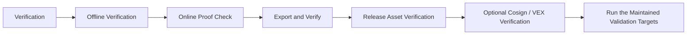

# Verification

Use this page when you need to verify a HELM OSS EvidencePack, boundary record, release artifact, or optional signature bundle without trusting prose.

## Source Truth

- Public route: `helm-oss/verification`
- Source document: `helm-oss/docs/VERIFICATION.md`
- Public manifest: `helm-oss/docs/public-docs.manifest.json`
- Source inventory: `helm-oss/docs/source-inventory.manifest.json`
- Validation: `make docs-coverage`, `make docs-truth`, and `npm run coverage:inventory` from `docs-platform`

Do not expand this page with unsupported product, SDK, deployment, compliance, or integration claims unless the inventory manifest points to code, schemas, tests, examples, or an owner doc that proves the claim.

## Troubleshooting

| Symptom | First check |
| --- | --- |
| The public page and source behavior disagree | Treat the source path in `Source Truth` as canonical, then update the docs and source-inventory row in the same change. |
| A link or route is missing from the docs website | Check `docs/public-docs.manifest.json`, `llms.txt`, search, and the per-page Markdown export before changing navigation. |
| A claim is not backed by code or tests | Remove the claim or add the missing code, example, schema, or validation command before publishing. |

## Diagram

This scheme maps the main sections of Verification in reading order.



The verification path is local-first. `helm verify <evidence-pack.tar|dir>`
performs offline checks by default; `--online` is optional and only runs after
offline checks pass.

Current public release: `v0.5.0`, published on 2026-05-13 at
<https://github.com/Mindburn-Labs/helm-oss/releases/tag/v0.5.0>. The release
page attaches platform binaries, `SHA256SUMS.txt`, `sbom.json`,
`v0.5.0.openvex.json`, `release-attestation.json`, `evidence-pack.tar`,
`release.high_risk.v3.toml`, `sample-policy-material.tar`, `helm.mcpb`,
`helm.rb`, and matching `*.cosign.bundle` files for each primary asset.

There is no public GitHub Release object for `v0.4.1`; use `v0.4.0` as the
actual baseline when auditing the `v0.5.0` delta.

## v0.5.0 Asset Contract

The `v0.5.0` release attaches these primary assets:

- `helm-darwin-amd64`
- `helm-darwin-arm64`
- `helm-linux-amd64`
- `helm-linux-arm64`
- `helm-windows-amd64.exe`
- `SHA256SUMS.txt`
- `sbom.json`
- `v0.5.0.openvex.json`
- `release-attestation.json`
- `evidence-pack.tar`
- `release.high_risk.v3.toml`
- `sample-policy-material.tar`
- `helm.mcpb`
- `helm.rb`

`sample-policy-material.tar` must include both
`release.high_risk.v3.toml` and
`reference_packs/eu_ai_act_high_risk.v1.json`. The release workflow signs each
primary asset, including `SHA256SUMS.txt`, with a matching
`*.cosign.bundle`.

## Offline Verification

```bash
helm verify evidence-pack.tar
```

Compatibility form:

```bash
helm verify --bundle evidence-pack.tar
```

Successful compact output includes the envelope id, signature count, anchor state, and sealed timestamp when those fields are embedded in the pack. If no anchor is embedded, the CLI reports `anchor offline`; it does not invent an anchor.

## Online Proof Check

```bash
helm verify evidence-pack.tar --online
```

`--online` posts envelope/root metadata to `HELM_LEDGER_URL` or `https://mindburn.org/api/proof/verify`. Public proof verification is additive and must never use fixture-backed positive proof.

## Export and Verify

```bash
helm export --evidence ./data/evidence --out evidence.tar
helm verify evidence.tar
```

## Local Tamper-Failure Demo

The launch proof demo exercises the public verification path without external
network calls:

```bash
./scripts/launch/demo-proof.sh
```

The script starts a localhost HELM boundary, creates a signed `DENY` receipt
for the dangerous shell fixture, verifies the receipt through `/api/demo/verify`,
then flips the verdict through `/api/demo/tamper`. The original receipt must
verify, and the tamper attempt must fail signature and ProofGraph hash checks.

## Boundary Records, Checkpoints, and Envelopes

The execution-boundary verifier checks HELM-native records first. External envelopes are wrappers over HELM roots, not independent authority.

```bash
helm boundary records --json
helm boundary checkpoint --create --receipt-count 1 --json
helm boundary verify boundary-record-bootstrap --json
helm evidence envelope create --envelope dsse --native-hash sha256:evidence --manifest-id demo --json
helm evidence envelope verify --manifest-id demo --json
```

For API-backed verification, use:

```text
POST /api/v1/boundary/records/{record_id}/verify
POST /api/v1/evidence/envelopes/{manifest_id}/verify
POST /api/v1/evidence/verify
POST /api/v1/replay/verify
```

## Release Asset Verification

Download the binary and `SHA256SUMS.txt` from the same GitHub release, then
check the digest before executing the binary:

```bash
shasum -a 256 -c SHA256SUMS.txt --ignore-missing
```

Inspect the release metadata and SBOM:

```bash
jq . release-attestation.json
jq . sbom.json
```

`release-attestation.json` in `v0.4.0` is release metadata. Treat it as
descriptive unless a release also provides a cryptographically verifiable
provenance predicate and a documented verifier command.

Verify the bundled offline evidence pack:

```bash
helm verify evidence-pack.tar
```

For `v0.5.0`, this command passes without network access. The verifier
accepts both the legacy `receipts/` layout and the canonical
`02_PROOFGRAPH/receipts/` layout.

For `v0.4.0`, the included EvidencePack also verifies offline and reports
`anchor offline`, but that release does not attach OpenVEX or Cosign bundles.

## Cosign Artifact Verification When Bundles Are Attached

Cosign verification requires a matching `*.cosign.bundle` file attached to the
release. When a release includes those files, verify a downloaded binary blob
with the bundled signature:

```bash
cosign verify-blob \
  --bundle helm-linux-amd64.cosign.bundle \
  --certificate-identity-regexp "https://github.com/Mindburn-Labs/helm-oss" \
  --certificate-oidc-issuer https://token.actions.githubusercontent.com \
  helm-linux-amd64
```

Verify the published container image when one is published for the release:

```bash
cosign verify \
  --certificate-identity-regexp "Mindburn-Labs/helm-oss" \
  --certificate-oidc-issuer https://token.actions.githubusercontent.com \
  ghcr.io/mindburn-labs/helm-oss:<version>
```

Verify every artifact in a downloaded release directory in one command when the
directory contains matching `*.cosign.bundle` files:

```bash
bash scripts/release/verify_cosign.sh ./downloaded-release/
```

The script walks the directory, finds every `*.cosign.bundle`, and runs
`cosign verify-blob` against the matching artifact. A run with zero bundle
files proves no signature coverage; check that bundles exist before treating
Cosign as part of the release evidence. The `make verify-cosign` target runs
the same script against `dist/`. If the release has no bundle assets, use
checksum, SBOM, release metadata, offline EvidencePack, and reproducible-build
verification instead.

### VEX Consumption When A VEX File Is Attached

The repository retains OpenVEX policy source under `release/vex/`. When a
release attaches an OpenVEX file next to the SBOM, filter scanner output
through the published VEX statements:

```bash
vexctl filter --vex release/vex/v<version>.openvex.json sbom.json
```

CVEs marked `not_affected` in the VEX are removed from the scan output;
`under_investigation` and `affected` entries pass through unchanged so
the scanner can still surface them.

## Run the Maintained Validation Targets

```bash
make test
make test-console
make test-platform
make test-all
make crucible
make launch-smoke
make sdk-openapi-check
make sdk-examples-smoke
make launch-ready
make release-smoke
```

## Benchmarks

```bash
make bench
make bench-report
```

The benchmark report writes a local artifact under `benchmarks/results/`; benchmark output is generated locally or in CI and is not committed as a release-truth artifact in the repository tree.
