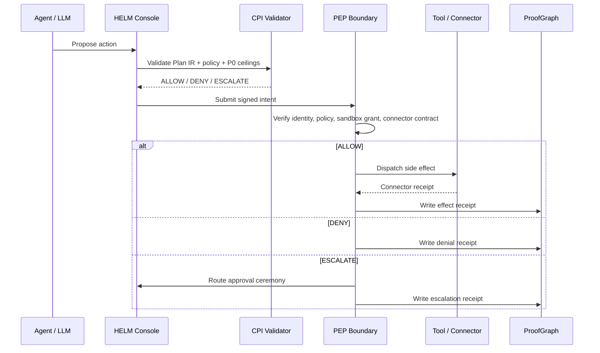

# HELM Canonical Diagrams

This doctrine keeps HELM public diagrams aligned with UCS v1.3. Diagrams must
explain execution authority, not generic AI governance. HELM OSS and HELM
Commercial are canonical HELM surfaces; sibling systems remain reference or
private unless a source explicitly says otherwise.

## Usage Rules

- Use `ALLOW`, `DENY`, and `ESCALATE` for new public proof flows.
- Treat OrgDNA as intake material. Treat OrgGenome as reviewed, signed,
  policy-bearing organizational law.
- Do not show Pilot as a HELM component. Do not show TITAN as a public product.
- Mark physical-world and organization-compilation material as strategic /
  non-normative unless it is tied to shipped OSS behavior.
- Do not imply that `oss.mindburn.org` is live until DNS, health, demo,
  verification, and tamper-failure smoke tests pass.

## 1. Execution Boundary

```text
LLM / Agent / Copilot
        |
        v
Signed intent
        |
        v
HELM Execution Boundary
identity -> OrgGenome policy -> P0 ceilings -> CPI validation
        -> sandbox grant -> connector contract -> MCP approval state
        |
        v
ALLOW / DENY / ESCALATE
        |
        v
Tool / Connector / Human approval
        |
        v
Receipt -> ProofGraph -> EvidencePack
```

## 2. Models Propose, HELM Governs



`ALLOW` dispatches. `DENY` records a blocked action. `ESCALATE` routes missing
facts, approval, solver timeout, or policy-hold paths without dispatching side
effects.

## 3. Company AI OS Loop

```text
Company Reality
meetings · tickets · PRs · deployments · customer calls · docs · specs
        |
        v
CompanyArtifactGraph
        |
        v
Should-vs-is Engine
        |
        v
TruthConflict / DriftSignal
        |
        v
GeneratedSpec
        |
        v
Review / Approval / Policy
        |
        v
PEP / CPI Boundary
        |
        v
Receipt -> ProofGraph -> EvidencePack -> CompanyArtifactGraph
```

`TruthConflict` is a mismatch between a claim source and a reality source.
`DriftSignal` is process or organizational divergence that has not yet become a
contradiction but will compound if ignored. `GeneratedSpec` remains a proposal
until reviewed or approved according to policy.

## 4. OrgDNA, OrgGenome, OrgPhenotype

```text
OrgDNA
raw intake material
        |
        v
OrgGenome Compiler
        |
        v
Draft OrgGenome artifacts
        |
        v
Verified Genesis Loop
        |
        v
OrgGenome
reviewed, signed, policy-bearing organizational specification
        |
        v
OrgPhenotype
deterministic runtime state from OrgGenome + ProofGraph checkpoints
        |
        v
PEP / CPI Execution
```

OrgDNA is never execution authority. OrgGenome carries execution authority only
after review and approval.

## 5. MCP Quarantine Lifecycle

```text
Discovered MCP server
        |
        v
Quarantined by default
        |
        v
Metadata + schema inspection
        |
        v
Risk classification
        |
        v
Approval record
server identity · endpoint · tools · approver · receipt · expiry
        |
        v
Policy-bound active state
        |
        v
ALLOW / DENY / ESCALATE per tool call
        |
        v
Receipt + ProofGraph event
```

If registry state, approval state, metadata, schema validation, or policy
evaluation is unavailable, the boundary must fail closed.

## 6. Evidence And Redaction

```text
Sensitive evidence
raw payloads · PII · secrets · customer data
        |
        v
Encrypted off-graph storage
ciphertext_hash · blob_ref · kek_ref · redaction_policy_ref
        |
        v
ProofGraph
hashes · signatures · policy verdicts · inclusion proofs
        |
        v
EvidencePack
minimal replay slice
        |
        v
Redacted views
operator · auditor · regulator · public
```

Proof should not require publishing secrets. Sensitive payloads stay off-graph;
public proof uses hashes, signatures, policy verdicts, inclusion proofs, and
deterministic redactions.

## 7. Connector Drift Lifecycle

```text
Connector response arrives
        |
        v
Schema hash / contract check
        |
        v
Drift detected
        |
        v
DENY with ERR_CONNECTOR_CONTRACT_DRIFT
        |
        v
Execution thread halts safely
        |
        v
Mechanic shim proposal
        |
        v
Offline simulation + policy equivalence check
        |
        v
Human / CI approval
        |
        v
Replay halted intent with shim receipt
```

Runtime drift is not healed probabilistically. Shims are proposed out of band,
simulated offline, and approved before replay.

## 8. Digital-To-Physical Bridge

```text
Digital effect
API call · database write · deploy
        -> PEP/CPI + receipt + replay

Analog proxy effect
human contractor · delivery service · off-platform actor
        -> approval unless allowlisted

Kinetic effect
robot · actuator · industrial system
        -> actuation envelope · safe-state command · telemetry · simulation · receipt
```

Strategic / non-normative: physical and analog effects require stronger
boundaries because they cannot be reliably rolled back.

## Product Detail Blocks

Sandbox grants should expose `grant_id`, runtime, runtime version,
backend profile, image or template digest, filesystem preopens, environment
variables, network policy, resource limits, policy epoch, and `grant_hash`.

Approval ceremonies should bind the exact intent hash, human-visible summary,
P0 ceilings, quorum or approver policy, deliberate confirmation, timelock where
required, and final approval attestation.

Proof condensation should route T3 high-risk actions to full EvidencePacks,
T2 medium-risk actions to policy-selected EvidencePacks, T1 low-risk actions to
hash-only receipts plus checkpoints, and T0 routine operations to Merkle
condensation checkpoints.
