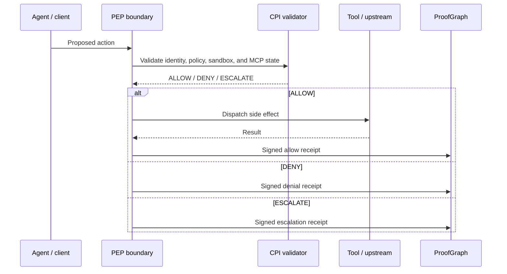

# HELM OSS Canonical Diagrams

This page defines the public diagram doctrine for HELM OSS. Diagrams must show the implemented execution boundary: agents propose actions, deterministic HELM systems evaluate authority before dispatch, and signed receipts plus EvidencePacks make the result verifiable offline.

Do not use HELM OSS diagrams to describe commercial products, hosted services, organization compilers, portfolio systems, private domains, or roadmap-only surfaces.

## Diagram Rules

- Use `ALLOW`, `DENY`, and `ESCALATE` for current runtime decisions.
- Use `Console` for the self-hostable OSS UI.
- Use `EvidencePack` and `ProofGraph` for canonical evidence terms.
- Show MCP quarantine as fail-closed before tool dispatch.
- Mark any non-implemented idea as roadmap outside current-state docs.
- Do not imply hosted control-plane, billing, private connector, or tenant-admin capabilities ship in HELM OSS.

## 1. Execution Boundary

```text
Agent / MCP client / OpenAI-compatible client
        |
        v
Proposed tool call or model request
        |
        v
HELM OSS execution boundary
identity -> policy bundle -> PEP -> CPI -> sandbox grant -> MCP approval state
        |
        v
ALLOW / DENY / ESCALATE
        |
        v
Dispatch only on ALLOW
        |
        v
Signed receipt -> ProofGraph -> EvidencePack
```

Plain version: the model or agent proposes. HELM checks. The side effect runs only after `ALLOW`. Every outcome records a signed receipt.

## 2. Models Propose, HELM Governs



`ESCALATE` stops execution and asks for more facts, policy, or human approval. It must not dispatch the side effect.

## 3. MCP Quarantine Lifecycle

```text
Discovered MCP server
        |
        v
Quarantined by default
        |
        v
Metadata and schema inspection
        |
        v
Risk classification
        |
        v
Approval record
server identity · endpoint · tools · approver · receipt · expiry
        |
        v
Policy-bound active state
        |
        v
ALLOW / DENY / ESCALATE per tool call
        |
        v
Signed receipt + ProofGraph event
```

If registry state, approval state, metadata, schema validation, or policy evaluation is unavailable, the boundary fails closed.

## 4. Evidence And Redaction

```text
Sensitive payloads
PII · secrets · customer data
        |
        v
Off-graph storage or redaction
ciphertext hash · blob ref · policy ref
        |
        v
ProofGraph
hashes · signatures · decisions · inclusion proofs
        |
        v
EvidencePack
minimal replay slice
        |
        v
Offline verification
```

Proof should not require publishing secrets. Public proof uses hashes, signatures, decision records, inclusion proofs, and deterministic redactions.

## 5. Sandbox Grants

```text
Requested execution
        |
        v
Sandbox profile
runtime · image/template digest · filesystem preopens · env policy · network policy
        |
        v
Grant hash
        |
        v
PEP / CPI decision
        |
        v
ALLOW / DENY / ESCALATE
        |
        v
Signed receipt
```

Sandbox grants should expose `grant_id`, runtime, runtime version, backend profile, image or template digest, filesystem preopens, environment variables, network policy, resource limits, policy epoch, and `grant_hash`.

## 6. Connector Drift

```text
Connector response
        |
        v
Schema hash / contract check
        |
        v
Drift detected
        |
        v
DENY with connector contract reason
        |
        v
Execution thread halts safely
        |
        v
Out-of-band remediation
```

Runtime drift is not healed probabilistically. Compatibility shims are proposed out of band, simulated offline, and approved before replay.
