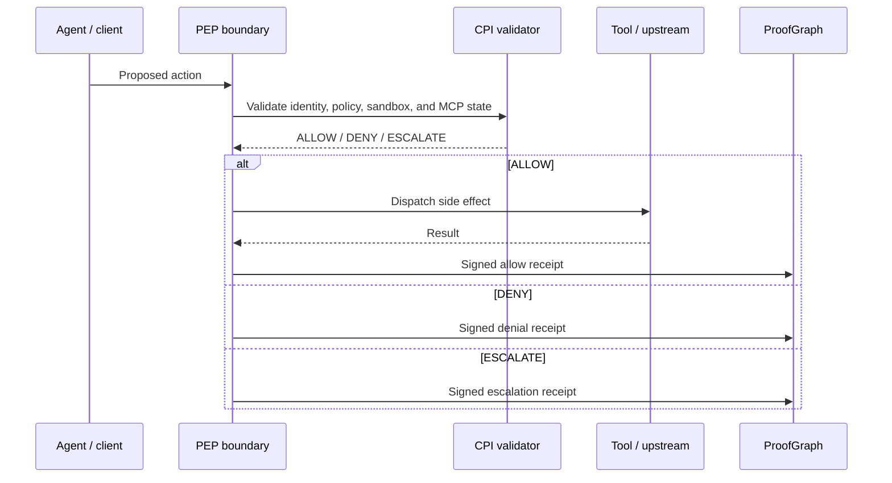

# HELM AI Kernel Canonical Diagrams

This page defines the public diagram doctrine for HELM AI Kernel. Diagrams must show the implemented execution boundary: agents propose actions, deterministic HELM systems evaluate authority before dispatch, and signed receipts plus EvidencePacks make the result verifiable offline.

## Audience

This page is for maintainers writing, reviewing, or embedding public HELM AI Kernel diagrams. It defines the canonical visual language for the execution boundary, MCP quarantine, receipts, ProofGraph, EvidencePack, and sandbox grants.

## Outcome

Every public HELM AI Kernel diagram should describe a current source-backed mechanism and avoid implying hosted operations, commercial account management, or roadmap-only control planes. If a diagram cannot be traced to the source map below, keep it out of current-state docs.

## Source Truth

This page is owned by `docs/source-inventory.manifest.json`, `docs/public-docs.manifest.json`, `docs/EXECUTION_SECURITY_MODEL.md`, `docs/INTEGRATIONS/mcp.md`, `core/pkg/kernel/README.md`, and `core/pkg/proofgraph/README.md`.

Do not use HELM AI Kernel diagrams to describe commercial products, hosted services, organization compilers, portfolio systems, private domains, or roadmap-only surfaces.

## Diagram Rules

- Use `ALLOW`, `DENY`, and `ESCALATE` for current runtime decisions.
- Use `Console` for the self-hostable OSS UI.
- Use `EvidencePack` and `ProofGraph` for canonical evidence terms.
- Show MCP quarantine as fail-closed before tool dispatch.
- Mark any non-implemented idea as roadmap outside current-state docs.
- Do not imply hosted operations, private account-management, non-OSS extension, or tenant-admin capabilities ship in HELM AI Kernel.

## Review Checklist

Before publishing a HELM AI Kernel diagram, check the direction of authority. The
agent, model, MCP client, or OpenAI-compatible client may propose work, but it
does not authorize the side effect. The authorization step belongs inside the
HELM AI Kernel execution boundary, and dispatch appears only after an `ALLOW`
decision. `DENY` and `ESCALATE` are terminal for the proposed side effect until
new policy, evidence, or approval is supplied.

Check the evidence path next. A diagram that shows execution should also show a
signed receipt, ProofGraph event, or EvidencePack export unless the page is
explicitly about pre-execution discovery. Public proof should be represented by
hashes, signatures, inclusion proofs, deterministic redaction, or offline
verification, not by raw secrets or customer payloads.

Finally, check product boundaries. HELM AI Kernel diagrams may show the CLI, kernel,
self-hostable Console, MCP firewall, OpenAI-compatible proxy, sandbox grants,
schemas, receipts, and conformance harness. Commercial tenant administration,
hosted billing, private connectors, and portfolio operating systems belong in
their own docs and must not appear as current HELM AI Kernel surfaces.

Use one diagram per claim. If a page needs to explain both MCP quarantine and
EvidencePack verification, show those as separate flows or explicitly label the
handoff between them. Dense diagrams invite readers to infer authority that the
kernel does not grant.

## 1. Execution Boundary

```text
Agent / MCP client / OpenAI-compatible client
        |
        v
Proposed tool call or model request
        |
        v
HELM AI Kernel execution boundary
identity -> policy bundle -> PEP -> CPI -> sandbox grant -> MCP approval state
        |
        v
ALLOW / DENY / ESCALATE
        |
        v
Dispatch only on ALLOW
        |
        v
Signed receipt -> ProofGraph -> EvidencePack
```

Plain version: the model or agent proposes. HELM checks. The side effect runs only after `ALLOW`. Every outcome records a signed receipt.

## 2. Models Propose, HELM Governs



`ESCALATE` stops execution and asks for more facts, policy, or human approval. It must not dispatch the side effect.

## 3. MCP Quarantine Lifecycle

```text
Discovered MCP server
        |
        v
Quarantined by default
        |
        v
Metadata and schema inspection
        |
        v
Risk classification
        |
        v
Approval record
server identity · endpoint · tools · approver · receipt · expiry
        |
        v
Policy-bound active state
        |
        v
ALLOW / DENY / ESCALATE per tool call
        |
        v
Signed receipt + ProofGraph event
```

If registry state, approval state, metadata, schema validation, or policy evaluation is unavailable, the boundary fails closed.

## 4. Evidence And Redaction

```text
Sensitive payloads
PII · secrets · customer data
        |
        v
Off-graph storage or redaction
ciphertext hash · blob ref · policy ref
        |
        v
ProofGraph
hashes · signatures · decisions · inclusion proofs
        |
        v
EvidencePack
minimal replay slice
        |
        v
Offline verification
```

Proof should not require publishing secrets. Public proof uses hashes, signatures, decision records, inclusion proofs, and deterministic redactions.

## 5. Sandbox Grants

```text
Requested execution
        |
        v
Sandbox profile
runtime · image/template digest · filesystem preopens · env policy · network policy
        |
        v
Grant hash
        |
        v
PEP / CPI decision
        |
        v
ALLOW / DENY / ESCALATE
        |
        v
Signed receipt
```

Sandbox grants should expose `grant_id`, runtime, runtime version, backend profile, image or template digest, filesystem preopens, environment variables, network policy, resource limits, policy epoch, and `grant_hash`.

## 6. Connector Drift

```text
Connector response
        |
        v
Schema hash / contract check
        |
        v
Drift detected
        |
        v
DENY with connector contract reason
        |
        v
Execution thread halts safely
        |
        v
Out-of-band remediation
```

Runtime drift is not healed probabilistically. Compatibility shims are proposed out of band, simulated offline, and approved before replay.

## Troubleshooting

| Symptom | First check |
| --- | --- |
| A diagram shows side effects before `ALLOW` | Rewrite the flow so dispatch happens only after the PEP/CPI decision. |
| A diagram mentions hosted tenants or commercial control planes | Move it out of HELM AI Kernel current-state docs or mark it as non-OSS context. |
| A diagram uses old verdict terms | Replace them with `ALLOW`, `DENY`, and `ESCALATE` unless the page is explicitly describing compatibility migration. |
| A diagram cannot be traced to a source file | Remove it or add the missing source-backed doc before publication. |

When in doubt, diagrams should be narrower and more literal. The public HELM AI Kernel diagram set exists to make execution boundaries, quarantine, signed receipts, and offline verification easier to inspect, not to describe future product strategy.
