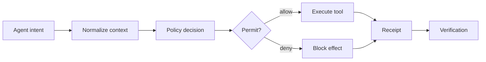

# Cognitive Firewall Split-Compute Pattern

## Audience

## Outcome

After this page you should know what this surface is for, which source files own the behavior, which public route or adjacent page to use next, and which validation command to run before changing the claim.

## Source Truth

- Public route: `helm-oss/architecture/cognitive-firewall`
- Source document: `helm-oss/docs/architecture/cognitive-firewall.md`
- Public manifest: `helm-oss/docs/public-docs.manifest.json`
- Source inventory: `helm-oss/docs/source-inventory.manifest.json`
- Validation: `make docs-coverage`, `make docs-truth`, and `npm run coverage:inventory` from `docs-platform`

Do not expand this page with unsupported product, SDK, deployment, compliance, or integration claims unless the inventory manifest points to code, schemas, tests, examples, or an owner doc that proves the claim.

## Troubleshooting

| Symptom | First check |
| --- | --- |
| The public page and source behavior disagree | Treat the source path in `Source Truth` as canonical, then update the docs and source-inventory row in the same change. |
| A link or route is missing from the docs website | Check `docs/public-docs.manifest.json`, `llms.txt`, search, and the per-page Markdown export before changing navigation. |
| A claim is not backed by code or tests | Remove the claim or add the missing code, example, schema, or validation command before publishing. |

Source: Qianlong Lan and Anuj Kaul, "The Cognitive Firewall: Securing Browser Based AI Agents Against Indirect Prompt Injection Via Hybrid Edge Cloud Defense", arXiv:2603.23791.

The HELM OSS mapping keeps the paper's three-stage split:

| Paper stage | HELM OSS mapping |
| --- | --- |
| Local visual Sentinel | `BrowserSplitObservation`: URL, DOM hash, visual-text hash, Sentinel risk, findings |
| Cloud Deep Planner | `BrowserSplitPlan`: tool intent, side-effect flag, planner reference hash |
| Deterministic Guard | `BrowserSplitAdapter`: domain policy, Sentinel risk gate, planner-reference gate, ProofGraph intent node |

The adapter lives at `core/pkg/runtimeadapters/browser_split.go`. It does not ship a browser UI or cloud planner. Instead, it defines the boundary contract a browser extension, OpenClaw-style gateway, or MCP browser tool can use when forwarding an already-scanned action into HELM governance.

## Egress Gate Composition

The split-compute guard should run before browser side effects are dispatched:

1. The browser-side Sentinel hashes the DOM and visual text, scores presentation-layer prompt-injection risk, and forwards only risk metadata and hashes.
2. The planner returns a tool intent with `planner_ref` instead of raw chain-of-thought.
3. `BrowserSplitAdapter` denies side-effecting actions when the Sentinel risk exceeds policy, when the destination is outside domain scope, or when the planner reference is missing.
4. Deployments that also use Guardian should pass the same destination as `destination`, the page text hash as evidence, and tainted browser content as `user_input`/`source_channel=TOOL_OUTPUT` so Guardian's threat scanner and egress checker can produce the final signed decision.

This keeps semantic reasoning and execution authority split: the planner may propose, but the deterministic guard owns the last pre-dispatch decision.

## Diagram

<!-- docs-depth-final-pass -->

## Implementation Checklist

A change to this pattern is complete only when the adapter test covers allow, deny, and missing-planner-reference paths, the receipt records the Sentinel risk and planner reference, and the public page still describes the browser UI and cloud planner as integration points rather than bundled HELM OSS features. Keep examples focused on the boundary contract: input hashes, domain scope, side-effect flag, destination, policy threshold, and resulting receipt. If a downstream browser extension or MCP browser tool adds richer context later, update this page by linking to that source-owner document instead of widening the core adapter claim.
