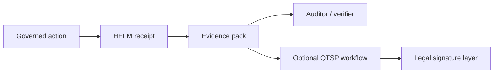

# eIDAS QTSP Anchoring

## Audience

## Outcome

After this page you should know what this surface is for, which source files own the behavior, which public route or adjacent page to use next, and which validation command to run before changing the claim.

## Source Truth

- Public route: `helm-oss/architecture/eidas-qtsp`
- Source document: `helm-oss/docs/architecture/eidas-qtsp.md`
- Public manifest: `helm-oss/docs/public-docs.manifest.json`
- Source inventory: `helm-oss/docs/source-inventory.manifest.json`
- Validation: `make docs-coverage`, `make docs-truth`, and `npm run coverage:inventory` from `docs-platform`

Do not expand this page with unsupported product, SDK, deployment, compliance, or integration claims unless the inventory manifest points to code, schemas, tests, examples, or an owner doc that proves the claim.

## Troubleshooting

| Symptom | First check |
| --- | --- |
| The public page and source behavior disagree | Treat the source path in `Source Truth` as canonical, then update the docs and source-inventory row in the same change. |
| A link or route is missing from the docs website | Check `docs/public-docs.manifest.json`, `llms.txt`, search, and the per-page Markdown export before changing navigation. |
| A claim is not backed by code or tests | Remove the claim or add the missing code, example, schema, or validation command before publishing. |

helm-oss timestamps every evidence pack against an RFC 3161 anchor. For
EU regulated workloads, the anchor must be a **Qualified Trust Service
Provider** (QTSP) under [Regulation (EU) No 910/2014 (eIDAS)](https://eur-lex.europa.eu/eli/reg/2014/910/oj),
giving the timestamp **presumption of legal reliability** in every EU
member state.

This document covers:

- Why eIDAS qualified timestamps matter for the EU AI Act high-risk track
- How helm-oss validates qualified timestamps against the EU LOTL
- Operator workflow: configuring a QTSP, refreshing trust, verifying
- Recognized QTSP options + a fallback for testing

## Why qualified timestamps

Article 12 of the EU AI Act requires high-risk AI systems to keep
automatic logs of operations across their lifecycle. Article 50 obligates
providers to mark the time and provenance of system outputs. Article 14
on human oversight implicitly demands a tamper-evident audit trail.

A plain RFC 3161 timestamp answers *"the receipt existed at time T"*. A
**qualified** RFC 3161 timestamp under eIDAS adds a legal layer: any
court in the EU treats the timestamp as authentic until rebutted, no
extra evidence required (Art. 41(2) of eIDAS). For an AI execution
governance kernel, that is the difference between a useful audit trail
and a *defensible* audit trail.

## Architecture

### Anchor pipeline

Each receipt-anchoring decision composes optional layers:

1. **Internal proof DAG** — Lamport-ordered causal graph in
   `core/pkg/proofgraph/`. Always present.
2. **Sigstore Rekor** — public transparency log entry in
   `core/pkg/proofgraph/anchor/rekor.go`. Optional.
3. **RFC 3161 timestamp** — generic time-stamp authority in
   `core/pkg/proofgraph/anchor/rfc3161.go`. Optional.
4. **eIDAS qualified timestamp** — restricted variant of (3), validated
   against the EU LOTL in `core/pkg/proofgraph/anchor/eidas.go`. Optional
   but **required** when `qtsp_required: true` in the loaded reference
   pack (see `reference_packs/eu_ai_act_high_risk.v1.json`).

The verifier accepts any subset; the strictest verifier (`helm verify
--require-eidas`) demands the eIDAS layer.

### LOTL refresh

The EU **List of Trusted Lists** (LOTL) is a signed XML document that
enumerates per-member-state trusted lists; each member-state list
enumerates that country's qualified TSAs.

`core/pkg/trust/eu_trusted_list.go` fetches and validates the LOTL on a
configurable interval (default 24h, controlled by
`qtsp_lotl_freshness_hours` in the loaded pack). Validation:

1. Fetch the LOTL XML from the configured endpoint
   (default `https://ec.europa.eu/tools/lotl/eu-lotl.xml`).
2. Verify the LOTL XML signature against the EU Commission's pinned
   signing certificate set.
3. For each pointer in the LOTL, fetch and verify the country-level
   trusted list signature.
4. Extract the X.509 certificate set authorized for qualified
   timestamping.
5. Cache the parsed roots; expose them to `eidas.go` for chain
   validation.

A stale LOTL beyond the freshness threshold blocks `helm verify
--require-eidas`. The status is observable via:

```bash
helm trust eu-list status
```

### Receipt anchor

When an evidence pack is assembled with a configured QTSP endpoint:

1. The receipt's pre-signature canonical form (JCS RFC 8785 + SHA-256)
   becomes the message imprint of an RFC 3161 TSP request.
2. The QTSP returns a `TimeStampToken` (RFC 3161 §2.4) signed by a
   certificate that chains to a root in the EU LOTL.
3. The `EIDASAnchor` validator parses the token, walks the chain, and
   confirms termination at a LOTL root.
4. The validated token is embedded next to the existing Rekor / RFC 3161
   anchor in the proof-graph node.

A modified receipt invalidates the message imprint; a fabricated token
fails chain validation; an expired LOTL fails the freshness gate.

## Operator workflow

### Configure a QTSP

Set the QTSP endpoint and (optional) refresh interval in your kernel
config:

```yaml
trust:
  eu_lotl:
    endpoint: https://ec.europa.eu/tools/lotl/eu-lotl.xml
    refresh_hours: 24
  qtsp:
    endpoint: https://qtsp.example.eu/tsa
    digest_algorithm: SHA-256
```

### Verify with eIDAS strictness

```bash
helm verify --require-eidas eu-evidence-pack.tar
```

Failure modes (each emits a structured diagnostic):

- `eidas: anchor missing` — receipt lacks an eIDAS qualified token.
- `eidas: chain does not terminate at LOTL root` — token signed by a
  TSA not on any member-state trusted list.
- `eidas: lotl stale` — local LOTL cache older than
  `qtsp_lotl_freshness_hours`.
- `eidas: lotl signature invalid` — LOTL fetched but its signature
  cannot be validated against the pinned EU Commission key set.

### Inspect the trust state

```bash
helm trust eu-list status
```

Output: last-refresh timestamp, LOTL signer, count of qualified TSAs by
member state, and any expired entries.

## Recognized QTSP options

helm-oss does not maintain commercial QTSP relationships. The list below
is informational. Verify against the
[official Trusted List Browser](https://eidas.ec.europa.eu/efda/tl-browser/)
before depending on a specific provider in production.

| Provider | Country | Endpoint hint |
| --- | --- | --- |
| SK ID Solutions | Estonia | timestamping service per their service catalog |
| Sectigo Qualified Time Stamping | Multi-EU | per Sectigo documentation |
| Trustpro Qualified TSA | Multiple | per Trustpro service portal |
| Buypass AS | Norway (EEA) | per Buypass service portal |

For local testing, [FreeTSA](https://www.freetsa.org/) provides a
non-qualified RFC 3161 endpoint suitable for the
`core/pkg/proofgraph/anchor/rfc3161.go` path. It does **not** chain to
the EU LOTL and therefore fails `--require-eidas`.

## Reference pack semantics

When a loaded reference pack carries
`evidence_requirements.qtsp_required: true` (e.g.
`reference_packs/eu_ai_act_high_risk.v1.json`), the kernel:

- Refuses to mint receipts at runtime if no QTSP endpoint is configured.
- Refuses to verify packs missing eIDAS anchors at the boundary.
- Surfaces an actionable error rather than silently downgrading.

This makes QTSP enforcement a static property of the deployment plus its
loaded packs, not a runtime flag the operator can forget.

## See also

- [Verification](../VERIFICATION.md) — full `helm verify` reference
- [Architecture](../ARCHITECTURE.md) — kernel and anchor architecture
- [`core/pkg/proofgraph/anchor/eidas.go`](../../core/pkg/proofgraph/anchor/eidas.go) — implementation
- [`core/pkg/trust/eu_trusted_list.go`](../../core/pkg/trust/eu_trusted_list.go) — LOTL validator

## Diagram


