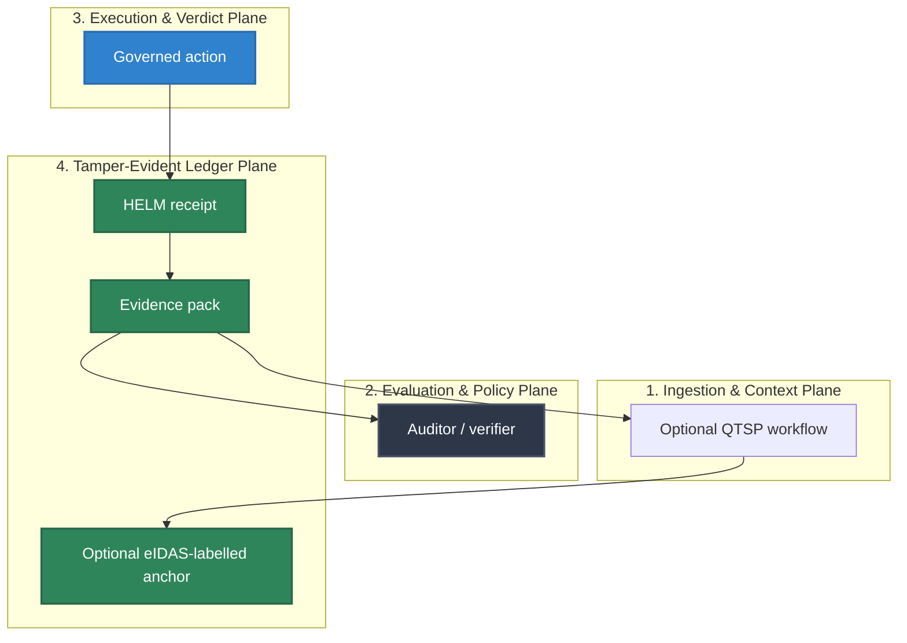

# eIDAS QTSP Anchoring

## Audience

Security and compliance reviewers checking the current eIDAS/QTSP evidence mapping limits for HELM AI Kernel.

## Outcome

After this page you should know what this surface is for, which source files own the behavior, which public route or adjacent page to use next, and which validation command to run before changing the claim.

## Source Truth

- Public route: `architecture/eidas-qtsp`
- Source document: `helm-ai-kernel/docs/architecture/eidas-qtsp.md`
- Public manifest: `helm-ai-kernel/docs/public-docs.manifest.json`
- Source inventory: `helm-ai-kernel/docs/source-inventory.manifest.json`
- Validation: `make docs-coverage`, `make docs-truth`, and `npm run coverage:inventory` from `docs-platform`

Do not expand this page with unsupported product, SDK, deployment, compliance, or integration claims unless the inventory manifest points to code, schemas, tests, examples, or an owner doc that proves the claim.

HELM AI Kernel contains optional RFC 3161/eIDAS anchoring building blocks. It
does not timestamp every EvidencePack, choose a Qualified Trust Service
Provider (QTSP), or determine that a timestamp is legally qualified by loading
an EU AI Act reference pack.

This document covers:

- the current library and CLI surfaces;
- what the EU List of Trusted Lists (LOTL) parser does and does not verify;
- what `--require-eidas` proves today; and
- why the EU AI Act v2 pack is mapping-only.

## Why qualified timestamps

Article 41(2) of
[Regulation (EU) No 910/2014](https://eur-lex.europa.eu/eli/reg/2014/910/oj)
gives a qualified electronic time stamp a presumption of the accuracy of its
date and time and the integrity of the data to which those are bound. That
legal status depends on the service and evidence meeting eIDAS requirements;
HELM metadata alone cannot create it. The EU AI Act mapping does not state
that a QTSP anchor is mandatory for every high-risk system.

## Architecture

### Anchor pipeline

The repository contains these optional components:

1. **ProofGraph anchors** in `core/pkg/proofgraph/anchor/`, including optional
   Rekor, RFC 3161, and eIDAS-labelled backends.
2. **`EIDASAnchor.Anchor`**, which submits a SHA-256 message imprint derived
   from the Merkle root to a configured RFC 3161 endpoint and stores the
   returned token in an anchor receipt.
3. **`EIDASAnchor.Verify`**, which parses certificates embedded in the token
   and requires at least one certificate thumbprint to be present in a supplied
   `EUTrustedList`. This is a library-level check; it is not selected by the EU
   AI Act reference pack.
4. **`helm-ai-kernel trust eu-list status`**, which can fetch and parse the
   configured LOTL endpoint or inspect an explicit local fixture.

The v2 EU AI Act pack has no `runtime_actions` or `actions`. Loading it through
`release.high_risk.v3.toml` therefore compiles zero runtime rules and remains
fail-closed.

### LOTL refresh

`core/pkg/trust/eu_trusted_list.go` fetches XML over HTTPS, parses the supplied
LOTL document, extracts qualifying service certificate thumbprints, and keeps
them in an in-memory cache. Its default refresh interval is 24 hours.

Important boundary: the current implementation does **not** verify the LOTL's
XML/XAdES signature and does not make pack field values configure refresh
freshness. The source explicitly leaves full XML-signature verification as
follow-up work. Do not treat a successful parse or a non-zero TSA count as
source-owned proof of a fully validated EU trust chain.

The current status command is:

```bash
helm-ai-kernel trust eu-list status
```

## Operator workflow

### Inspect the LOTL parser state

```bash
helm-ai-kernel trust eu-list status
```

Use `--fixture <path> --offline` for an explicit local XML fixture. A network
status invocation creates a fresh in-memory list for that command; this page
does not claim a durable, automatically refreshed trust store.

### Require eIDAS-labelled anchor metadata

```bash
helm-ai-kernel verify --require-eidas --eidas-max-age-hours 24 eu-evidence-pack.tar
```

Current limitation: this CLI gate inventories anchor JSON, rejects entries
whose `backend` is not `eidas-qtsp`, requires at least one eIDAS-labelled item,
requires a parseable non-zero `integrated_time`, and compares that declared
time with the requested age. It does **not** call `EIDASAnchor.Verify`, parse
the RFC 3161 token, validate its message imprint or signature, or consult an EU
trusted list. Therefore a passing CLI result is only a metadata-shape and
declared-time check, not cryptographic or legal qualification proof.

Current CLI failure modes include:

- no anchor metadata found;
- no `backend=eidas-qtsp` anchor; or
- missing/unparseable `integrated_time`; or
- an anchor `integrated_time` older than `--eidas-max-age-hours`.

Provider selection is outside this repository. Check the
[official Trusted List Browser](https://eidas.ec.europa.eu/efda/tl-browser/)
and obtain compliance/legal approval before relying on a service.

## Reference pack semantics

`reference_packs/eu_ai_act_high_risk.v2.json` records
`qtsp_timestamp_anchor: OPTIONAL_MAPPING_ONLY`. It does not configure a QTSP
endpoint, set LOTL freshness, require an anchor during receipt minting, or turn
on `--require-eidas`. Those are separate integration/operator choices. The pack
is evidence and control mapping metadata, not runtime enforcement or legal
advice.

## See also

- [Verification](../VERIFICATION.md) — full `helm-ai-kernel verify` reference
- [Architecture](../ARCHITECTURE.md) — kernel and anchor architecture
- [`core/pkg/proofgraph/anchor/eidas.go`](../../core/pkg/proofgraph/anchor/eidas.go) — implementation
- [`core/pkg/trust/eu_trusted_list.go`](../../core/pkg/trust/eu_trusted_list.go) — LOTL validator

## Troubleshooting

| Symptom | First check |
| --- | --- |
| Published output is stale or incomplete | Run `npm run helm-public:accuracy` in `docs-platform`, then check the source path and public manifest row for this page. |
| A claim needs implementation backing | Check the Source Truth files above and update the implementation, manifest, source inventory, or page in the same change. |

## Diagram


```mermaid
flowchart TD
    subgraph Ingestion["1. Ingestion & Context Plane"]
        qtsp["Optional QTSP workflow"]
    end

    subgraph Evaluation["2. Evaluation & Policy Plane"]
        auditor["Auditor / verifier"]
    end

    subgraph Execution["3. Execution & Verdict Plane"]
        action["Governed action"]
    end

    subgraph Ledger["4. Tamper-Evident Ledger Plane"]
        receipt["HELM receipt"]
        evidence["Evidence pack"]
        legal["Optional eIDAS-labelled anchor"]
    end

    %% Operational Flow Edges
    action --> receipt
    receipt --> evidence
    evidence --> auditor
    evidence --> qtsp
    qtsp --> legal

    %% Premium Styling Rules
    style action fill:#3182ce,stroke:#2b6cb0,stroke-width:2px,color:#fff
    style receipt fill:#2f855a,stroke:#276749,stroke-width:2px,color:#fff
    style evidence fill:#2f855a,stroke:#276749,stroke-width:2px,color:#fff
    style auditor fill:#2d3748,stroke:#4a5568,stroke-width:2px,color:#fff
    style legal fill:#2f855a,stroke:#276749,stroke-width:2px,color:#fff
```
