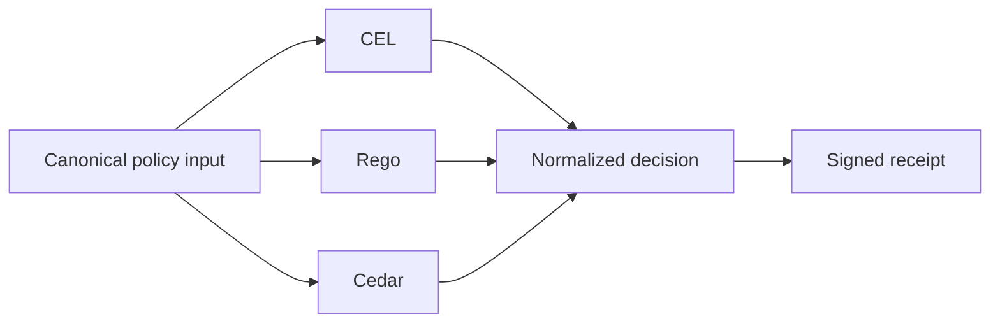

# Policy Languages — CEL, Rego, Cedar

## Audience

Use this page when you need the public `helm-oss/architecture/policy-languages` guidance without opening repo internals first. It is written for developers, operators, security reviewers, and evaluators who need to connect the docs website back to the owning HELM source files.

## Outcome

After this page you should know what this surface is for, which source files own the behavior, which public route or adjacent page to use next, and which validation command to run before changing the claim.

## Source Truth

- Public route: `helm-oss/architecture/policy-languages`
- Source document: `helm-oss/docs/architecture/policy-languages.md`
- Public manifest: `helm-oss/docs/public-docs.manifest.json`
- Source inventory: `helm-oss/docs/source-inventory.manifest.json`
- Validation: `make docs-coverage`, `make docs-truth`, and `npm run coverage:inventory` from `docs-platform`

Do not expand this page with unsupported product, SDK, deployment, compliance, or integration claims unless the inventory manifest points to code, schemas, tests, examples, or an owner doc that proves the claim.

## Troubleshooting

| Symptom | First check |
| --- | --- |
| The public page and source behavior disagree | Treat the source path in `Source Truth` as canonical, then update the docs and source-inventory row in the same change. |
| A link or route is missing from the docs website | Check `docs/public-docs.manifest.json`, `llms.txt`, search, and the per-page Markdown export before changing navigation. |
| A claim is not backed by code or tests | Remove the claim or add the missing code, example, schema, or validation command before publishing. |

helm-oss accepts policy sources written in three languages and routes
them through one enforcement boundary. The kernel never branches on
language at decision time; only the multi-language registry in
[`core/pkg/policybundles/registry.go`](../../core/pkg/policybundles/registry.go)
does, and only at compile/load.

## CEL — historical baseline

[Common Expression Language](https://github.com/google/cel-spec). Single
expression returning a verdict envelope. Carried via the existing
`core/pkg/celcheck/` and `core/pkg/policybundles/builtin.go` pipeline.

- Inputs: `request.action`, `request.principal.roles`, `request.context`.
- Strengths: fastest evaluation, smallest dependency footprint, best
  fit for attribute-mostly rules.
- Weaknesses: limited control flow; nested ternaries get unwieldy.
- Example: [`examples/policies/cel/example.cel`](../../examples/policies/cel/example.cel).

## OPA / Rego — procurement standard

[Rego](https://www.openpolicyagent.org/docs/latest/policy-language/) via
[`core/pkg/policybundles/rego/`](../../core/pkg/policybundles/rego/).

- Inputs: top-level `input` document.
- Strengths: rich set semantics, partial evaluation, mature ecosystem.
- Determinism guard:
  [`core/pkg/policybundles/rego/capabilities.json`](../../core/pkg/policybundles/rego/capabilities.json)
  forbids `http.send`, `time.now_ns`, `rand.intn`, and
  `crypto.x509.parse_certificates`.
- Example: [`examples/policies/rego/example.rego`](../../examples/policies/rego/example.rego).

## Cedar — entity-shape model

[Cedar](https://docs.cedarpolicy.com) via
[`core/pkg/policybundles/cedar/`](../../core/pkg/policybundles/cedar/).

- Inputs: principal/action/resource as `EntityUID` (`Type::"id"`); an
  optional entities document declares parent chains for the `in`
  operator.
- Strengths: explicit entity types, native role/group reasoning, AWS
  Verified Permissions interop.
- Example:
  [`examples/policies/cedar/example.cedar`](../../examples/policies/cedar/example.cedar)
  with companion entities at
  [`examples/policies/cedar/entities.json`](../../examples/policies/cedar/entities.json).

## Side-by-side: same logical rule

*Anyone may view; only admins may delete; default deny.*

```cel
request.action == "view"
  ? {"verdict": "ALLOW"}
  : (request.action == "delete" && ("admin" in request.principal.roles)
       ? {"verdict": "ALLOW"}
       : {"verdict": "DENY"})
```

```rego
package helm.policy
import rego.v1

default decision := {"verdict": "DENY"}
decision := {"verdict": "ALLOW"} if { input.action == "view" }
decision := {"verdict": "ALLOW"} if {
  input.action == "delete"
  "admin" in input.principal.roles
}
```

```cedar
permit(principal, action == Action::"view", resource);
permit(principal, action == Action::"delete", resource)
when { principal in Role::"admin" };
```

A regression test under `tests/conformance/policy-langs/` (Workstream
F1) will assert byte-identical decisions across all three on a
50-policy reference suite.

## Edge-case behavior

| Edge case | CEL | Rego | Cedar |
| --- | --- | --- | --- |
| Negation of undefined | undefined propagates | `not` is well-defined | requires explicit guards |
| Set membership on missing list | error / `false` | empty set | `in` returns `false` |
| Numeric overflow | int64 wraps | bignum-correct | int64 wraps |
| Role / group reasoning | flat `in roles` | set semantics + virtual docs | parent-chain via entities |
| Time predicates | `request.now()` injected | `time.now_ns` forbidden; use `input.now` | supply `context.now` |
| Recursion | not allowed | partial-eval supported | not allowed |

## Non-determinism rules (uniform)

Across all three languages, helm-oss enforces:

- No network I/O during evaluation.
- No random number generation.
- No system clock reads; the kernel injects `now`.
- No filesystem reads.
- No environment-variable reads.

Rego uses OPA's capabilities file. CEL uses the curated function set in
`core/pkg/celcheck/`. Cedar's spec excludes these operations natively.

## Choose your lane

| You want | Pick |
| --- | --- |
| Smallest footprint, fastest eval, attribute-mostly rules | **CEL** |
| Procurement-team-already-on-OPA, rich set semantics | **Rego** |
| Entity-rich auth, AWS Verified Permissions interop | **Cedar** |

Bundle manifests carry `language: cel | rego | cedar`. The kernel loads
+ dispatches via
[`core/pkg/policybundles/registry.go`](../../core/pkg/policybundles/registry.go).
The `helm bundle build` subcommand auto-detects from file extension when
`--language` is omitted.

## See also

- [`core/pkg/policybundles/registry.go`](../../core/pkg/policybundles/registry.go) — language dispatch
- [Conformance Profile v1](../CONFORMANCE.md) — required behavior across implementations
- [Verification](../VERIFICATION.md) — verifying a built bundle's hash

## Diagram


