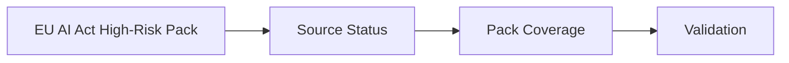

# EU AI Act High-Risk Pack

## Audience

Use this page when you need the public `helm-oss/compliance/eu-ai-act-high-risk-pack` guidance without opening repo internals first. It is written for developers, operators, security reviewers, and evaluators who need to connect the docs website back to the owning HELM source files.

## Outcome

After this page you should know what this surface is for, which source files own the behavior, which public route or adjacent page to use next, and which validation command to run before changing the claim.

## Source Truth

- Public route: `helm-oss/compliance/eu-ai-act-high-risk-pack`
- Source document: `helm-oss/docs/compliance/eu-ai-act-high-risk-pack.md`
- Public manifest: `helm-oss/docs/public-docs.manifest.json`
- Source inventory: `helm-oss/docs/source-inventory.manifest.json`
- Validation: `make docs-coverage`, `make docs-truth`, and `npm run coverage:inventory` from `docs-platform`

Do not expand this page with unsupported product, SDK, deployment, compliance, or integration claims unless the inventory manifest points to code, schemas, tests, examples, or an owner doc that proves the claim.

## Troubleshooting

| Symptom | First check |
| --- | --- |
| The public page and source behavior disagree | Treat the source path in `Source Truth` as canonical, then update the docs and source-inventory row in the same change. |
| A link or route is missing from the docs website | Check `docs/public-docs.manifest.json`, `llms.txt`, search, and the per-page Markdown export before changing navigation. |
| A claim is not backed by code or tests | Remove the claim or add the missing code, example, schema, or validation command before publishing. |

## Diagram

This scheme maps the main sections of EU AI Act High-Risk Pack in reading order.

The HELM OSS EU AI Act reference pack is `reference_packs/eu_ai_act_high_risk.v1.json`.

## Source Status

Primary source verified on April 30, 2026: the European Commission AI Act Service Desk timeline says the majority of AI Act rules start applying on August 2, 2026, including Annex III high-risk AI system rules, Article 50 transparency rules, innovation-support measures, and national/EU-level enforcement.

The same source notes that high-risk AI embedded in regulated products applies on August 2, 2027. The reference pack therefore distinguishes:

- `high_risk_full`: `2026-08-02`
- `high_risk_annex_i`: `2027-08-02`

## Pack Coverage

The pack maps HELM evidence requirements and policy rules to:

- Article 9 risk management;
- Article 11 technical documentation;
- Article 13 transparency;
- Article 14 human oversight;
- Annex III high-risk deployment areas.

The April 2026 MCP update also records two evidence requirements relevant to high-risk agent deployments:

- `oauth_resource_binding`: bearer tokens used at the MCP gateway are checked against the intended resource indicator;
- `tool_scope_enforcement`: per-tool scopes can be exposed in MCP metadata and enforced before execution.

These requirements complement, but do not replace, receipt signing, ProofGraph verification, AI-BOM availability, conformity-assessment evidence, and QTSP timestamp anchoring.
