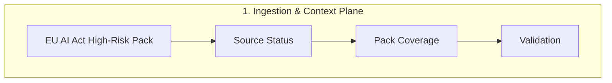

# EU AI Act High-Risk Pack

This page is a mapping only. It is not legal advice, conformity assessment,
certification, auditor acceptance, or proof that a deployment satisfies the EU
AI Act.

## Audience

Compliance reviewers using HELM AI Kernel evidence outputs to map, not certify, EU AI Act high-risk controls.

## Outcome

After this page you should know what this surface is for, which source files own the behavior, which public route or adjacent page to use next, and which validation command to run before changing the claim.

## Source Truth

- Public route: `compliance/eu-ai-act-high-risk-pack`
- Source document: `helm-ai-kernel/docs/compliance/eu-ai-act-high-risk-pack.md`
- Public manifest: `helm-ai-kernel/docs/public-docs.manifest.json`
- Source inventory: `helm-ai-kernel/docs/source-inventory.manifest.json`
- Validation: `make docs-coverage`, `make docs-truth`, and `npm run coverage:inventory` from `docs-platform`

Do not expand this page with unsupported product, SDK, deployment, compliance, or integration claims unless the inventory manifest points to code, schemas, tests, examples, or an owner doc that proves the claim.

## Troubleshooting

| Symptom | First check |
| --- | --- |
| Published output is stale or incomplete | Run `npm run helm-public:accuracy` in `docs-platform`, then check the source path and public manifest row for this page. |
| A claim needs implementation backing | Check the Source Truth files above and update the implementation, manifest, source inventory, or page in the same change. |

## Diagram

This scheme maps the main sections of EU AI Act High-Risk Pack in reading order.


```mermaid
flowchart TD
    subgraph Ingestion["1. Ingestion & Context Plane"]
        Page["EU AI Act High-Risk Pack"]
        A["Source Status"]
        B["Pack Coverage"]
        C["Validation"]
    end

    %% Operational Flow Edges
    Page --> A
    A --> B
    B --> C

    %% Premium Styling Rules
```


The current HELM AI Kernel EU AI Act mapping is
`reference_packs/eu_ai_act_high_risk.v2.json`. It contains no supported
top-level runtime actions and compiles fail-closed with zero allow-rules.

## Source Status

Primary sources verified against EUR-Lex on August 10, 2026. Regulation (EU)
2026/1744 amends Regulation (EU) 2024/1689 and defers the application of
Chapter III, Sections 1-3, **except Article 6(5)**:

- Annex III high-risk systems: from August 2, 2026 to **December 2, 2027**
- Annex I high-risk systems, embedded in regulated products: from August 2, 2027 to **August 2, 2028**

That narrow deferral does not move obligations in other sections or chapters.
Article 50 generally applies from August 2, 2026. Under amended Article 111(4),
providers of systems described by Article 50(2) that were placed on the market
before that date must comply with Article 50(2) by December 2, 2026.

Serious-incident reporting is Article 73, not Article 62. Its outer deadlines
are 15 days generally, two days for a widespread infringement or a serious
incident described by Article 3(49)(b), and 10 days where a person dies. The
duty to report immediately under the Article still applies. Articles 48, 49
and 71 (CE marking, registration and the EU database) also sit outside the
amended Sections 1-3 deferral. Whether any provision applies to a particular
system remains a legal determination outside this mapping.

The reference pack therefore records:

- `article_50_general_application`: `2026-08-02`
- `article_50_2_preexisting_system_transition`: `2026-12-02`
- `chapter_iii_sections_1_3_annex_iii`: `2027-12-02`
- `chapter_iii_sections_1_3_annex_i`: `2028-08-02`
- `article_6_5_deferred`: `false`

Sources: EUR-Lex CELEX 32024R1689 and CELEX 32026R1744
([Regulation 2024/1689](http://data.europa.eu/eli/reg/2024/1689/oj),
[Regulation 2026/1744](http://data.europa.eu/eli/reg/2026/1744/oj)).

`reference_packs/eu_ai_act_high_risk.v1.json` is a previously released
artifact. Its bytes remain unchanged (SHA-256
`8a33ad51441d6d939d74da2be388c1d11c12da1e055f1aeca72ca2763ebc05c4`);
supersession and corrected-source metadata live in v2 and this guide rather
than rewriting the released v1 file.

## Pack Coverage

The pack maps selected controls, evidence names and **candidate** policy
outcomes to:

- Article 9 risk management;
- Article 11 technical documentation;
- Article 13 transparency;
- Article 14 human oversight;
- Annex III high-risk deployment areas.

The mapping records evidence categories that can be relevant to high-risk
agent deployments, including:

- signed receipts and ProofGraph references;
- EvidencePacks and audit-chain records;
- AI-BOM and conformity records;
- OAuth resource-binding and tool-scope records; and
- an optional QTSP timestamp-anchor mapping.

The v2 JSON does not configure or prove those controls. In particular it has
no `qtsp_required`, LOTL freshness, arbitrary budget, `runtime_actions`, or
`actions` field. Operators must configure and verify supported runtime policy
and evidence paths separately.

<!-- docs-depth-final-pass -->

## Evidence Boundary

This pack is a documentation and evidence mapping layer, not a legal
conclusion. Candidate conditions are not compiled by the daemon. The canonical
contract test in `core/cmd/helm-ai-kernel/quickstart_cmd_test.go` rejects an
empty or enforcement-shaped v2 mapping, protects the released v1 bytes, and
proves that the sample policy compiles with zero runtime rules. Customer- or
system-specific applicability, conformity assessment, regulator filings and
legal sign-off remain outside the pack.

## Validation

```bash
cd core
GOWORK=off go test ./cmd/helm-ai-kernel -run '^TestCanonicalEUAIActMappingPackContract$'
GOWORK=off go test ./pkg/compliance/euaiact ./pkg/compliance/regwatch
```
