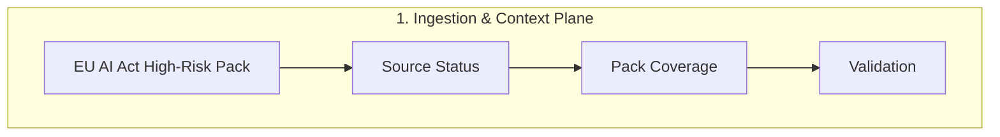

# EU AI Act High-Risk Pack

This page is a mapping only. It is not legal advice, conformity assessment,
certification, auditor acceptance, or proof that a deployment satisfies the EU
AI Act.

## Audience

Compliance reviewers using HELM AI Kernel evidence outputs to map, not certify, EU AI Act high-risk controls.

## Outcome

After this page you should know what this surface is for, which source files own the behavior, which public route or adjacent page to use next, and which validation command to run before changing the claim.

## Source Truth

- Public route: `compliance/eu-ai-act-high-risk-pack`
- Source document: `helm-ai-kernel/docs/compliance/eu-ai-act-high-risk-pack.md`
- Public manifest: `helm-ai-kernel/docs/public-docs.manifest.json`
- Source inventory: `helm-ai-kernel/docs/source-inventory.manifest.json`
- Validation: `make docs-coverage`, `make docs-truth`, and `npm run coverage:inventory` from `docs-platform`

Do not expand this page with unsupported product, SDK, deployment, compliance, or integration claims unless the inventory manifest points to code, schemas, tests, examples, or an owner doc that proves the claim.

## Troubleshooting

| Symptom | First check |
| --- | --- |
| Published output is stale or incomplete | Run `npm run helm-public:accuracy` in `docs-platform`, then check the source path and public manifest row for this page. |
| A claim needs implementation backing | Check the Source Truth files above and update the implementation, manifest, source inventory, or page in the same change. |

## Diagram

This scheme maps the main sections of EU AI Act High-Risk Pack in reading order.

```mermaid
flowchart TD
    subgraph Ingestion["1. Ingestion & Context Plane"]
        Page["EU AI Act High-Risk Pack"]
        A["Source Status"]
        B["Pack Coverage"]
        C["Validation"]
    end

    %% Operational Flow Edges
    Page --> A
    A --> B
    B --> C

    %% Premium Styling Rules
```

The HELM AI Kernel EU AI Act reference pack is `reference_packs/eu_ai_act_high_risk.v2.json`.

## Source Status

Primary source verified on August 6, 2026 against EUR-Lex. Regulation (EU) 2026/1744 (Digital Omnibus on AI), adopted July 8, 2026 and in force July 27, 2026, amends Regulation (EU) 2024/1689 and defers the application of Chapter III, Sections 1-3:

- Annex III high-risk systems: from August 2, 2026 to **December 2, 2027**
- Annex I high-risk systems, embedded in regulated products: from August 2, 2027 to **August 2, 2028**

Article 50 transparency obligations were not deferred and apply from August 2, 2026.

The reference pack therefore records:

- `transparency_art_50`: `2026-08-02`
- `high_risk_annex_iii`: `2027-12-02` — replaces the v1 key `high_risk_full`, which was ambiguous once the two high-risk dates diverged
- `high_risk_annex_i`: `2028-08-02`

Sources: EUR-Lex CELEX 32024R1689 and CELEX 32026R1744 (`http://data.europa.eu/eli/reg/2026/1744/oj`).

An earlier version of this page cited the European Commission AI Act Service Desk timeline, verified April 30, 2026, for an August 2, 2026 high-risk date. That statement was accurate when written and was superseded by the amending Regulation on July 27, 2026. `reference_packs/eu_ai_act_high_risk.v1.json` stays in the repository marked `superseded` so previously shipped evidence remains auditable.

## Pack Coverage

The pack maps HELM evidence requirements and policy rules to:

- Article 9 risk management;
- Article 11 technical documentation;
- Article 13 transparency;
- Article 14 human oversight;
- Annex III high-risk deployment areas.

The April 2026 MCP update also records two evidence requirements relevant to high-risk agent deployments:

- `oauth_resource_binding`: bearer tokens used at the MCP gateway are checked against the intended resource indicator;
- `tool_scope_enforcement`: per-tool scopes can be exposed in MCP metadata and enforced before execution.

These requirements complement, but do not replace, receipt signing, ProofGraph verification, AI-BOM availability, conformity-assessment evidence, and QTSP timestamp anchoring.

<!-- docs-depth-final-pass -->

## Evidence Boundary

This pack is a documentation and evidence mapping layer, not a legal conclusion. A release-ready pack should identify the receipt fields, policy bundle, evidence export, operator control, and verification command that support each mapped obligation. When the implementation changes, update the mapping by linking to schemas, tests, and example EvidencePacks instead of copying unsupported compliance language. Public docs can describe what HELM AI Kernel can produce for an evaluator; customer or legal-specific filings belong outside anonymous exports. The minimum acceptance path is: generate a governed decision, export its EvidencePack, verify the receipt offline, and show which mapped controls the exported artifact supports.
