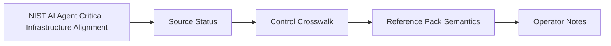

# NIST AI Agent Critical Infrastructure Alignment

## Audience

Security and compliance reviewers mapping HELM OSS receipts and conformance evidence to NIST critical-infrastructure concerns.

## Outcome

After this page you should know what this surface is for, which source files own the behavior, which public route or adjacent page to use next, and which validation command to run before changing the claim.

## Source Truth

- Public route: `helm-oss/compliance/nist-ai-agent-critical-infrastructure`
- Source document: `helm-oss/docs/compliance/nist-ai-agent-critical-infrastructure.md`
- Public manifest: `helm-oss/docs/public-docs.manifest.json`
- Source inventory: `helm-oss/docs/source-inventory.manifest.json`
- Validation: `make docs-coverage`, `make docs-truth`, and `npm run coverage:inventory` from `docs-platform`

Do not expand this page with unsupported product, SDK, deployment, compliance, or integration claims unless the inventory manifest points to code, schemas, tests, examples, or an owner doc that proves the claim.

## Troubleshooting

| Symptom | First check |
| --- | --- |
| The public page and source behavior disagree | Treat the source path in `Source Truth` as canonical, then update the docs and source-inventory row in the same change. |
| A link or route is missing from the docs website | Check `docs/public-docs.manifest.json`, `llms.txt`, search, and the per-page Markdown export before changing navigation. |
| A claim is not backed by code or tests | Remove the claim or add the missing code, example, schema, or validation command before publishing. |

## Diagram

This scheme maps the main sections of NIST AI Agent Critical Infrastructure Alignment in reading order.

This page maps current NIST AI-agent and critical-infrastructure work to HELM OSS controls.

## Source Status

NIST has not published a finalized "AI Agent - Critical Infrastructure Profile" as of April 29, 2026. The implemented HELM artifact is therefore an early alignment pack grounded in these current NIST sources:

| Source | Status | HELM use |
| --- | --- | --- |
| [NIST AI Agent Standards Initiative](https://www.nist.gov/artificial-intelligence/ai-agent-standards-initiative) | Created February 17, 2026, updated April 20, 2026 | Agent identity, authorization, secure protocol, and interoperability mapping |
| [NIST AI RMF Profile on Trustworthy AI in Critical Infrastructure concept note](https://www.nist.gov/programs-projects/concept-note-ai-rmf-profile-trustworthy-ai-critical-infrastructure) | Started April 2026, ongoing | Critical-infrastructure risk-management mapping |
| [NCCoE Software and AI Agent Identity and Authorization](https://www.nccoe.nist.gov/projects/software-and-ai-agent-identity-and-authorization) | Reviewing comments after the April 2, 2026 comment deadline | Non-human identity, delegated authority, auditing, and non-repudiation mapping |

The reference pack is `reference_packs/nist_ai_agent_cip.v1.json`. It should be treated as a concept-note alignment until NIST publishes a stable control catalog or profile.

## Control Crosswalk

| NIST direction | HELM control surface | Evidence emitted |
| --- | --- | --- |
| Agents operate securely on behalf of users | `DecisionRequest.Principal`, machine identity schemas, delegation sessions | Signed `DecisionRecord`, `AuthorizedExecutionIntent`, delegation metadata |
| Agent access and actions are authorized before execution | Guardian freeze, context, identity, egress, taint, threat, delegation, privilege, and PRG gates | Decision verdict, reason code, policy content hash, effect digest |
| Agent-to-tool protocols need secure interoperability | Connector manifests, MCP integration, effect schemas, capability packs | Tool schema reference, connector manifest hash, evidence pack export |
| Critical-infrastructure AI needs lifecycle risk management | Reference-pack overlays, effect type catalog, P0/P1/P2 ceilings, approval artifacts | ProofGraph, receipt chain, approval references, audit logs |
| Supply-chain trust must extend across AI and CI lifecycles | Pack verifier, module provenance, AI-BOM, content-addressed policy state | Pack attestation, policy hash, provenance envelope, evidence retention |

## Reference Pack Semantics

The `nist-ai-agent-cip-v1` pack contains four active programs:

1. `prog-agent-identity-authorization` - binds every autonomous action to a principal and scoped delegation authority.
2. `prog-critical-infrastructure-risk` - requires approval or fail-closed denial for high-impact critical-infrastructure effects.
3. `prog-secure-interoperable-protocols` - denies unmanaged connector and protocol surfaces.
4. `prog-supply-chain-assurance` - requires provenance and policy-content evidence for critical-infrastructure activation.

The pack deliberately uses HELM's existing reference-pack vocabulary. It does not claim NIST endorsement or final profile conformance.

## Operator Notes

For critical-infrastructure deployments, set `critical_infrastructure=true` in the policy context and bind the `nist-ai-agent-cip-v1` reference pack alongside jurisdiction and industry packs. The pack assumes:

- Agent identity is present before any side-effecting action.
- Delegated authority is validated when an agent acts for a user or another agent.
- High-risk CI effects have approval evidence before execution.
- Policy and artifact state is content-addressed.
- Evidence packs are retained long enough for incident reconstruction and audit review.
