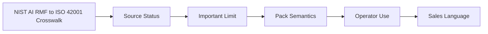

# NIST AI RMF to ISO 42001 Crosswalk

## Audience

Compliance reviewers comparing HELM AI Kernel evidence surfaces with NIST AI RMF and ISO 42001 control language.

## Outcome

After this page you should know what this surface is for, which source files own the behavior, which public route or adjacent page to use next, and which validation command to run before changing the claim.

## Source Truth

- Public route: `helm-ai-kernel/compliance/nist-ai-rmf-iso-42001-crosswalk`
- Source document: `helm-ai-kernel/docs/compliance/nist-ai-rmf-iso-42001-crosswalk.md`
- Public manifest: `helm-ai-kernel/docs/public-docs.manifest.json`
- Source inventory: `helm-ai-kernel/docs/source-inventory.manifest.json`
- Validation: `make docs-coverage`, `make docs-truth`, and `npm run coverage:inventory` from `docs-platform`

Do not expand this page with unsupported product, SDK, deployment, compliance, or integration claims unless the inventory manifest points to code, schemas, tests, examples, or an owner doc that proves the claim.

## Troubleshooting

| Symptom | First check |
| --- | --- |
| The public page and source behavior disagree | Treat the source path in `Source Truth` as canonical, then update the docs and source-inventory row in the same change. |
| A link or route is missing from the docs website | Check `docs/public-docs.manifest.json`, `llms.txt`, search, and the per-page Markdown export before changing navigation. |
| A claim is not backed by code or tests | Remove the claim or add the missing code, example, schema, or validation command before publishing. |

## Diagram

This scheme maps the main sections of NIST AI RMF to ISO 42001 Crosswalk in reading order.

This page maps the HELM AI Kernel `reference_packs/iso_42001.v1.json` pack to NIST AI RMF 1.0 functions. The goal is one runtime evidence set that can support ISO 42001 AI management system audit readiness and NIST AI RMF reporting.

## Source Status

| Source | Status | HELM use |
| --- | --- | --- |
| [NIST AI RMF crosswalks](https://www.nist.gov/itl/ai-risk-management-framework/crosswalks-nist-artificial-intelligence-risk-management-framework) | NIST page updated December 17, 2024 | Confirms NIST publishes AI RMF crosswalks and treats international standards alignment as a priority |
| [NIST AI RMF to ISO/IEC 42001 crosswalk](https://airc.nist.gov/docs/NIST_AI_RMF_to_ISO_IEC_42001_Crosswalk.pdf) | Public crosswalk PDF | Maps AI RMF functions and categories to ISO 42001 clauses and Annex B controls |
| [ISO/IEC 42001:2023](https://www.iso.org/standard/42001) | Published international standard, December 2023 | Defines the AI management system standard that this reference pack models |

## Important Limit

This is a dual-framework evidence pack, not a dual-certification claim. ISO/IEC 42001 can be certified only through an appropriate audit process. NIST AI RMF is a voluntary risk-management framework, not a certification program. HELM produces signed runtime evidence that can support both conversations; it does not grant certification or substitute for legal, auditor, or certification-body review.

## Pack Semantics

The pack remains `iso-42001-v1`; ISO 42001 is the primary control vocabulary. The NIST AI RMF crosswalk is embedded as `nist_ai_rmf_crosswalk` metadata on each program:

| Pack program | ISO 42001 basis | NIST AI RMF functions | HELM evidence |
| --- | --- | --- | --- |
| `prog-leadership` | Clauses 5 and 6 | Govern, Map | Policy content hash, decision owner, management review interval, approval trace |
| `prog-operational-control` | Clause 8 and Annex B lifecycle controls | Govern, Map | Policy simulation, risk treatment verdict, AI-BOM presence, receipt chain, human oversight requirement |
| `prog-performance-evaluation` | Clause 9 | Measure, Govern | Decision record, evidence pack, policy replay result, audit chain verification |
| `prog-improvement` | Clause 10 | Manage | Compliance score, nonconformity escalation, corrective action reference, policy activation history |

## Operator Use

Attach `reference_packs/iso_42001.v1.json` to an AI system or workspace when the operator needs both:

1. ISO 42001-style AIMS control evidence.
2. NIST AI RMF reporting categories for governance, mapping, measurement, and risk management.

The pack should be used with HELM receipt signing, ProofGraph, AI-BOM, and evidence-pack export enabled. A complete evidence export should include:

- Signed `DecisionRecord` for every relevant action.
- Active policy bundle hash.
- Pack ID and pack version.
- AI-BOM or equivalent system inventory reference.
- Policy replay output for sampled or disputed decisions.
- Management review interval and escalation evidence.

## Sales Language

Use: "one runtime evidence pack for ISO 42001 audit readiness and NIST AI RMF reporting."

Do not use: "one pack, two certifications." That overstates NIST AI RMF and implies certification outcomes HELM cannot grant.
