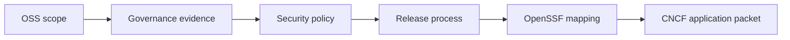

# helm-oss CNCF Sandbox Application

## Audience

Maintainers using this internal governance note to track source-backed CNCF-readiness evidence for HELM OSS.

## Outcome

After this page you should know what this surface is for, which source files own the behavior, which public route or adjacent page to use next, and which validation command to run before changing the claim.

## Source Truth

- Public route: `helm-oss/governance/cncf-application`
- Source document: `helm-oss/docs/governance/cncf-application.md`
- Public manifest: `helm-oss/docs/public-docs.manifest.json`
- Source inventory: `helm-oss/docs/source-inventory.manifest.json`
- Validation: `make docs-coverage`, `make docs-truth`, and `npm run coverage:inventory` from `docs-platform`

Do not expand this page with unsupported product, SDK, deployment, compliance, or integration claims unless the inventory manifest points to code, schemas, tests, examples, or an owner doc that proves the claim.

## Troubleshooting

| Symptom | First check |
| --- | --- |
| The public page and source behavior disagree | Treat the source path in `Source Truth` as canonical, then update the docs and source-inventory row in the same change. |
| A link or route is missing from the docs website | Check `docs/public-docs.manifest.json`, `llms.txt`, search, and the per-page Markdown export before changing navigation. |
| A claim is not backed by code or tests | Remove the claim or add the missing code, example, schema, or validation command before publishing. |

This document is the canonical narrative used to file helm-oss for CNCF
Sandbox admission. It is intentionally short and references the project's
existing governance, security, and release artifacts rather than restating
them.

## Project Name

**helm-oss** — open-source execution kernel for governed AI tool calling.

## Description

helm-oss is a fail-closed execution boundary that sits between an AI agent
or tool-calling LLM and the systems it would otherwise call directly. It
applies policy bundles (CEL today; Rego and Cedar planned), records signed
receipts for both allow and deny decisions, anchors evidence in
transparency logs (Sigstore Rekor and RFC 3161 TSA), and exports evidence
packs that any third party can verify offline with the bundled `helm verify`
CLI.

The kernel is small (a few hundred KB binary), pure Go, and ships with
production-aligned SBOM material, release attestation, and reproducible
builds. OpenVEX policy source is retained in the repository and should only be
described as a published release asset when attached to a GitHub release. The
repository contains the kernel, its CLI, the OpenAI-compatible
proxy, the MCP server, and five public SDKs (Go, Python, TypeScript, Rust,
Java).

## Sponsor

CNCF TOC liaison: known gap owned by governance; update this field when a
named liaison confirms sponsorship.

## Problem Statement

AI agents increasingly invoke tools and APIs autonomously. The execution
path between the agent and those tools is today an unaudited gap: prompts,
policies, and outcomes are not bound together by anything a regulator,
customer, or downstream consumer can independently verify. Existing OSS
options solve adjacent problems (model-evaluation, prompt-firewalling,
guardrail-libraries) but none provide a verifiable, signed, replayable
record of every governed call.

helm-oss closes that gap by being an execution-side governance kernel:
policy enforcement is a fail-closed precondition for the call, every
allow/deny decision produces a signed receipt, every receipt is anchored
in a transparency log, and every receipt can be verified offline against
the published trust roots.

## Why CNCF

helm-oss is a cloud-native control plane for AI tool calling: it ships as
a container image, deploys via a Helm chart, exposes Prometheus metrics,
emits OpenTelemetry spans (with planned GenAI semconv adoption), and is
governed neutrally rather than as a single-vendor stack. CNCF Sandbox
gives the project the neutral home its enterprise consumers expect for
infrastructure they will run on the execution path.

## Alignment with Cloud-Native Principles

- **Container-first**: published as `ghcr.io/mindburn-labs/helm-oss` with a
  slim variant; deployed via `deploy/helm-chart/`.
- **Declarative configuration**: signed policy bundles loaded at startup;
  no runtime configuration drift.
- **Observability**: OpenTelemetry tracing, Prometheus metrics, and
  structured logs by default.
- **Open standards**: CycloneDX SBOM material, release attestation, optional
  OpenVEX release assets, Sigstore Rekor, RFC 3161, TUF, SLSA, OpenSSF
  Scorecard, Verifiable Credentials, ML-DSA-65 PQC signatures.
- **Vendor-neutral identity**: planned W3C DID resolver and IATP-shaped
  agent handshake.

## Current Adoption Signals

- Five maintained public SDKs in active use across the Go, Python,
  TypeScript, Rust, and Java ecosystems.
- Conformance Profile v1 (`tests/conformance/profile-v1/`) used by
  external implementers as a compatibility target.
- Public benchmark snapshots pinned per release under
  `benchmarks/results/v<version>.json`.

The project's commercial and pre-commercial adoption signals are tracked
outside this repository and provided to the CNCF TOC under the application's
private appendix.

## License

Apache-2.0. See `LICENSE`.

## Governance

Project governance is documented in `GOVERNANCE.md`. The maintainer
roster is in `MAINTAINERS.md`. Decisions follow lazy consensus, with
super-majority gates for breaking and governance changes. The Code of
Conduct is the Contributor Covenant 2.1, with reports routed to
`conduct@mindburn.org`.

## Security

Security policy is in `SECURITY.md`. Vulnerability reports go to
`security@mindburn.org`. Releases are built reproducibly (verified by the
`reproducibility-check` job in `.github/workflows/release.yml`) and shipped with
checksums, SBOM material, and release attestation. Cosign bundle and OpenVEX
verification apply when those files are attached to the GitHub release; the
current public `v0.4.0` release published on 2026-04-25 does not attach
`*.cosign.bundle` or `*.openvex.json` assets. Continuous fuzzing is configured
for upstream OSS-Fuzz under `oss-fuzz/`. The OpenSSF Scorecard runs weekly via
`.github/workflows/scorecard.yml`. The OpenSSF Best Practices gold-tier mapping
is in `BEST_PRACTICES.md`.

## Forward Plan

Per-release planning is tracked through GitHub issues and surfaced per
release through `CHANGELOG.md`. A condensed view is published in
`README.md` and `docs/index.md`.

## Relationship with LF AI

The HELM Conformance Profile v1
(`tests/conformance/profile-v1/`) is being submitted to LF AI as a
cross-implementation conformance profile. The relationship is:

- **CNCF (this application)**: governs the helm-oss kernel — code,
  binaries, container images, Helm chart, SDKs.
- **LF AI**: governs the Conformance Profile as a vendor-neutral
  specification with multiple implementations.

The two homes are complementary. helm-oss as the reference implementation
lives at CNCF; the conformance specification it implements lives at LF AI,
allowing competing implementations to certify against the same axes
without depending on the helm-oss codebase.

## Application Status

| Step | Status |
| --- | --- |
| Governance documented | Done (`GOVERNANCE.md`) |
| Maintainer roster published | Done (`MAINTAINERS.md`) |
| Security policy published | Done (`SECURITY.md`) |
| OpenSSF Best Practices submission | In progress (`BEST_PRACTICES.md`) |
| OSS-Fuzz upstream PR | In progress (`oss-fuzz/`) |
| TOC sponsor identified | Known gap; governance owner |
| Sandbox proposal filed | Known gap; governance owner |

## Diagram

