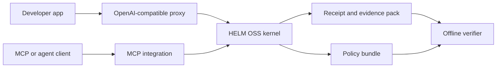

# HELM OSS Developer Portal

HELM OSS is the open execution boundary for governed AI tool use. It gives developers a local kernel, policy bundle loader, OpenAI-compatible proxy path, MCP integration, receipts, evidence packs, and offline verification without requiring a hosted control plane.

## Audience

This page is for open-source developers, platform teams, security reviewers, and framework authors who need to integrate or inspect the HELM kernel directly. If you need workspaces, approvals, SSO, retention, or team administration, start with the Teams and Enterprise docs on `helm.docs.mindburn.org`.

## Outcome

After this page you should know which public HELM OSS surface to use:

- quickstart for a local boundary;
- developer journey for end-to-end install, runtime, SDK, deployment, and verification coverage;
- architecture for the trust and execution model;
- CLI and SDKs for integration;
- MCP and OpenAI-compatible proxy for agent frameworks;
- conformance and verification for CI and audits;
- publishing and compatibility docs for release consumers.

## OSS Boundary Map

## Source Truth

This portal is assembled from source-owned docs:

- `docs/QUICKSTART.md`
- `docs/DEVELOPER_JOURNEY.md`
- `docs/ARCHITECTURE.md`
- `docs/CONFORMANCE.md`
- `docs/VERIFICATION.md`
- `docs/COMPATIBILITY.md`
- `docs/PUBLISHING.md`
- `docs/INTEGRATIONS/`
- `docs/security/`
- `docs/compliance/`

The code, command output, and verification artifacts override marketing language. If a doc claim cannot be mapped to a source file, command, or artifact, remove or qualify it.

## Start Here

1. Run the quickstart: [Quickstart](QUICKSTART.md).
2. Use the complete source-backed path: [Developer Journey](DEVELOPER_JOURNEY.md).
3. Read the execution model: [Architecture](ARCHITECTURE.md).
4. Pick an integration:
   - [OpenAI-compatible proxy](INTEGRATIONS/openai_baseurl.md)
   - [MCP integration](INTEGRATIONS/mcp.md)
   - [SDK index](sdks/00_INDEX.md)
5. Verify an output: [Verification](VERIFICATION.md).
6. Add conformance checks: [Conformance](CONFORMANCE.md).

## Interfaces

| Interface | Use When | Public Doc |
| --- | --- | --- |
| CLI | You want local serving, policy loading, receipts, or verification commands. | [Quickstart](QUICKSTART.md) |
| OpenAI-compatible proxy | You have an existing OpenAI-style client and want a small integration diff. | [Proxy integration](INTEGRATIONS/openai_baseurl.md) |
| MCP | You are exposing governed tools to MCP-capable clients. | [MCP integration](INTEGRATIONS/mcp.md) |
| SDKs | You need typed wrappers or generated examples. | [SDK index](sdks/00_INDEX.md) |
| Verifier | You need replayable evidence independent of the model provider. | [Verification](VERIFICATION.md) |

## Trust and Compliance

HELM OSS docs separate implementation security from compliance mapping:

- [Execution Security Model](EXECUTION_SECURITY_MODEL.md) describes containment, policy evaluation, receipts, and evidence.
- [OWASP MCP Threat Mapping](OWASP_MCP_THREAT_MAPPING.md) maps MCP-specific risks to HELM controls.
- [OWASP Agentic Top 10 Mapping](security/owasp-agentic-top10-coverage.md) maps agentic failure modes to boundary controls.
- [NIST AI RMF to ISO 42001 Crosswalk](compliance/nist-ai-rmf-iso-42001-crosswalk.md) explains how reference packs are intended to support operator evidence.

## Compatibility and Publishing

Use [Compatibility](COMPATIBILITY.md) before relying on a public surface. Use [Publishing](PUBLISHING.md) before consuming release artifacts or publishing downstream packages. The docs intentionally distinguish retained compatibility paths from preferred paths so agents and humans can choose the least surprising integration.

## Troubleshooting

| Problem | Where to Go |
| --- | --- |
| Local proxy starts but receipts are missing | [Troubleshooting](TROUBLESHOOTING.md) and [Proxy integration](INTEGRATIONS/openai_baseurl.md) |
| A bundle does not verify | [Verification](VERIFICATION.md) |
| A framework adapter behaves differently from direct CLI use | [Compatibility](COMPATIBILITY.md) |
| A public release artifact cannot be trusted | [Publishing](PUBLISHING.md) |
| A security reviewer asks what is in the trust boundary | [Execution Security Model](EXECUTION_SECURITY_MODEL.md) |

## Support Path

For bugs, include the HELM version, policy bundle hash, command used, receipt ID or bundle path, and verifier output. Do not include provider keys, private prompts, customer data, or unredacted receipts from production tenants.
