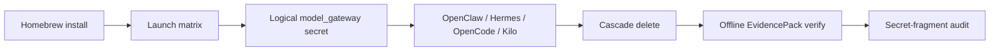

# Launchpad Clean Install GA

Status: v0.5.5 gate implemented; v1.0 keeps the supported-app clean-install
gate focused on OpenClaw and Hermes, with a separate candidate probe for
OpenCode and Kilo Code.

Launchpad GA is a product-adoption gate for the `v0.5.4` release. It proves the
Homebrew package, signed Launchpad artifacts, local-container app launcher,
MCP interceptor posture, signed receipts, teardown, and offline EvidencePack
verification survive a machine that did not build the release.

## Audience

This page is for release owners, Launchpad maintainers, and operators who need
to prove a supported app can be installed and removed from a clean workstation
without relying on a developer checkout.

## Outcome

You should leave with the supported-app gate, the exact clean-machine command
sequence, and the evidence files that prove install, launch, teardown, and
offline verification.

## Source Truth

- Release: <https://github.com/Mindburn-Labs/helm-ai-kernel/releases/tag/v0.5.4>
- Launchpad artifact workflow: <https://github.com/Mindburn-Labs/helm-ai-kernel/actions/runs/26110916296>
- Release workflow: <https://github.com/Mindburn-Labs/helm-ai-kernel/actions/runs/26131090671>
- Homebrew tap PR: <https://github.com/mindburnlabs/homebrew-tap/pull/2>
- Final release report: `docs/launchpad/final_report.json`
- Clean-install report: `docs/launchpad/clean_install_report.json`



## Required Secret

Live local-container conformance uses a scoped OpenRouter test key. Store the
fresh CI-only key as `HELM_LAUNCHPAD_CI_OPENROUTER_API_KEY`. Workflows map it to
`OPENROUTER_API_KEY` only inside the live Launchpad test step. Do not commit the
key, fragments, screenshots, or raw logs.

## Clean Machine Commands

Run these from a clean macOS developer machine with Homebrew, `gh`, and a
Docker-compatible runtime such as Docker Desktop or Colima:

```bash
brew update
brew install mindburnlabs/tap/helm-ai-kernel
helm-ai-kernel launch matrix --json
helm-ai-kernel launch secrets set model_gateway --provider openrouter --value-env OPENROUTER_API_KEY
helm-ai-kernel launch openclaw local-container --headless --output json
helm-ai-kernel launch hermes local-container --headless --output json
helm-ai-kernel launch delete <launch_id> --cascade
helm-ai-kernel verify --bundle <pack>
```

Use the repo-native gate to collect redacted evidence:

```bash
export HELM_LAUNCHPAD_CI_OPENROUTER_API_KEY='<fresh CI-only key>'
bash scripts/launch/clean_install_gate.sh \
  --release-tag v0.5.4 \
  --artifact-run-id 26110916296 \
  --host-kind developer_macos \
  --output docs/launchpad/clean_install_report.json
```

OpenCode and Kilo Code are candidate promotion probes, not supported-app clean
install commands:

```bash
bash scripts/launch/clean_install_gate.sh \
  --release-tag v0.5.4 \
  --artifact-run-id 26110916296 \
  --host-kind developer_macos \
  --output docs/launchpad/clean_install_report.json \
  --include-candidates
```

The script downloads the signed Launchpad artifact manifest, resolves the
immutable egress-proxy image, confirms app GHCR digests, launches the selected
app set through `local-container`, deletes each launch with `--cascade`, verifies every
produced EvidencePack, and scans command output, GitHub logs, release
notes/assets, reports, and EvidencePacks for the CI key and fixed-length key
fragments without printing the secret. The default supported app set is
OpenClaw and Hermes. `--include-candidates` adds OpenCode and Kilo Code and is
expected to fail until their live conformance, teardown, receipt, and offline
EvidencePack verification complete.

## Supported App Digests

| App | Availability | Image |
| --- | --- | --- |
| OpenClaw | `oss_supported` | `ghcr.io/mindburn-labs/helm-launchpad/openclaw@sha256:808d750ed3ce3e29ed45d68c00c9c77ff50990204b3fe563b9f45d00f1beb88e` |
| Hermes | `oss_supported` | `ghcr.io/mindburn-labs/helm-launchpad/hermes@sha256:b970c2308182384377670704f6769e200eef89e18cc1a1102de9cba0d2437527` |
| OpenCode | `oss_candidate` | `ghcr.io/mindburn-labs/helm-launchpad/opencode@sha256:fd3db72a2acfae066e455241f17800bd698070d2126e534e18a441f7910ed35b`; live conformance pending |
| Kilo Code | `oss_candidate` | `ghcr.io/mindburn-labs/helm-launchpad/kilocode@sha256:f2d741249f09b2d5b6c512413fdeadba06e200652e10355287a7758b15cdbe69`; live conformance pending |

Codex, Claude Code, Cursor, and Junie remain external/BYO adapters.

## CI Gate

Manual CI entrypoint:

```bash
gh workflow run launchpad-clean-install.yml \
  --repo Mindburn-Labs/helm-ai-kernel \
  -f release_tag=v0.5.4 \
  -f artifact_run_id=26110916296
```

The CI report is a repeatability signal. The separate clean Mac report remains
the canonical GA evidence for developer experience.

## Troubleshooting

| Condition | Response |
| --- | --- |
| Homebrew package is unavailable | Recheck the release tag, tap PR, and release workflow before running app launch commands. |
| Launch fails before receipts | Treat the gate as failed and inspect policy, sandbox, and provider readiness from the redacted report. |
| EvidencePack verification fails | Do not promote the app; rerun with fresh artifacts and preserve the failed verification output. |
| Teardown leaves resources | Reconcile local/container resources before declaring the machine clean. |
