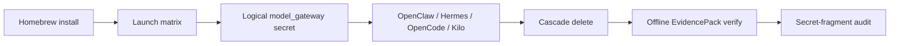

# Launchpad Clean Install GA

Status: v0.5.5 gate implemented; v1 promotes OpenClaw, Hermes, OpenCode, and
Kilo Code into the supported-app clean-install set after workflow
`26186959337` passed signed artifact, live conformance, teardown, receipts, and
offline EvidencePack verification.

Launchpad GA is a product-adoption gate for the `v0.5.5` release. It proves the
Homebrew package, signed Launchpad artifacts, local-container app launcher,
MCP interceptor posture, signed receipts, teardown, and offline EvidencePack
verification survive a machine that did not build the release.

## Audience

This page is for release owners, Launchpad maintainers, and operators who need
to prove a supported app can be installed and removed from a clean workstation
without relying on a developer checkout.

## Outcome

You should leave with the supported-app gate, the exact clean-machine command
sequence, and the evidence files that prove install, launch, teardown, and
offline verification.

## Source Truth

- Release target: `v0.5.5`
- Current four-app Launchpad artifact workflow: <https://github.com/Mindburn-Labs/helm-ai-kernel/actions/runs/26186959337>
- Current macOS Homebrew clean-install workflow: <https://github.com/Mindburn-Labs/helm-ai-kernel/actions/runs/26192627823>
- Current Launchpad v1 report: `docs/launchpad/v1_report.json`
- Historical `v0.5.4` release report: `docs/launchpad/final_report.json`
- Clean-install report: `docs/launchpad/clean_install_report.json`



## Required Secret

Live local-container conformance uses a scoped OpenRouter test key. Store the
fresh CI-only key as `HELM_LAUNCHPAD_CI_OPENROUTER_API_KEY`. Workflows map it to
`OPENROUTER_API_KEY` only inside the live Launchpad test step. Do not commit the
key, fragments, screenshots, or raw logs.

## Clean Machine Commands

Run these from a clean macOS developer machine with Homebrew, `gh`, and a
Docker-compatible runtime such as Docker Desktop or Colima:

```bash
brew update
brew install mindburnlabs/tap/helm-ai-kernel
helm-ai-kernel launch matrix --json
helm-ai-kernel launch secrets set model_gateway --provider openrouter --value-env OPENROUTER_API_KEY
helm-ai-kernel launch openclaw local-container --headless --output json
helm-ai-kernel launch hermes local-container --headless --output json
helm-ai-kernel launch opencode local-container --headless --output json
helm-ai-kernel launch kilocode local-container --headless --output json
helm-ai-kernel launch delete <launch_id> --cascade
helm-ai-kernel verify --bundle <pack>
```

Use the repo-native gate to collect redacted evidence:

```bash
export HELM_LAUNCHPAD_CI_OPENROUTER_API_KEY='<fresh CI-only key>'
bash scripts/launch/clean_install_gate.sh \
  --release-tag v0.5.5 \
  --artifact-run-id 26186959337 \
  --host-kind developer_macos \
  --output docs/launchpad/clean_install_report.json
```

The script downloads the signed Launchpad artifact manifest, resolves the
immutable egress-proxy image, confirms app GHCR digests, launches the selected
app set through `local-container`, deletes each launch with `--cascade`, verifies every
produced EvidencePack, and scans command output, GitHub logs, release
notes/assets, reports, and EvidencePacks for the CI key and fixed-length key
fragments without printing the secret. The default supported app set is
OpenClaw, Hermes, OpenCode, and Kilo Code. `--include-candidates` remains
accepted for backward compatibility.

## Supported App Digests

| App | Availability | Image |
| --- | --- | --- |
| OpenClaw | `oss_supported` | `ghcr.io/mindburn-labs/helm-launchpad/openclaw@sha256:c5b6d872798514cab6e1a27f9f168aa4c38adb7166d711d49fd2a501aec8b1f9` |
| Hermes | `oss_supported` | `ghcr.io/mindburn-labs/helm-launchpad/hermes@sha256:807f96a9bcc831a810ac77a775dec8f8486ad7df68dd024feb3d75a0a148a03e` |
| OpenCode | `oss_supported` | `ghcr.io/mindburn-labs/helm-launchpad/opencode@sha256:3e258a0b5424b6a141e0e71516754cd7598a71b5727443c9620a90152dcc0f38` |
| Kilo Code | `oss_supported` | `ghcr.io/mindburn-labs/helm-launchpad/kilocode@sha256:59d6eec39e1eb7f3ccdf218055b9590cffe55fd19ca58feb5944369c833c8f65` |

Codex, Claude Code, Cursor, and Junie remain external/BYO adapters.

## CI Gate

Manual CI entrypoint:

```bash
gh workflow run launchpad-clean-install.yml \
  --repo Mindburn-Labs/helm-ai-kernel \
  -f release_tag=v0.5.5 \
  -f artifact_run_id=26186959337
```

The CI report is the current repeatable macOS Homebrew gate. A separately
operated clean Mac transcript can be attached as an additional adoption artifact
when release owners need a non-CI workstation record.

## Troubleshooting

| Condition | Response |
| --- | --- |
| Homebrew package is unavailable | Recheck the release tag, tap PR, and release workflow before running app launch commands. |
| Launch fails before receipts | Treat the gate as failed and inspect policy, sandbox, and provider readiness from the redacted report. |
| EvidencePack verification fails | Do not promote the app; rerun with fresh artifacts and preserve the failed verification output. |
| Teardown leaves resources | Reconcile local/container resources before declaring the machine clean. |
