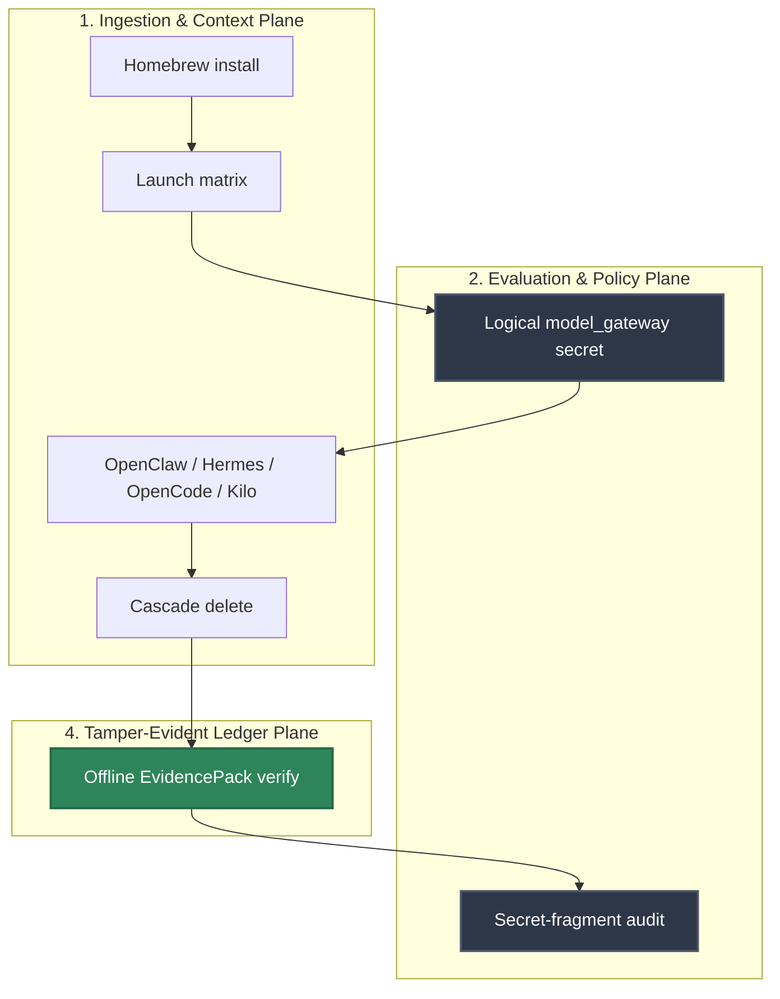

# Launchpad Clean Install GA

Status: the gate is implemented and its release target tracks the current
release tag, `v0.8.3`. The supported-app clean-install set is OpenClaw and
Hermes, which passed signed artifact, live conformance, teardown, receipts, and
offline EvidencePack verification in workflow `26198407296`. OpenCode and Kilo
Code are in the verify-only set, not the supported set.

Launchpad GA is a product-adoption gate for the current release. It proves the
Homebrew package, signed Launchpad artifacts, local-container app launcher,
MCP interceptor posture, signed receipts, teardown, and offline EvidencePack
verification survive a machine that did not build the release.

## Audience

This page is for release owners, Launchpad maintainers, and operators who need
to prove a supported app can be installed and removed from a clean workstation
without relying on a developer checkout.

## Outcome

You should leave with the supported-app gate, the exact clean-machine command
sequence, and the evidence files that prove install, launch, teardown, and
offline verification.

## Source Truth

- Release target: `v0.8.3`. Do not hand-edit that number here. It is the
  `RELEASE_TAG` default in `scripts/launch/clean_install_gate.sh` and the
  `release_tag` input default in `.github/workflows/launchpad-clean-install.yml`,
  and `tests/launchpad/claims_truth_test.go` fails the build unless both equal
  `v` + the `version:` field of `deploy/helm-chart/Chart.yaml`.
- Four-app Launchpad artifact workflow: <https://github.com/Mindburn-Labs/helm-ai-kernel/actions/runs/26198407296>
- Last executed macOS Homebrew clean-install workflow: <https://github.com/Mindburn-Labs/helm-ai-kernel/actions/runs/26199878246>.
  That run was against release tag `v0.5.5`, not against the current target;
  `docs/launchpad/clean_install_report.json` is its recorded output. No
  clean-install run has been executed against `v0.8.3`.
- Current Launchpad v1 report: `docs/launchpad/v1_report.json`
- Historical `v0.5.4` release report: `docs/launchpad/final_report.json`
- Clean-install report: `docs/launchpad/clean_install_report.json`


```mermaid
flowchart TD
    subgraph Ingestion["1. Ingestion & Context Plane"]
        brew["Homebrew install"]
        matrix["Launch matrix"]
        apps["OpenClaw / Hermes / OpenCode / Kilo"]
        teardown["Cascade delete"]
    end

    subgraph Evaluation["2. Evaluation & Policy Plane"]
        secret["Logical model_gateway secret"]
        audit["Secret-fragment audit"]
    end

    subgraph Ledger["4. Tamper-Evident Ledger Plane"]
        verify["Offline EvidencePack verify"]
    end

    %% Operational Flow Edges
    brew --> matrix
    matrix --> secret
    secret --> apps
    apps --> teardown
    teardown --> verify
    verify --> audit

    %% Premium Styling Rules
    style secret fill:#2d3748,stroke:#4a5568,stroke-width:2px,color:#fff
    style verify fill:#2f855a,stroke:#276749,stroke-width:2px,color:#fff
    style audit fill:#2d3748,stroke:#4a5568,stroke-width:2px,color:#fff
```


## Required Secret

Live local-container conformance uses one scoped BYO model-provider test key
from `core/pkg/launchpad/modelproviders/catalog.json`. CI may continue to store
an OpenRouter-only compatibility key as `HELM_LAUNCHPAD_CI_OPENROUTER_API_KEY`;
the gate maps it to `OPENROUTER_API_KEY` inside the live Launchpad test step.
For provider-agnostic CI, set `HELM_LAUNCHPAD_CI_MODEL_PROVIDER_SECRET_JSON` to
a JSON object keyed by catalog env names.
Do not commit provider keys, fragments, screenshots, or raw logs.

## Clean Machine Commands

Run these from a clean macOS developer machine with Homebrew, `gh`, and a
Docker-compatible runtime such as Docker Desktop or Colima:

```bash
brew update
brew install mindburnlabs/tap/helm-ai-kernel
helm-ai-kernel launch matrix --json
helm-ai-kernel launch secrets set model_gateway --provider openai --value-env OPENAI_API_KEY
helm-ai-kernel launch openclaw local-container --headless --output json
helm-ai-kernel launch hermes local-container --headless --output json
helm-ai-kernel app preflight opencode --json
helm-ai-kernel app preflight kilocode --json
helm-ai-kernel launch delete <launch_id> --cascade
helm-ai-kernel verify --bundle <pack>
```

Use the repo-native gate to collect redacted evidence:

```bash
export OPENAI_API_KEY='<fresh CI-only key>'
bash scripts/launch/clean_install_gate.sh \
  --release-tag v0.8.3 \
  --artifact-run-id 26198407296 \
  --host-kind developer_macos \
  --output docs/launchpad/clean_install_report.json
```

The script downloads the signed Launchpad artifact manifest, resolves the
immutable egress-proxy image, confirms app GHCR digests, launches the supported
app set through `local-container`, deletes each launch with `--cascade`, verifies every
produced EvidencePack, and scans command output, GitHub logs, release
notes/assets, reports, and EvidencePacks for the CI key and fixed-length key
fragments without printing the secret. The default supported app set is
OpenClaw and Hermes. OpenCode and Kilo Code are `verify_only`; `--version`
smoke checks do not count as live-agent F2 coverage. `--include-candidates`
remains accepted for backward compatibility but does not launch verify-only apps.

## App Digests

| App | Support level | Pinned digest |
| --- | --- | --- |
| OpenClaw | `agent_live` | `registry/launchpad/apps/openclaw.yaml` → `install.digest` |
| Hermes | `agent_live` | `registry/launchpad/apps/hermes.yaml` → `install.digest` |
| OpenCode | `verify_only` | `registry/launchpad/apps/opencode.yaml` → `install.digest`; `--version` smoke checks do not count as live-agent F2 coverage |
| Kilo Code | `verify_only` | `registry/launchpad/apps/kilocode.yaml` → `install.digest`; `--version` smoke checks do not count as live-agent F2 coverage |

The registry files are the pin a launch actually resolves, and the
`ci(launchpad): promote signed launchpad image refs` automation rewrites them,
so this page names the file instead of restating a digest that goes stale on
the next promotion. `docs/launchpad/v1_report.json` (`apps.*.ghcr_digest`)
records the digests that evidence run `26198407296` exercised; for OpenClaw and
Hermes those are older than the current registry pins.

Codex, Claude Code, Cursor, and Junie remain external/BYO adapters.

## CI Gate

Manual CI entrypoint:

```bash
gh workflow run launchpad-clean-install.yml \
  --repo Mindburn-Labs/helm-ai-kernel \
  -f release_tag=v0.8.3 \
  -f artifact_run_id=26198407296
```

Both inputs already default to these values in the workflow, so a plain
`gh workflow run launchpad-clean-install.yml` dispatches the same run.

The CI report is the current repeatable macOS Homebrew gate. A separately
operated clean Mac transcript can be attached as an additional adoption artifact
when release owners need a non-CI workstation record.

## Troubleshooting

| Condition | Response |
| --- | --- |
| Homebrew package is unavailable | Recheck the release tag, tap PR, and release workflow before running app launch commands. |
| Launch fails before receipts | Treat the gate as failed and inspect policy, sandbox, and provider readiness from the redacted report. |
| EvidencePack verification fails | Do not promote the app; rerun with fresh artifacts and preserve the failed verification output. |
| Teardown leaves resources | Reconcile local/container resources before declaring the machine clean. |
