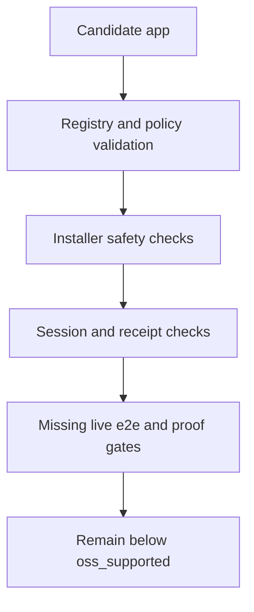

# Launchpad Conformance

Status: partial gates only.

## Source Truth

- Runtime package and tests: `core/pkg/launchpad/`
- CLI launch command: `core/cmd/helm-ai-kernel/launch_cmd.go`
- Registry fixtures: `registry/launchpad/`
- Policy fixtures: `policies/launchpad/`
- Schemas under test: `schemas/launchpad/`

Implemented checks currently prove:

- `launchpad-artifacts` CI is defined to build pinned OpenClaw/Hermes upstream refs into GHCR OCI images, sign with GitHub OIDC keyless cosign, generate syft SBOMs, run grype scans, and publish a manifest;
- `helm-ai-kernel launch promote` refuses promotion unless the CI artifact manifest, immutable image digest, cosign signature, syft SBOM, grype/trivy scan, live e2e run, teardown receipt, and EvidencePack refs are present;
- local-container OpenRouter egress requires an explicit launch-scoped egress proxy receipt and rejects non-OpenRouter allowlists;
- unverified apps are not launchable;
- `openclaw local-container` plans as `ESCALATE`;
- missing conformance prevents `oss_supported`;
- registry and policy refs are validated;
- installer rejects missing digests and host `curl | bash`;
- MCP governance rejects unknown or revoked tools and requires schema pins;
- session store rejects `RUNNING` without launch receipt, healthcheck receipt, and sandbox grant refs;
- session store rejects `DELETED` without teardown receipt;
- generated fail-closed EvidencePacks verify offline through `helm-ai-kernel verify --bundle`;
- Enterprise Console Launchpad smoke verifies matrix, escalation, MCP quarantine, EvidencePack, and teardown receipt visibility in Chromium.

Not complete:

- live local-container e2e;
- successful app reference packs from live e2e;
- signed artifact/SBOM/vulnerability proof from an executed CI artifact workflow;
- full app healthchecks;
- full teardown proof against live resources.

No app may move to `oss_supported` until the missing gates pass.
