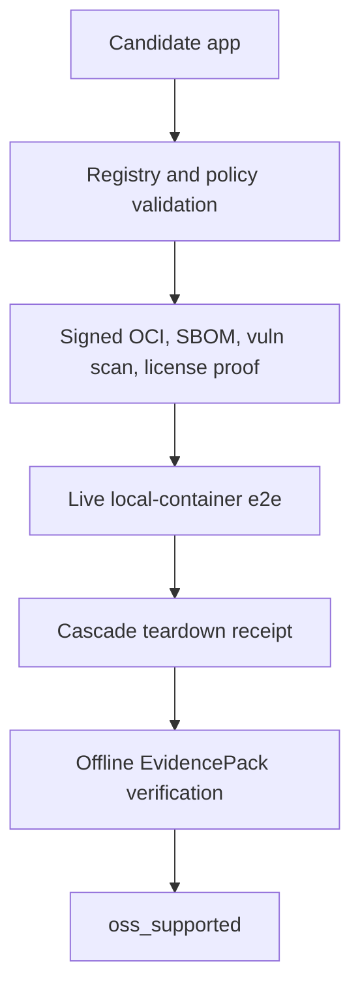

# Launchpad Conformance

Status: OpenClaw and Hermes passed the `v0.5.4` release evidence bar. v1.0
hardening adds logical secret binding, four-app artifact matrix support, and
DigitalOcean/Hetzner opt-in beta provisioner gates; OpenCode and Kilo Code stay
below support until their evidence is produced.

## Audience

Maintainers validating whether Launchpad app, substrate, registry, policy,
runtime, receipt, and public GA claims are backed by source and release evidence.

## Outcome

You can see which Launchpad checks are release-backed, which apps remain below
promotion, and which commands prove the local-container app launcher and
EvidencePacks on a clean machine.

## Source Truth

- Runtime package and tests: `core/pkg/launchpad/`
- CLI launch command: `core/cmd/helm-ai-kernel/launch_cmd.go`
- Registry fixtures: `registry/launchpad/`
- Policy fixtures: `policies/launchpad/`
- Schemas under test: `schemas/launchpad/`
- Launchpad artifact workflow: `.github/workflows/launchpad-artifacts.yml`
- Clean install workflow: `.github/workflows/launchpad-clean-install.yml`
- Release evidence: `docs/launchpad/final_report.json`
- v1.0 evidence status: `docs/launchpad/v1_report.json`

Implemented checks currently prove:

- `launchpad-artifacts` workflow `26110916296` built pinned OpenClaw and Hermes
  upstream refs into GHCR OCI images, signed them with GitHub OIDC keyless
  cosign, generated syft SBOMs, ran grype scans, and published a promotion
  manifest.
- `helm-ai-kernel launch promote` refuses promotion unless the CI artifact
  manifest, immutable image digest, cosign signature, syft SBOM, grype/trivy
  scan, live e2e run, teardown receipt, and EvidencePack refs are present and
  tied to the same workflow run.
- OpenCode and Kilo Code are now eligible for promotion only through that same
  complete signed-evidence path. The registry still blocks them as
  `oss_candidate` until a promotion manifest supplies the missing refs.
- OpenClaw and Hermes are `oss_supported` in the registry from signed CI
  evidence, not from assertion.
- OpenClaw image:
  `ghcr.io/mindburn-labs/helm-launchpad/openclaw@sha256:808d750ed3ce3e29ed45d68c00c9c77ff50990204b3fe563b9f45d00f1beb88e`.
- Hermes image:
  `ghcr.io/mindburn-labs/helm-launchpad/hermes@sha256:b970c2308182384377670704f6769e200eef89e18cc1a1102de9cba0d2437527`.
- Local-container OpenRouter egress requires a launch-scoped egress proxy
  receipt, can use the signed egress-proxy image from the artifact workflow, and
  rejects non-OpenRouter allowlists.
- Installer tests reject missing digests, host `curl | bash`, mutable git
  update patterns, and package-manager mutation inside the current worktree.
- MCP governance rejects unknown or revoked tools and requires schema pins.
- Session store rejects `RUNNING` without launch receipt, healthcheck receipt,
  sandbox grant refs, and egress refs for networked launches.
- Session store rejects `DELETED` without teardown receipt.
- Generated and static Launchpad EvidencePacks verify offline through
  `helm-ai-kernel verify --bundle`.
- Enterprise Launchpad route tests, route registry/OpenAPI parity, Console
  Playwright coverage, evidence refs, teardown receipt, and EvidencePack
  visibility passed in PR #30.

Still gated:

- Clean Homebrew install from a separate developer machine.
- OpenCode and Kilo Code promotion runs.
- Controlled live DigitalOcean and Hetzner app launches across the four-app
  matrix.
- Codex redistribution; Codex remains external/BYO unless redistribution proof
  changes.



No additional app may move to `oss_supported` until it passes the same bar.

## Clean Install Validation

```bash
brew update
brew install mindburnlabs/tap/helm-ai-kernel
helm-ai-kernel launch matrix --json
helm-ai-kernel launch secrets set model_gateway --provider openrouter --value-env OPENROUTER_API_KEY
helm-ai-kernel launch openclaw local-container --headless --output json
helm-ai-kernel launch hermes local-container --headless --output json
helm-ai-kernel launch opencode local-container --headless --output json
helm-ai-kernel launch kilocode local-container --headless --output json
helm-ai-kernel launch delete <launch_id> --cascade
helm-ai-kernel verify --bundle <pack>
```

`scripts/launch/clean_install_gate.sh` automates the command sequence, digest
confirmation, EvidencePack verification, and secret-fragment audit. It writes
redacted JSON only.

## Troubleshooting

| Symptom | First check |
| --- | --- |
| Published output is stale or incomplete | Run `npm run helm-public:accuracy` in `docs-platform`, then check the source path and public manifest row for this page. |
| A claim needs implementation backing | Check the Source Truth files above and update the implementation, manifest, source inventory, or page in the same change. |
