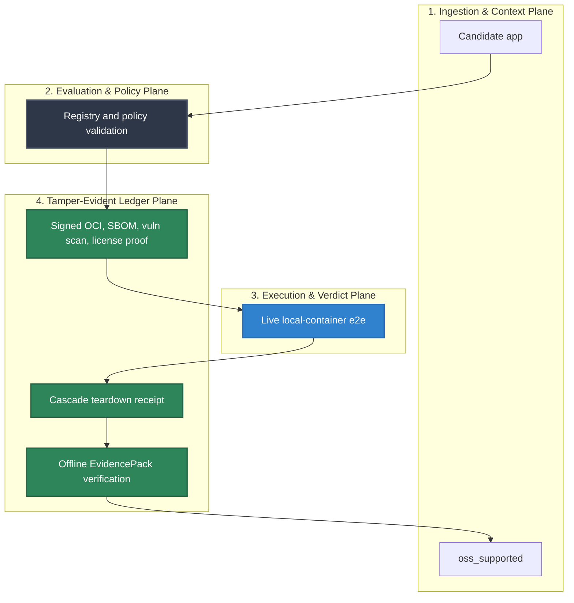

# Launchpad Conformance

Status: OpenClaw, Hermes, OpenCode, and Kilo Code passed the v1.0 signed
artifact, live local-container, teardown, receipt, and offline EvidencePack
bar in workflow `26198407296`. DigitalOcean opt-in beta passed for all four
apps; Hetzner remains fail-closed until a scoped provider token is available.

## Audience

Maintainers validating whether Launchpad app, substrate, registry, policy,
runtime, receipt, and public GA claims are backed by source and release evidence.

## Outcome

You can see which Launchpad checks are release-backed, which apps are promoted,
and which commands prove the local-container app launcher and EvidencePacks on
a clean machine.

## Source Truth

- Runtime package and tests: `core/pkg/launchpad/`
- CLI launch command: `core/cmd/helm-ai-kernel/launch_cmd.go`
- Registry fixtures: `registry/launchpad/`
- Policy fixtures: `policies/launchpad/`
- Schemas under test: `schemas/launchpad/`
- Launchpad artifact workflow: `.github/workflows/launchpad-artifacts.yml`
- Clean install workflow: `.github/workflows/launchpad-clean-install.yml`
- Release evidence: `docs/launchpad/final_report.json`
- v1.0 evidence status: `docs/launchpad/v1_report.json`

Implemented checks currently prove:

| App | Support level | F2 claim boundary |
| --- | --- | --- |
| OpenClaw | `agent_live` | live local-container contract and attack matrix eligible after preflight |
| Hermes | `agent_live` | live local-container contract and attack matrix eligible after preflight |
| OpenCode | `verify_only` | contract/version proof only; `--version` smoke checks do not count as live-agent F2 coverage |
| Kilo Code | `verify_only` | contract/version proof only; `--version` smoke checks do not count as live-agent F2 coverage |

- `launchpad-artifacts` workflow `26198407296` built pinned OpenClaw, Hermes,
  OpenCode, and Kilo Code upstream refs into GHCR OCI images, signed them with
  GitHub OIDC keyless cosign, generated syft SBOMs, ran grype scans, and
  published a promotion manifest.
- `helm-ai-kernel launch promote` refuses promotion unless the CI artifact
  manifest, immutable image digest, cosign signature, syft SBOM, grype/trivy
  scan, live e2e run, teardown receipt, and EvidencePack refs are present and
  tied to the same workflow run.
- OpenClaw and Hermes are live `agent_live` apps in the registry from signed CI
  evidence, contract preflight, live e2e, teardown, receipts, and offline
  EvidencePack verification, not from assertion.
- OpenCode and Kilo Code are `verify_only`; `--version` smoke checks do not
  count as live-agent F2 coverage.
- OpenClaw image:
  `ghcr.io/mindburn-labs/helm-launchpad/openclaw@sha256:4da80a1e48b5603fd203b7d2b98539a01f796142b0ed9315e5ed86b25bf5d995`.
- Hermes image:
  `ghcr.io/mindburn-labs/helm-launchpad/hermes@sha256:4ec024dd8d0191fc887f04dc92c959fc865808d1526f782b5093f395fdd41652`.
- OpenCode image (`verify_only`):
  `ghcr.io/mindburn-labs/helm-launchpad/opencode@sha256:cdbeb88cfbd698809e673339d525083cdf1cdb3e91529e01c6834cd90b778550`.
- Kilo Code image (`verify_only`):
  `ghcr.io/mindburn-labs/helm-launchpad/kilocode@sha256:7b03834725235714ea8e698d38d89ce9b8bd81230b7e784016cb20a2c3c93ca6`.
- F2 reports are blocked unless they attach contract preflight JSON, launch
  plan, kernel verdict, sandbox grant, egress receipt, MCP quarantine receipt,
  healthcheck receipt, runtime environment, EvidencePack, offline verify output,
  and raw per-case results.
- Local-container BYO model-provider egress requires a launch-scoped egress
  proxy receipt, can use the signed egress-proxy image from the artifact
  workflow, and rejects destinations outside the embedded model-provider
  catalog.
- Installer tests reject missing digests, host `curl | bash`, mutable git
  update patterns, and package-manager mutation inside the current worktree.
- MCP governance rejects unknown or revoked tools and requires schema pins.
- Supported app specs must reference signed MCP manifests with pinned package
  digest, schema hashes, tool effects, required secrets, and grants.
- Substrate specs must declare capability metadata. `local-container` is the GA
  baseline; Docker microVM and hosted sandbox substrates are registry-visible
  but experimental until their adapters pass the same receipt/evidence/teardown
  bar.
- Generated Launchpad EvidencePacks include a hash-chained receipt graph at
  `04_EXPORTS/launchpad_evidence_graph.json`.
- Session store rejects `RUNNING` without launch receipt, healthcheck receipt,
  sandbox grant refs, and egress refs for networked launches.
- Session store rejects `DELETED` without teardown receipt.
- Generated and static Launchpad EvidencePacks verify offline through
  `helm-ai-kernel verify --bundle`.
- Enterprise Launchpad route tests, route registry/OpenAPI parity, evidence
  refs, teardown receipt, and EvidencePack visibility passed in PR #30. Browser
  coverage belongs to the standalone Console repository.

Still gated:

- Clean Homebrew install from a separate developer machine.
- Hetzner live app launches across the four-app matrix.
- Codex redistribution; Codex remains external/BYO unless redistribution proof
  changes.




No additional app may move to `oss_supported` until it passes the same bar.

## Clean Install Validation

```bash
brew update
brew install mindburnlabs/tap/helm-ai-kernel
helm-ai-kernel launch matrix --json
helm-ai-kernel launch secrets set model_gateway --provider openai --value-env OPENAI_API_KEY
helm-ai-kernel launch openclaw local-container --headless --output json
helm-ai-kernel launch hermes local-container --headless --output json
helm-ai-kernel app preflight opencode --json
helm-ai-kernel app preflight kilocode --json
helm-ai-kernel launch delete <launch_id> --cascade
helm-ai-kernel evidence inspect <pack>
helm-ai-kernel evidence diff <pack-a> <pack-b>
helm-ai-kernel verify --bundle <pack>
```

`scripts/launch/clean_install_gate.sh` automates the command sequence, digest
confirmation, EvidencePack verification, and secret-fragment audit. It writes
redacted JSON only.

OpenCode and Kilo Code are now part of the verify-only clean-install proof set,
not the live supported launch set. `--include-candidates` remains accepted by the clean-install gate for backward
compatibility only.

## Troubleshooting

| Symptom | First check |
| --- | --- |
| Published output is stale or incomplete | Run `npm run helm-public:accuracy` in `docs-platform`, then check the source path and public manifest row for this page. |
| A claim needs implementation backing | Check the Source Truth files above and update the implementation, manifest, source inventory, or page in the same change. |
