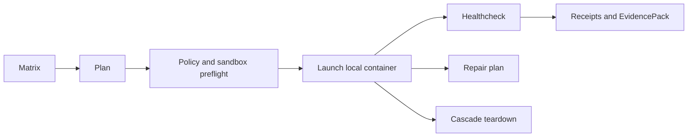

# HELM Launchpad Flow Catalog

HELM Launchpad is the OSS local-container app launcher for AI agents. Launchpad starts apps; HELM governs execution.

## Audience

Use this page if you are planning, launching, repairing, or tearing down a Launchpad app through the local-container substrate.

## Outcome

After reading this page, you should know which CLI flows exist, what each flow proves, and where Launchpad stops so the HELM execution boundary can govern effects.

## Flow

## Source Truth

- CLI launch command: `core/cmd/helm-ai-kernel/launch_cmd.go`
- Launchpad runtime: `core/pkg/launchpad/`
- App registry: `registry/launchpad/apps/`
- Substrate registry: `registry/launchpad/substrates/`
- App policies: `policies/launchpad/apps/`
- Release truth: `docs/launchpad/final_report.json`
- Clean-install truth: `docs/launchpad/clean_install_report.json`

## Matrix

`helm-ai-kernel launch matrix --json`

Loads AppSpecs, SubstrateSpecs, policy packs, and conformance metadata. No app is `AVAILABLE` without license, artifact, policy, sandbox, healthcheck, e2e, receipts, teardown, and offline EvidencePack proof.

## Plan

`helm-ai-kernel launch plan <app> <substrate> --json`

Compiles a LaunchPlan with app/substrate/policy/sandbox hashes, required secrets, network allowlist, filesystem mounts, MCP policy, budgets, action IR, CPI output, verdict, state, teardown plan, and evidence requirements.

## Launch Local Container

`helm-ai-kernel launch openclaw local-container --headless --output json`

Required path:

1. Resolve AppSpec and SubstrateSpec.
2. Verify signed artifact evidence and conformance metadata.
3. Compile policy and action IR.
4. Pass CPI/PEP/boundary checks.
5. Run sandbox preflight.
6. Bind MCP as quarantined.
7. Install immutable artifact.
8. Start local-container with deny-by-default filesystem and network.
9. Project scoped secrets.
10. Route OpenRouter egress through launch-owned proxy.
11. Run healthcheck.
12. Emit receipts and EvidencePack.

## Repair

`helm-ai-kernel launch repair <launch_id>`

Produces a deterministic repair plan for missing secrets, healthcheck failures, MCP auth expiry, sandbox failure, policy denial, dirty install attempts, port/proxy collisions, and ambiguous cloud state. Repair side effects still require CPI/PEP.

## Teardown

`helm-ai-kernel launch delete <launch_id> --cascade`

Stops containers and proxy, revokes scoped secrets, revokes sandbox grants, quarantines or revokes MCP registrations, reconciles remote resources when applicable, emits teardown receipt, and updates the final EvidencePack.

## Current Truth

[KEEP] OpenClaw and Hermes are `oss_supported` from signed `v0.5.4` CI
artifacts, live local-container e2e, teardown receipts, and offline
EvidencePack verification.

[REFACTOR] The CPI/PEP/boundary path still needs deeper action-by-action authority binding.

[REBUILD] Clean install GA is not complete until `scripts/launch/clean_install_gate.sh`
passes on both the macOS CI runner and a separate developer Mac.

Deferred: DigitalOcean and Hetzner stay dry-run by default.

## Troubleshooting

| Symptom | First check |
| --- | --- |
| Matrix says an app is not available | Verify license, artifact, policy, sandbox, healthcheck, receipts, teardown, and EvidencePack proof. |
| Launch fails before container start | Inspect CPI, PEP, sandbox preflight, and required secret projection. |
| Repair proposes an external effect | Route the effect through CPI and PEP before applying it. |
| Teardown leaves state behind | Re-run `launch delete <launch_id> --cascade` and inspect the teardown receipt. |
