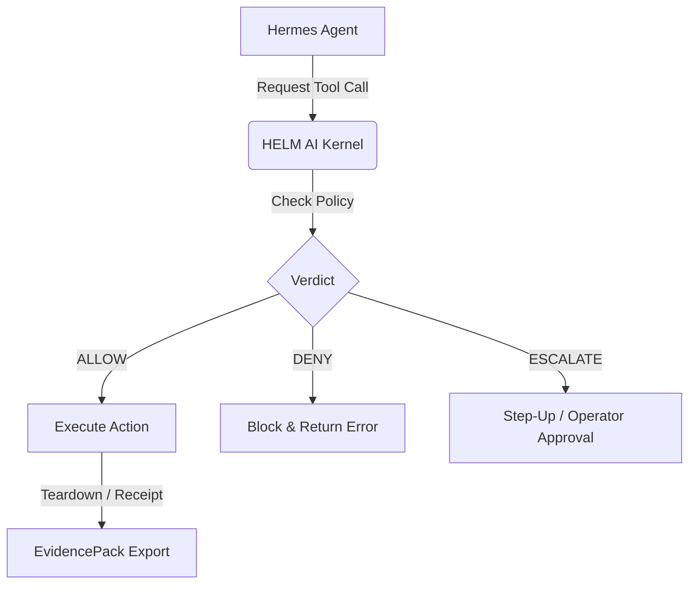

# Hermes on HELM

## What this proves
Hermes runs through HELM’s fail-closed execution boundary.



## One-command path
```bash
helm-ai-kernel up hermes --target local --live --json --no-open
```

## Headless path
```bash
helm-ai-kernel launch hermes local-container --headless --output json
```

## Source Truth
- Registry source: `registry/launchpad/apps/hermes.yaml`
- Policy source: `policies/launchpad/apps/hermes.safe.toml`
- Production runbook: `docs/launchpad/HERMES_PRODUCTION_RUNBOOK.md`

## Production claim boundary
Hermes production proof uses explicit `--live` mode with OpenRouter-only model
gateway scope and team-grade EvidencePack trust. It is a Mindburn-owned
production proof, not a customer/high-assurance claim.

## Evidence requirements
- cpi_output
- kernel_verdict
- sandbox_grant
- launch_receipt
- install_receipt
- healthcheck_receipt
- teardown_receipt
- evidence_pack
- evidence_graph
- mcp_quarantine
- mcp_manifest
- model_gateway_broker
- artifact_digest
- cosign_signature
- syft_sbom
- grype_vulnerability_scan

## Verify
```bash
helm-ai-kernel verify --bundle <pack>
```
