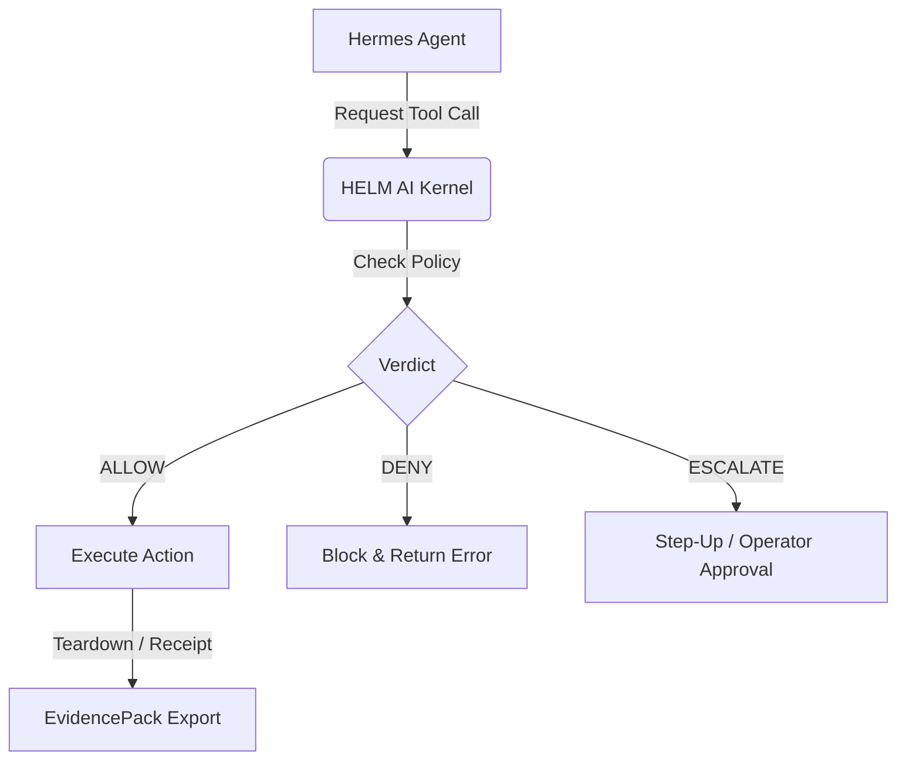

# Hermes on HELM

## Audience
Operators and security reviewers who want to run the upstream Hermes agent
(`NousResearch/hermes-agent`, MIT-licensed) behind the HELM AI Kernel
fail-closed execution boundary.

## Outcome
After this page you know which registry, policy, launch command, and runbook
own the Hermes sandbox behavior, how to launch the signed OCI artifact, and
which EvidencePack artifacts must exist before the live-agent proof is accepted.

## What this proves
Hermes runs through HELM’s fail-closed execution boundary. The launch is driven by a registry-pinned app definition and a safe default-deny policy: HELM installs Hermes into a sandboxed local container, gates every tool call through the kernel verdict path, and emits a signed receipt for each lifecycle step, from install and healthcheck to teardown. The run ends with an exported EvidencePack that anyone can verify offline, so "it ran safely" is a checkable claim rather than an assertion.



## One-command path
```bash
helm-ai-kernel up hermes --target local --live --json
```

## Headless path
```bash
helm-ai-kernel launch hermes local-container --headless --output json
```

## Source Truth
- Registry source: `registry/launchpad/apps/hermes.yaml`
- Policy source: `policies/launchpad/apps/hermes.safe.toml`
- Launch commands: `core/cmd/helm-ai-kernel/up_cmd.go`, `core/cmd/helm-ai-kernel/launch_cmd.go`
- Production runbook: `docs/launchpad/HERMES_PRODUCTION_RUNBOOK.md`
- Validation: `python3 scripts/check_documentation_coverage.py` and `python3 scripts/check_documentation_truth.py`

## Troubleshooting
| Symptom | First check |
| --- | --- |
| Launch fails before install | Verify the signed OCI image digest pinned in `registry/launchpad/apps/hermes.yaml`. |
| Healthcheck times out | Confirm the `model_gateway` secret is bound; the healthcheck sends one OpenRouter query through the launch-scoped egress proxy. |
| Hermes cannot write config or cache files | `HOME` is redirected to the writable app-state mount at `/var/lib/hermes`; check the filesystem policy mounts and state directory. |
| An MCP tool is refused | Unknown MCP servers are quarantined and unknown MCP tools return `ESCALATE`; add a pinned schema before broadening access. |

## Claim boundary
Hermes public status is local app proof. Do not expand this page into managed,
hosted, or third-party deployment language unless the exact claim is backed by
source-owned tests, receipts, and EvidencePack material.

## Evidence requirements
- cpi_output
- kernel_verdict
- sandbox_grant
- launch_receipt
- install_receipt
- healthcheck_receipt
- teardown_receipt
- evidence_pack
- evidence_graph
- mcp_quarantine
- mcp_manifest
- model_gateway_broker
- artifact_digest
- cosign_signature
- syft_sbom
- grype_vulnerability_scan

## Verify
```bash
helm-ai-kernel verify --bundle <pack>
```
