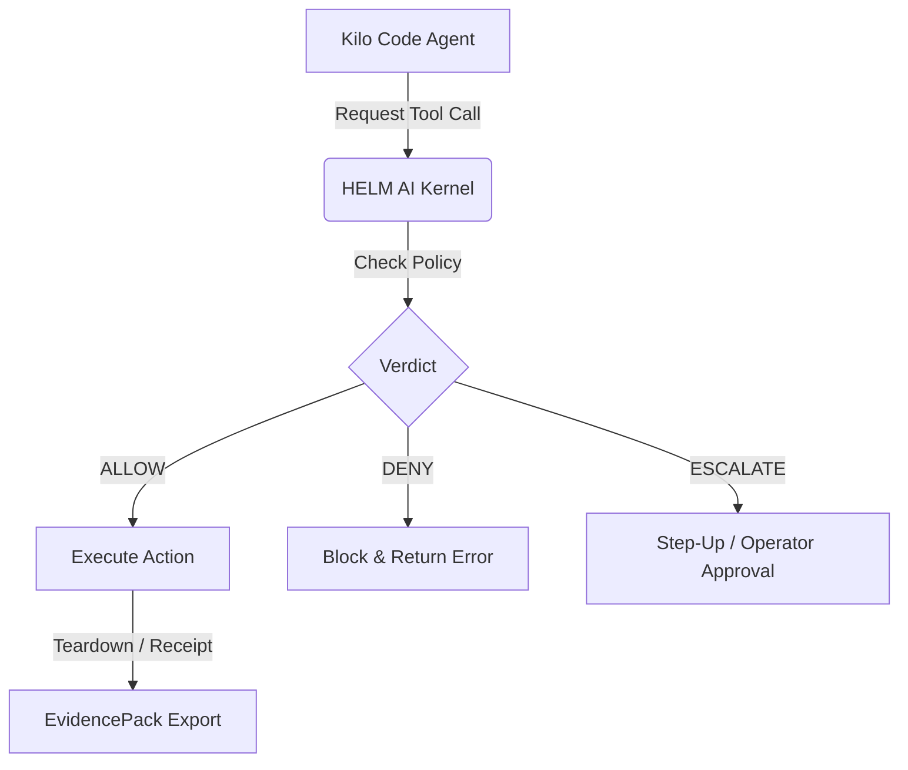

# Kilo Code on HELM

## Audience
Operators and security reviewers validating the upstream Kilo Code agent
(`Kilo-Org/kilocode`, MIT-licensed) as a HELM Launchpad app contract.

## Outcome
After this page you can verify the Kilo Code signed OCI artifact contract,
understand why its current support level is `verify_only`, and identify the
evidence that is still missing before HELM can claim live-agent F2 coverage.

## What this proves
Kilo Code currently has `verify_only` contract evidence. The pinned image and
`kilocode --version` healthcheck are useful smoke proof, but `--version` smoke
checks do not count as live-agent F2 coverage.

The supported claim is deliberately limited. HELM proves that the Kilo Code app
spec, signed OCI image reference, filesystem policy, MCP quarantine settings,
and EvidencePack export path can be validated as a Launchpad contract. It does
not prove that a live Kilo Code coding session, tool sequence, or model-backed
workflow has passed the full F2 runtime bar.



## Contract preflight path
```bash
helm-ai-kernel app preflight kilocode --json
```

## Operator boundary
Kilo Code keeps a scoped workspace and app-state mount, denied default network
egress, schema-pinned MCP manifests, and escalation for unknown MCP tools. The
default profile requires no provider secret, keeps `runtime_install_policy`
forbidden, and relies on baked dependencies such as `kilocode-cli` and
`ripgrep` instead of launch-time downloads.

Do not treat this page as a live-agent success claim until teardown receipts,
offline verification, and EvidencePack material exist for a real Kilo Code
command path. Until that evidence is present, the correct status is signed OCI
plus verify-only contract preflight.

## Source Truth
- Registry source: `registry/launchpad/apps/kilocode.yaml`
- Policy source: `policies/launchpad/apps/kilocode.safe.toml`
- Launch command owner: `core/cmd/helm-ai-kernel/launch_cmd.go`
- Validation: `python3 scripts/check_documentation_coverage.py` and `python3 scripts/check_documentation_truth.py`

## Troubleshooting
| Symptom | First check |
| --- | --- |
| Contract preflight fails | Verify the signed OCI image digest and `framework_contract` fields in `registry/launchpad/apps/kilocode.yaml`. |
| Healthcheck fails | The current healthcheck is `kilocode --version`; confirm the baked `kilocode-cli` dependency resolves inside the image. |
| An MCP tool is refused | Unknown MCP servers are quarantined and unknown MCP tools return `ESCALATE`; pin the tool schema in `kilocode.default` before authorizing it. |
| A live-agent claim is requested | Hold the claim until a real Kilo Code command path emits teardown receipts, offline verification, and EvidencePack material. |

## Evidence requirements
- cpi_output
- kernel_verdict
- sandbox_grant
- healthcheck_receipt
- evidence_pack
- offline_verify
- evidence_graph
- mcp_quarantine
- mcp_manifest
- artifact_digest
- cosign_signature
- syft_sbom
- grype_vulnerability_scan

## Verify
```bash
helm-ai-kernel verify --bundle <pack>
```
