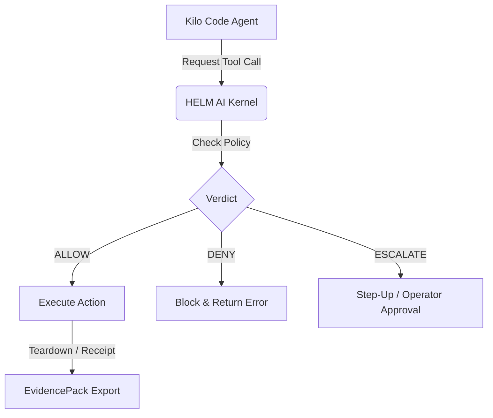

# Kilo Code on HELM

## What this proves
Kilo Code runs through HELM’s fail-closed execution boundary. The launch is driven by a registry-pinned app definition and a safe default-deny policy: HELM installs Kilo Code into a sandboxed local container, gates every tool call through the kernel verdict path, and emits a signed receipt for each lifecycle step, from install and healthcheck to teardown. The run ends with an exported EvidencePack that anyone can verify offline, so a coding agent's session leaves a replayable proof trail instead of just terminal scrollback.



## Headless path
```bash
helm-ai-kernel launch kilocode local-container --headless --output json
```

## Source Truth
- Registry source: `registry/launchpad/apps/kilocode.yaml`
- Policy source: `policies/launchpad/apps/kilocode.safe.toml`

## Evidence requirements
- cpi_output
- kernel_verdict
- sandbox_grant
- launch_receipt
- install_receipt
- healthcheck_receipt
- teardown_receipt
- evidence_pack
- evidence_graph
- mcp_quarantine
- mcp_manifest
- artifact_digest
- cosign_signature
- syft_sbom
- grype_vulnerability_scan

## Verify
```bash
helm-ai-kernel verify --bundle <pack>
```
