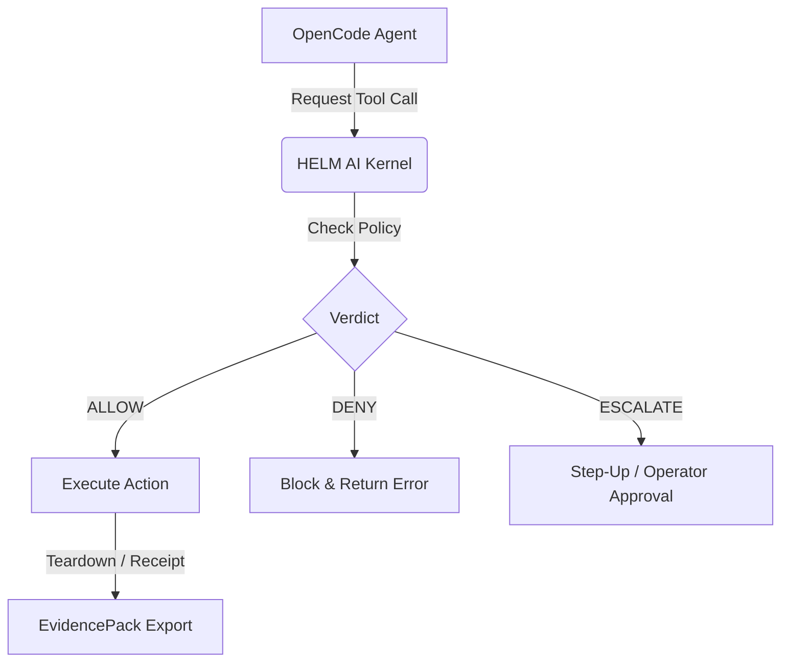

# OpenCode on HELM

## What this proves
OpenCode currently has `verify_only` contract evidence. The pinned image and
`opencode --version` healthcheck are useful smoke proof, but `--version` smoke
checks do not count as live-agent F2 coverage.



## Contract preflight path
```bash
helm-ai-kernel app preflight opencode --json
```

## Source Truth
- Registry source: `registry/launchpad/apps/opencode.yaml`
- Policy source: `policies/launchpad/apps/opencode.safe.toml`

## Evidence requirements
- cpi_output
- kernel_verdict
- sandbox_grant
- healthcheck_receipt
- evidence_pack
- offline_verify
- evidence_graph
- mcp_quarantine
- mcp_manifest
- artifact_digest
- cosign_signature
- syft_sbom
- grype_vulnerability_scan

## Verify
```bash
helm-ai-kernel verify --bundle <pack>
```
