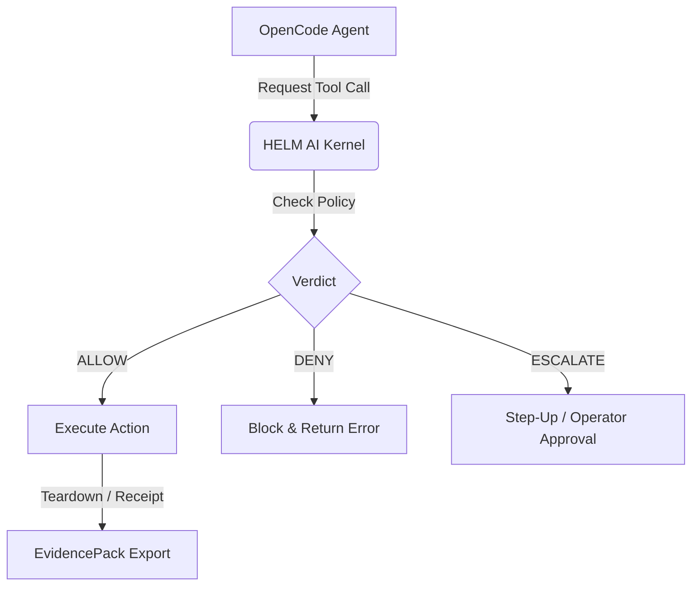

# OpenCode on HELM

## What this proves
OpenCode currently has `verify_only` contract evidence. The pinned image and
`opencode --version` healthcheck are useful smoke proof, but `--version` smoke
checks do not count as live-agent F2 coverage.

The supported claim is narrower than a full interactive agent run. HELM proves
that the app registry entry, policy, image digest, MCP quarantine rules, and
EvidencePack export path can be assembled and checked without runtime package
installation. Operators should treat this as contract readiness for the
Launchpad boundary, not as proof that arbitrary OpenCode tool use has been
observed under live workload conditions.



## Contract preflight path
```bash
helm-ai-kernel app preflight opencode --json
```

## Operator boundary
OpenCode runs with scoped workspace and app-state mounts, denied default network
egress, schema-pinned MCP manifests, and unknown MCP tools escalated instead of
silently allowed. The app has no required model secret in the default profile,
and the registry keeps `runtime_install_policy` forbidden so the image cannot
repair missing dependencies by downloading packages at launch time.

Do not promote this page to live F2 language until a real command path has
teardown receipts, offline verification, and EvidencePack material at the same
bar as the live OpenClaw and Hermes launchpad flows. Until then, the correct
operational posture is signed OCI plus verify-only preflight.

## Source Truth
- Registry source: `registry/launchpad/apps/opencode.yaml`
- Policy source: `policies/launchpad/apps/opencode.safe.toml`

## Evidence requirements
- cpi_output
- kernel_verdict
- sandbox_grant
- healthcheck_receipt
- evidence_pack
- offline_verify
- evidence_graph
- mcp_quarantine
- mcp_manifest
- artifact_digest
- cosign_signature
- syft_sbom
- grype_vulnerability_scan

## Verify
```bash
helm-ai-kernel verify --bundle <pack>
```
