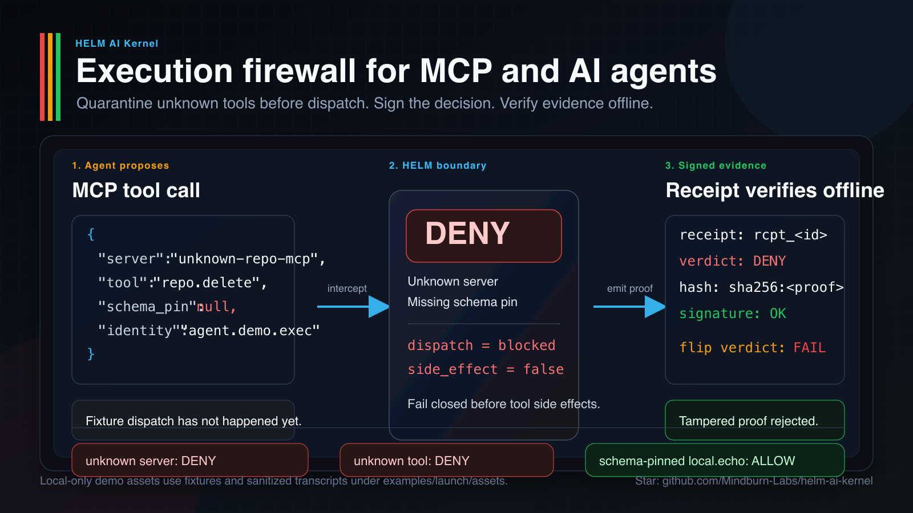

# MCP Quarantine Before Tool Dispatch

MCP makes tools discoverable to agents. That is powerful, but discovery is not
authorization. A server can be unknown, a tool can be new, or a schema can be
missing the pin needed for a safe dispatch decision.

HELM AI Kernel treats that state as quarantine. Unknown servers, unknown tools,
and missing schema pins return DENY or ESCALATE before fixture dispatch. A
known schema-pinned call can be allowed.



The local MCP launch demo exercises the path end to end:

- inspect fixture metadata and schema
- create a fail-closed wrapper profile
- deny unknown server and unknown tool calls
- approve a registry record bound to a HELM receipt
- allow one schema-pinned `local.echo` fixture call

Run it locally:

```bash
git clone https://github.com/Mindburn-Labs/helm-ai-kernel.git
cd helm-ai-kernel
make build
bash scripts/launch/demo-mcp.sh
```

The sanitized transcript is checked in at
[`examples/launch/assets/mcp-quarantine.transcript.txt`](../../examples/launch/assets/mcp-quarantine.transcript.txt).
