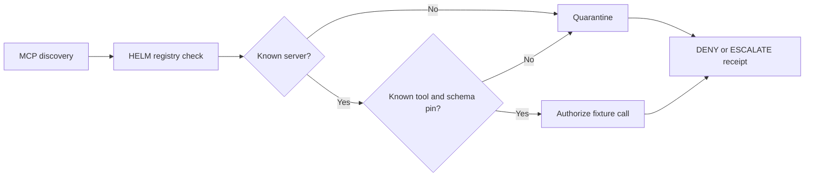

# MCP Quarantine Before Tool Dispatch

MCP makes tools discoverable to agents. That is powerful, but discovery is not
authorization. A server can be unknown, a tool can be new, or a schema can be
missing the pin needed for a safe dispatch decision.

HELM AI Kernel treats that state as quarantine. Unknown servers, unknown tools,
and missing schema pins return DENY or ESCALATE before fixture dispatch. A
known schema-pinned call can be allowed.

## Quarantine Flow




The local MCP launch demo exercises the path end to end:

- inspect fixture metadata and schema
- create a fail-closed wrapper profile
- deny unknown server and unknown tool calls
- approve a registry record bound to a HELM receipt
- allow one schema-pinned `local.echo` fixture call

Run it locally:

```bash
git clone https://github.com/Mindburn-Labs/helm-ai-kernel.git
cd helm-ai-kernel
make build
bash scripts/launch/demo-mcp.sh
```

The sanitized transcript is checked in at
[`examples/launch/assets/mcp-quarantine.transcript.txt`](../../examples/launch/assets/mcp-quarantine.transcript.txt).

For a source-owned proof bundle with one approved reversible local effect,
signed allow/denial/escalation receipts, sealed EvidencePack output, offline
verification, and a required tamper-negative check, run:

```bash
helm-ai-kernel mcp proof \
  --scenario all \
  --out /tmp/helm-mcp-proof \
  --run-id public-mcp-proof \
  --at 2026-06-09T00:00:00Z \
  --json
```

The command covers one pinned, scoped-approval path that dispatches exactly
once through `SafeExecutor`, then proves identical sequential replay does not
redispatch. It also covers malicious or unknown MCP servers, prompt-injected
tool output, excessive agency, invalid approval scope, confused-deputy scope
mismatch, missing schema pins, schema drift, and replay or reordering attempts.
Every negative case must report `dispatched=false`, and the complete proof must
finish in under 60 seconds.

See [MCP competitive threat conformance](../security/mcp-competitive-threat-conformance.md)
for the source files and validation commands.

## Source Truth

- [MCP integration](../INTEGRATIONS/mcp.md)
- [MCP launch demo](../../scripts/launch/demo-mcp.sh)
- [MCP fixture server](../../scripts/launch/mcp-fixture-server.py)
- [Launch assets](../../examples/launch/README.md)
- [MCP proof CLI](../../core/cmd/helm-ai-kernel/mcp_proof_cmd.go)
