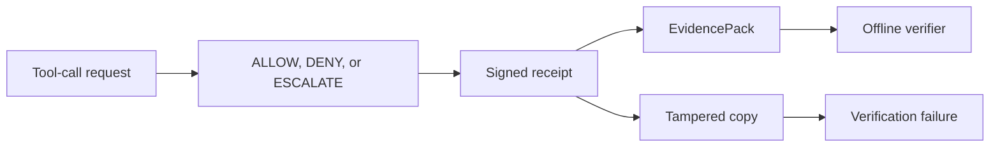

# Receipts Beat Logs for Agent Audit Trails

Logs are useful for debugging, but agent governance needs stronger evidence
than a stream of messages. When an AI agent requests a tool call, the important
question is not only what happened. It is what was proposed, what policy
decided, whether a side effect dispatched, and whether the evidence still
verifies later.

HELM AI Kernel emits signed receipts for execution-boundary decisions. The
local proof demo creates a signed DENY receipt, verifies it, then submits a
flipped-verdict copy and confirms the tamper attempt fails verification.

## Receipt Evidence Path




A useful agent receipt should make these checks boring:

- decision: ALLOW, DENY, or ESCALATE
- action identity and policy identity
- side-effect dispatch state
- receipt hash and signature state
- offline verification result
- tamper failure when the decision is modified

Run the proof path locally:

```bash
git clone https://github.com/Mindburn-Labs/helm-ai-kernel.git
cd helm-ai-kernel
make build
bash scripts/launch/demo-proof.sh
```

The demo uses localhost fixtures and sample policy data only.

## Source Truth

- [Verification](../VERIFICATION.md)
- [Execution security model](../EXECUTION_SECURITY_MODEL.md)
- [Proof launch demo](../../scripts/launch/demo-proof.sh)
- [Receipt schemas](../../protocols/json-schemas/SCHEMA_INDEX.md)
