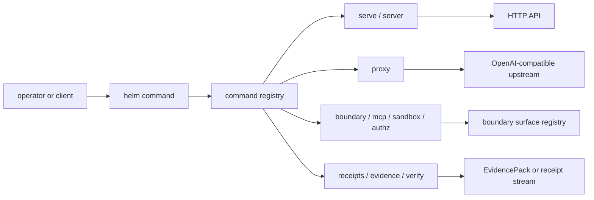

# HELM OSS CLI Reference

The `helm` binary is wired in [`core/cmd/helm`](../../core/cmd/helm). Command registration is centralized in [`registry.go`](../../core/cmd/helm/registry.go), with startup handling in [`main.go`](../../core/cmd/helm/main.go) and `helm serve` flag parsing in [`server_cmd.go`](../../core/cmd/helm/server_cmd.go).

## Audience

Use this page if you run the HELM OSS binary, copy CLI snippets into automation, or update command docs after changing `core/cmd/helm`.

## Outcome

After this page you should know the supported top-level command families, the source file that owns each command, the flag contracts that public docs may claim, and the tests that must pass after command changes.

## Source Truth

This page is generated from the active CLI implementation and must stay aligned with [`core/cmd/helm`](../../core/cmd/helm), [`core/cmd/README.md`](../../core/cmd/README.md), the command tests in [`core/cmd/helm`](../../core/cmd/helm), and the public manifest row for `helm-oss/reference/cli`.

## Runtime Map



## Primary Commands

| Command | Purpose | Source truth |
| --- | --- | --- |
| `helm serve` | Start the local execution boundary from a policy file. | [`server_cmd.go`](../../core/cmd/helm/server_cmd.go), [`serve_policy.go`](../../core/cmd/helm/serve_policy.go) |
| `helm server` | Start the default Guardian API and proxy services. | [`main.go`](../../core/cmd/helm/main.go), [`subsystems.go`](../../core/cmd/helm/subsystems.go) |
| `helm proxy` | Run the OpenAI-compatible governance proxy. | [`proxy_cmd.go`](../../core/cmd/helm/proxy_cmd.go) |
| `helm receipts tail` | Tail durable receipt events for a specific agent. | [`receipts_cmd.go`](../../core/cmd/helm/receipts_cmd.go), [`receipt_routes.go`](../../core/cmd/helm/receipt_routes.go) |
| `helm evidence` | Export evidence envelopes over native EvidencePacks. | [`evidence_cmd.go`](../../core/cmd/helm/evidence_cmd.go), [`contract_routes.go`](../../core/cmd/helm/contract_routes.go) |
| `helm export` | Export an EvidencePack from local evidence material. | [`export_cmd.go`](../../core/cmd/helm/export_cmd.go), [`export_pack.go`](../../core/cmd/helm/export_pack.go) |
| `helm verify` | Verify an EvidencePack directory or archive offline, with optional online proof checks. | [`verify_cmd.go`](../../core/cmd/helm/verify_cmd.go), [`core/pkg/verifier`](../../core/pkg/verifier) |
| `helm bundle` | List, inspect, verify, or build policy bundles. | [`bundle_cmd.go`](../../core/cmd/helm/bundle_cmd.go), [`core/pkg/policybundles`](../../core/pkg/policybundles) |
| `helm conform` | Run conformance gates and list negative boundary vectors. | [`conform.go`](../../core/cmd/helm/conform.go), [`core/pkg/conformance`](../../core/pkg/conformance) |
| `helm mcp` | Serve, package, scan, quarantine, approve, and authorize MCP surfaces. | [`mcp_cmd.go`](../../core/cmd/helm/mcp_cmd.go), [`mcp_boundary_cmd.go`](../../core/cmd/helm/mcp_boundary_cmd.go), [`mcp_runtime.go`](../../core/cmd/helm/mcp_runtime.go) |
| `helm boundary` | Inspect execution-boundary status, capabilities, records, verification, and checkpoints. | [`boundary_surface_cmd.go`](../../core/cmd/helm/boundary_surface_cmd.go), [`core/pkg/boundary`](../../core/pkg/boundary) |
| `helm identity` | Inspect OSS agent identities. | [`boundary_surface_cmd.go`](../../core/cmd/helm/boundary_surface_cmd.go), [`core/pkg/identity`](../../core/pkg/identity) |
| `helm sandbox` | Run governed sandbox execution and inspect sandbox grants. | [`sandbox_cmd.go`](../../core/cmd/helm/sandbox_cmd.go), [`sandbox_inspect_cmd.go`](../../core/cmd/helm/sandbox_inspect_cmd.go) |
| `helm authz`, `helm approvals`, `helm budget` | Inspect ReBAC snapshots, approval ceremonies, and budget ceilings. | [`boundary_surface_cmd.go`](../../core/cmd/helm/boundary_surface_cmd.go), [`core/pkg/contracts`](../../core/pkg/contracts) |
| `helm telemetry`, `helm coexistence`, `helm integrate` | Emit non-authoritative telemetry, coexistence, and pre-dispatch integration scaffolds. | [`boundary_surface_cmd.go`](../../core/cmd/helm/boundary_surface_cmd.go) |
| `helm policy`, `helm plan`, `helm pack` | Work with policy tests, execution plans, and governed self-extension packs. | [`policy_cmd.go`](../../core/cmd/helm/policy_cmd.go), [`plan_cmd.go`](../../core/cmd/helm/plan_cmd.go), [`pack_cmd.go`](../../core/cmd/helm/pack_cmd.go) |
| `helm doctor`, `helm init`, `helm onboard`, `helm demo` | Initialize, diagnose, and run local demonstration flows. | [`doctor_cmd.go`](../../core/cmd/helm/doctor_cmd.go), [`doctor_init_trust.go`](../../core/cmd/helm/doctor_init_trust.go), [`onboard_cmd.go`](../../core/cmd/helm/onboard_cmd.go), [`demo_cmd.go`](../../core/cmd/helm/demo_cmd.go) |
| `helm replay`, `helm report`, `helm certify`, `helm rollup` | Replay evidence, report compliance, certify packs, and build receipt rollups. | [`replay_cmd.go`](../../core/cmd/helm/replay_cmd.go), [`report_cmd.go`](../../core/cmd/helm/report_cmd.go), [`certify_cmd.go`](../../core/cmd/helm/certify_cmd.go), [`rollup_cmd.go`](../../core/cmd/helm/rollup_cmd.go) |
| `helm freeze`, `helm unfreeze`, `helm incident`, `helm brief`, `helm risk-summary` | Operate local safety, incident, brief, and risk surfaces. | [`freeze_cmd.go`](../../core/cmd/helm/freeze_cmd.go), [`incident_cmd.go`](../../core/cmd/helm/incident_cmd.go), [`risk_cmd.go`](../../core/cmd/helm/risk_cmd.go) |
| `helm trust`, `helm threat`, `helm shadow`, `helm did`, `helm tee`, `helm local` | Inspect trust roots, threats, shadow-AI patterns, identifiers, TEE attestations, and local provider profiles. | [`trust_cmd.go`](../../core/cmd/helm/trust_cmd.go), [`threat_cmd.go`](../../core/cmd/helm/threat_cmd.go), [`shadow_cmd.go`](../../core/cmd/helm/shadow_cmd.go), [`did_cmd.go`](../../core/cmd/helm/did_cmd.go), [`tee_cmd.go`](../../core/cmd/helm/tee_cmd.go), [`local_cmd.go`](../../core/cmd/helm/local_cmd.go) |
| `helm health`, `helm version`, `helm help` | Global utility commands for local health checks, version reporting, and usage output. | [`main.go`](../../core/cmd/helm/main.go), [`registry.go`](../../core/cmd/helm/registry.go) |

Auxiliary binaries under `core/cmd/bootstrap`, `core/cmd/channel_gateway`, `core/cmd/pack_verify`, `core/cmd/skill_lint`, and `core/cmd/skill_pack` are source-owned helpers. They are not top-level `helm` subcommands unless wired through `core/cmd/helm`.

This table documents registered top-level `helm` command families and global utility commands. Aliases are documented in source and should be exposed here only when public examples rely on them.

## Key Flag Contracts

| Command | Contract |
| --- | --- |
| `helm serve --policy <path>` | `--policy` is required. Optional flags are `--addr`, `--port`, `--data-dir`, `--console`, `--console-dir`, and `--json`. If the policy does not override bind or port, `serve` uses `127.0.0.1:7714`. |
| `helm server` | Starts without `--policy` and defaults to `127.0.0.1:8080` unless flags, env, or config override it. `HELM_BIND_ADDR` overrides the bind address when no explicit flag is set. `HELM_PORT` overrides the API port when no explicit flag is set. The separate health server uses `HELM_HEALTH_PORT` and defaults to `8081`. |
| `helm proxy` | Defaults to `--upstream https://api.openai.com/v1`, `--port 9090`, and `--receipts-dir ./helm-receipts`. `--websocket` is explicitly unsupported in the OSS proxy runtime. |
| `helm health` | Checks `http://localhost:$HELM_HEALTH_PORT/healthz`; if `HELM_HEALTH_PORT` is unset, it checks `http://localhost:8081/healthz`. |
| `helm receipts tail` | Requires `--agent <id>`. `--server` defaults from `HELM_URL` or `http://127.0.0.1:7714`. |
| `helm bundle build` | Takes the policy source as the positional argument: `helm bundle build [--language=cel|rego|cedar] [--entities=path] <source>`. There is no `--policy` flag for this subcommand. |
| `helm bundle verify` | Requires `--file <bundle.yaml>` and `--hash <expected-hash>`. |
| `helm verify` | Accepts a positional EvidencePack path or `--bundle`. `--online` only adds public proof-ledger verification after offline checks pass. |
| `helm boundary` | Uses `status`, `capabilities`, `records`, `get`, `verify`, and `checkpoint` subcommands. |

## Boundary And API References

- [HTTP API Reference](http-api.md) covers the route registry, auth classes, OpenAPI contract, and local API behavior.
- [Execution Boundary Reference](execution-boundary.md) covers boundary records, checkpoints, fail-closed cases, and native evidence authority.

## Validation

Run CLI-focused validation after changing command flags or public examples:

```bash
cd core
go test ./cmd/helm -count=1
```

Then run the documentation gates from the repository root:

```bash
make docs-coverage
make docs-truth
```

## Troubleshooting

| Symptom | First check |
| --- | --- |
| A command snippet fails with an unknown flag | Compare the snippet with `core/cmd/helm/*_cmd.go`; for example, `helm bundle build` takes the policy source positionally, not through `--policy`. |
| A helper binary appears in public docs as a `helm` subcommand | Keep helper binaries source-owned unless they are registered in `core/cmd/helm/registry.go`. |
| CLI docs and tests disagree | Update the source command, the command test, and this reference in the same change. |
