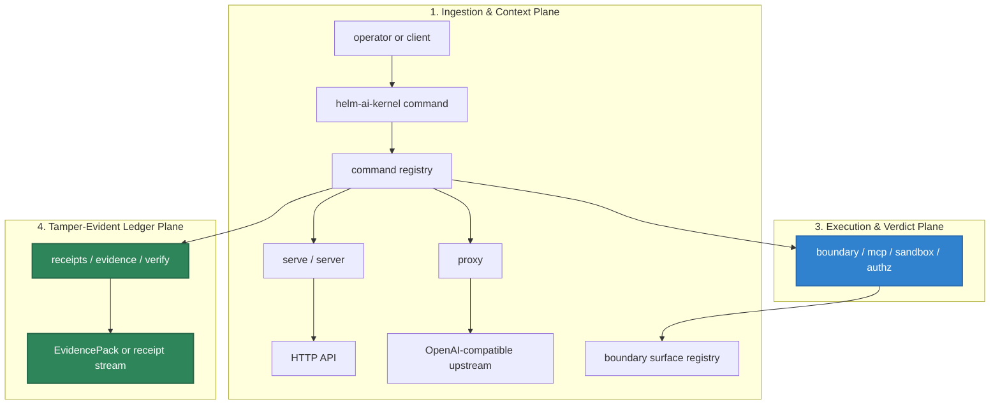

# HELM AI Kernel CLI Reference

The `helm-ai-kernel` binary is wired in [`core/cmd/helm-ai-kernel`](../../core/cmd/helm-ai-kernel). Command registration is centralized in [`registry.go`](../../core/cmd/helm-ai-kernel/registry.go), with startup handling in [`main.go`](../../core/cmd/helm-ai-kernel/main.go) and `helm-ai-kernel serve` flag parsing in [`server_cmd.go`](../../core/cmd/helm-ai-kernel/server_cmd.go).

## Audience

Use this page if you run the HELM AI Kernel binary, copy CLI snippets into automation, or update command docs after changing `core/cmd/helm-ai-kernel`.

## Outcome

After this page you should know the supported top-level command families, the source file that owns each command, the flag contracts that public docs may claim, and the tests that must pass after command changes.

## Source Truth

This page is generated from the active CLI implementation and must stay aligned with [`core/cmd/helm-ai-kernel`](../../core/cmd/helm-ai-kernel), [`core/cmd/README.md`](../../core/cmd/README.md), the command tests in [`core/cmd/helm-ai-kernel`](../../core/cmd/helm-ai-kernel), and the public manifest row for `helm-ai-kernel/reference/cli`.

## Runtime Map




## Primary Commands

| Command | Purpose | Source truth |
| --- | --- | --- |
| `helm up <app>` / `helm-ai-kernel up <app>` | Launch any supported AppSpec through HELM LaunchKit with environment preflight, supply-chain checks, policy/CPI compile, scoped secrets, sandbox grants, MCP quarantine, receipts, EvidencePack export, offline verify command, and CLI inspection command. | [`up_cmd.go`](../../core/cmd/helm-ai-kernel/up_cmd.go), [`core/pkg/launchkit`](../../core/pkg/launchkit) |
| `helm-ai-kernel serve` | Start the local execution boundary from a policy file. | [`server_cmd.go`](../../core/cmd/helm-ai-kernel/server_cmd.go), [`serve_policy.go`](../../core/cmd/helm-ai-kernel/serve_policy.go) |
| `helm-ai-kernel server` | Start the default Guardian API and proxy services. | [`main.go`](../../core/cmd/helm-ai-kernel/main.go), [`subsystems.go`](../../core/cmd/helm-ai-kernel/subsystems.go) |
| `helm-ai-kernel proxy` | Run the OpenAI-compatible governance proxy. | [`proxy_cmd.go`](../../core/cmd/helm-ai-kernel/proxy_cmd.go) |
| `helm-ai-kernel setup <claude-code\|codex>` | Install local MCP and PreToolUse hook integration for Claude Code or Codex, write autoconfigure draft artifacts, and start the local headless proof path. | [`setup_cmd.go`](../../core/cmd/helm-ai-kernel/setup_cmd.go), [`hook_cmd.go`](../../core/cmd/helm-ai-kernel/hook_cmd.go), [`quickstart_cmd.go`](../../core/cmd/helm-ai-kernel/quickstart_cmd.go) |
| `helm-ai-kernel receipts tail` | Tail durable receipt events for a specific agent. | [`receipts_cmd.go`](../../core/cmd/helm-ai-kernel/receipts_cmd.go), [`receipt_routes.go`](../../core/cmd/helm-ai-kernel/receipt_routes.go) |
| `helm-ai-kernel evidence` | Export evidence envelopes over native EvidencePacks. | [`evidence_cmd.go`](../../core/cmd/helm-ai-kernel/evidence_cmd.go), [`contract_routes.go`](../../core/cmd/helm-ai-kernel/contract_routes.go) |
| `helm-ai-kernel export` | Export an EvidencePack from local evidence material. | [`export_cmd.go`](../../core/cmd/helm-ai-kernel/export_cmd.go), [`export_pack.go`](../../core/cmd/helm-ai-kernel/export_pack.go) |
| `helm-ai-kernel export aat` | Export audit entries as an IETF draft-sharif-agent-audit-trail (AAT) conformant JSON Lines hash chain (`--in`, `--agent-id`, optional `--sign-key`), or verify an existing chain (`--verify`). | [`export_aat_cmd.go`](../../core/cmd/helm-ai-kernel/export_aat_cmd.go), [`core/pkg/audit`](../../core/pkg/audit) |
| `helm-ai-kernel verify` | Verify an EvidencePack directory or archive offline, with optional online proof checks. Use `--entry <path> --proof <file>` for privacy-preserving single-entry verification — confirm one manifest entry belongs to a pack via a Merkle inclusion path without possessing the other entries (see `evidence prove-entry` and evidence-pack-v1.md Section 14). | [`verify_cmd.go`](../../core/cmd/helm-ai-kernel/verify_cmd.go), [`verify_entry_cmd.go`](../../core/cmd/helm-ai-kernel/verify_entry_cmd.go), [`core/pkg/verifier`](../../core/pkg/verifier) |
| `helm-ai-kernel log` | Operate the receipt transparency log: append receipt hashes, emit signed tree heads, and build or verify RFC 6962 inclusion and consistency proofs. | [`translog_cmd.go`](../../core/cmd/helm-ai-kernel/translog_cmd.go), [`core/pkg/translog`](../../core/pkg/translog), [`receipt-transparency-v1.md`](../../protocols/specs/rfc/receipt-transparency-v1.md) |
| `helm-ai-kernel counterfactual summary` | Aggregate signed observe-mode counterfactual receipts (the verdicts the PDP would have issued under an observe grant) into a deterministic would-have summary: DENY/ESCALATE counts by policy epoch, tool, MCP server, and reason code. Counterfactual receipts confer no execution authority. | [`counterfactual_cmd.go`](../../core/cmd/helm-ai-kernel/counterfactual_cmd.go), [`core/pkg/contracts`](../../core/pkg/contracts), [`receipt-format-v1.md`](../../protocols/specs/rfc/receipt-format-v1.md) |
| `helm-ai-kernel bundle` | List, inspect, verify, or build policy bundles. | [`bundle_cmd.go`](../../core/cmd/helm-ai-kernel/bundle_cmd.go), [`core/pkg/policybundles`](../../core/pkg/policybundles) |
| `helm-ai-kernel conform` | Run conformance gates and list negative boundary vectors. | [`conform.go`](../../core/cmd/helm-ai-kernel/conform.go), [`core/pkg/conformance`](../../core/pkg/conformance) |
| `helm-ai-kernel mcp` | Serve, package, scan, quarantine, approve, and authorize MCP surfaces. | [`mcp_cmd.go`](../../core/cmd/helm-ai-kernel/mcp_cmd.go), [`mcp_boundary_cmd.go`](../../core/cmd/helm-ai-kernel/mcp_boundary_cmd.go), [`mcp_runtime.go`](../../core/cmd/helm-ai-kernel/mcp_runtime.go) |
| `helm-ai-kernel hook pre-tool` | Local client hook handler. It reads Claude Code or Codex PreToolUse JSON on stdin, emits hook denial JSON for selected high-risk effects, and writes signed workstation policy decision receipts. | [`hook_cmd.go`](../../core/cmd/helm-ai-kernel/hook_cmd.go), [`workstation_m3_cmd.go`](../../core/cmd/helm-ai-kernel/workstation_m3_cmd.go) |
| `helm-ai-kernel boundary` | Inspect execution-boundary status, capabilities, records, verification, and checkpoints. | [`boundary_surface_cmd.go`](../../core/cmd/helm-ai-kernel/boundary_surface_cmd.go), [`core/pkg/boundary`](../../core/pkg/boundary) |
| `helm-ai-kernel identity` | Inspect HELM AI Kernel agent identities. | [`boundary_surface_cmd.go`](../../core/cmd/helm-ai-kernel/boundary_surface_cmd.go), [`core/pkg/identity`](../../core/pkg/identity) |
| `helm-ai-kernel sandbox` | Run governed sandbox execution and inspect sandbox grants. | [`sandbox_cmd.go`](../../core/cmd/helm-ai-kernel/sandbox_cmd.go), [`sandbox_inspect_cmd.go`](../../core/cmd/helm-ai-kernel/sandbox_inspect_cmd.go) |
| `helm-ai-kernel authz`, `helm-ai-kernel approvals`, `helm-ai-kernel budget` | Inspect ReBAC snapshots, approval ceremonies, and budget ceilings. | [`boundary_surface_cmd.go`](../../core/cmd/helm-ai-kernel/boundary_surface_cmd.go), [`core/pkg/contracts`](../../core/pkg/contracts) |
| `helm-ai-kernel telemetry`, `helm-ai-kernel coexistence`, `helm-ai-kernel integrate` | Emit non-authoritative telemetry, coexistence, and pre-dispatch integration scaffolds. | [`boundary_surface_cmd.go`](../../core/cmd/helm-ai-kernel/boundary_surface_cmd.go) |
| `helm-ai-kernel policy`, `helm-ai-kernel plan`, `helm-ai-kernel pack` | Work with policy tests, execution plans, and governed self-extension packs. | [`policy_cmd.go`](../../core/cmd/helm-ai-kernel/policy_cmd.go), [`plan_cmd.go`](../../core/cmd/helm-ai-kernel/plan_cmd.go), [`pack_cmd.go`](../../core/cmd/helm-ai-kernel/pack_cmd.go) |
| `helm-ai-kernel test` | Run local HELM smoke checks exposed by the CLI. | [`test_cmd.go`](../../core/cmd/helm-ai-kernel/test_cmd.go) |
| `helm-ai-kernel scaffold`, `helm-ai-kernel dev` | Create a local governance scaffold and start HELM in development mode. | [`init_cmd.go`](../../core/cmd/helm-ai-kernel/init_cmd.go) |
| `helm-ai-kernel pack coverage` | Show governed self-extension pack coverage statistics. | [`pack_cmd.go`](../../core/cmd/helm-ai-kernel/pack_cmd.go) |
| `helm-ai-kernel workstation verify-decision` | Verify a signed workstation policy decision receipt, including hook DENY receipts. | [`workstation_m3_cmd.go`](../../core/cmd/helm-ai-kernel/workstation_m3_cmd.go), [`core/pkg/workstation`](../../core/pkg/workstation) |
| `helm-ai-kernel doctor`, `helm-ai-kernel init`, `helm-ai-kernel onboard`, `helm-ai-kernel demo` | Initialize, diagnose, and run local demonstration flows. | [`doctor_cmd.go`](../../core/cmd/helm-ai-kernel/doctor_cmd.go), [`doctor_init_trust.go`](../../core/cmd/helm-ai-kernel/doctor_init_trust.go), [`onboard_cmd.go`](../../core/cmd/helm-ai-kernel/onboard_cmd.go), [`demo_cmd.go`](../../core/cmd/helm-ai-kernel/demo_cmd.go) |
| `helm-ai-kernel replay`, `helm-ai-kernel report`, `helm-ai-kernel certify`, `helm-ai-kernel rollup` | Replay evidence, report compliance, certify packs, and build receipt rollups. | [`replay_cmd.go`](../../core/cmd/helm-ai-kernel/replay_cmd.go), [`report_cmd.go`](../../core/cmd/helm-ai-kernel/report_cmd.go), [`certify_cmd.go`](../../core/cmd/helm-ai-kernel/certify_cmd.go), [`rollup_cmd.go`](../../core/cmd/helm-ai-kernel/rollup_cmd.go) |
| `helm-ai-kernel freeze`, `helm-ai-kernel unfreeze`, `helm-ai-kernel incident`, `helm-ai-kernel brief`, `helm-ai-kernel risk-summary` | Operate local safety, incident, brief, and risk surfaces. | [`freeze_cmd.go`](../../core/cmd/helm-ai-kernel/freeze_cmd.go), [`incident_cmd.go`](../../core/cmd/helm-ai-kernel/incident_cmd.go), [`risk_cmd.go`](../../core/cmd/helm-ai-kernel/risk_cmd.go) |
| `helm-ai-kernel trust`, `helm-ai-kernel threat`, `helm-ai-kernel shadow`, `helm-ai-kernel did`, `helm-ai-kernel tee`, `helm-ai-kernel local` | Inspect trust roots, threats, shadow-AI patterns, identifiers, TEE attestations, and local provider profiles. | [`trust_cmd.go`](../../core/cmd/helm-ai-kernel/trust_cmd.go), [`threat_cmd.go`](../../core/cmd/helm-ai-kernel/threat_cmd.go), [`shadow_cmd.go`](../../core/cmd/helm-ai-kernel/shadow_cmd.go), [`did_cmd.go`](../../core/cmd/helm-ai-kernel/did_cmd.go), [`tee_cmd.go`](../../core/cmd/helm-ai-kernel/tee_cmd.go), [`local_cmd.go`](../../core/cmd/helm-ai-kernel/local_cmd.go) |
| `helm-ai-kernel health`, `helm-ai-kernel version`, `helm-ai-kernel help` | Global utility commands for local health checks, version reporting, and usage output. | [`main.go`](../../core/cmd/helm-ai-kernel/main.go), [`registry.go`](../../core/cmd/helm-ai-kernel/registry.go) |

Auxiliary binaries under `core/cmd/bootstrap`, `core/cmd/channel_gateway`, `core/cmd/pack_verify`, `core/cmd/skill_lint`, and `core/cmd/skill_pack` are source-owned helpers. They are not top-level `helm-ai-kernel` subcommands unless wired through `core/cmd/helm-ai-kernel`.

This table documents registered top-level `helm-ai-kernel` command families and global utility commands. Aliases are documented in source and should be exposed here only when public examples rely on them.

## Key Flag Contracts

| Command | Contract |
| --- | --- |
| `helm up <app>` | Defaults to `--target local --mode auto`; accepts `--target local|cloud|cloud:helm|cloud:aws|cloud:kubernetes`, `--demo`, `--verify-only`, `--live`, `--resume <run_id>`, `--yes`, and `--json`. `--verify-only` never starts runtime. `--live` never falls back to demo. Cloud targets escalate before paid resources unless provider auth and explicit approval are present. |
| `helm-ai-kernel setup <claude-code\|codex>` | Defaults to user scope and `~/.helm-ai-kernel`; accepts `--scope user|project`, `--yes`, `--dry-run`, `--json`, and `--data-dir`. `--dry-run` writes nothing. Non-dry-run setup requires `--yes`. The JSON summary includes target, binary path, client config path, hook config path, data dir, Kernel URL, scan grade, draft policy path, and uninstall command. |
| `helm-ai-kernel setup status <target>` / `setup remove <target>` | `status` checks for the HELM MCP and hook entries. `remove` requires `--yes` unless `--dry-run`; it removes the HELM hook entry and the local MCP entry for the selected target/scope. |
| `helm-ai-kernel hook pre-tool` | Requires `--client claude-code|codex`; reads hook JSON from stdin. Safe calls emit no output and grant no approval. Denied calls emit client-compatible `hookSpecificOutput.permissionDecision=deny` and write a signed decision receipt under `<data-dir>/receipts/hooks/`. |
| `helm-ai-kernel workstation verify-decision` | Requires `--receipt <file>` or a single positional receipt path. Returns exit `0` only when the workstation policy decision receipt hash and Ed25519 signature verify. Tampered receipts return exit `1` and print `signature: false`. |
| `helm-ai-kernel serve --policy <path>` | `--policy` is required. Optional flags are `--addr`, `--port`, `--data-dir`, and `--json`. If the policy does not override bind or port, `serve` uses `127.0.0.1:7714`. |
| `helm-ai-kernel server` | Starts without `--policy` and defaults to `127.0.0.1:8080` unless flags, env, or config override it. `HELM_BIND_ADDR` overrides the bind address when no explicit flag is set. `HELM_PORT` overrides the API port when no explicit flag is set. The separate health server uses `HELM_HEALTH_PORT` and defaults to `8081`. |
| `helm-ai-kernel proxy` | Defaults to `--upstream https://api.openai.com/v1`, `--port 9090`, and `--receipts-dir ./helm-receipts`. `--websocket` is explicitly unsupported in the OSS proxy runtime. |
| `helm-ai-kernel health` | Checks `http://localhost:$HELM_HEALTH_PORT/healthz`; if `HELM_HEALTH_PORT` is unset, it checks `http://localhost:8081/healthz`. |
| `helm-ai-kernel receipts tail` | Requires `--agent <id>`. `--server` defaults from `HELM_URL` or `http://127.0.0.1:7714`. |
| `helm-ai-kernel bundle build` | Takes the policy source as the positional argument: `helm-ai-kernel bundle build [--language=cel|rego|cedar] [--entities=path] <source>`. There is no `--policy` flag for this subcommand. |
| `helm-ai-kernel bundle verify` | Requires `--file <bundle.yaml>` and `--hash <expected-hash>`. |
| `helm-ai-kernel verify` | Accepts a positional EvidencePack path or `--bundle`. `--online` only adds public proof-ledger verification after offline checks pass. Passing `--entry`/`--proof` switches to single-entry inclusion-proof verification (offline, no network, no sibling entries required). |
| `helm-ai-kernel evidence prove-entry` | Requires `--manifest <manifest.json>` and `--entry <path>`; writes a self-contained inclusion proof to `--out` (default stdout) for redacted single-entry verification. |
| `helm-ai-kernel boundary` | Uses `status`, `capabilities`, `records`, `get`, `verify`, and `checkpoint` subcommands. |

## Receipt And Verification Output

`helm-ai-kernel receipts tail --agent <id>` is the live operator view over
durable boundary events. The command is useful when proving that Claude, Cursor,
LangGraph, or a custom runtime crossed HELM instead of calling a tool or model
endpoint directly.

Read the output as:

| Output field | Meaning |
| --- | --- |
| `receipt_id` | Stable handle for the governed request; cite this in issues, reviews, and EvidencePacks |
| `decision_id` | Policy decision that produced the receipt |
| `verdict` / `status` | Boundary result such as `ALLOW`, `DENY`, `ESCALATE`, `APPROVED`, or `DENIED` |
| `reason_code` | Machine-readable reason for the decision |
| `effect_id` | Proposed or denied side effect when the runtime records one |
| `output_hash` | Hash of the governed response, denial body, or completion |
| `signature` | Receipt signature material; required before treating the event as audit evidence |

`helm-ai-kernel verify evidence-pack.tar` is the offline archive verifier. A
successful run means the verifier accepted the archive/index shape, checked the
indexed content hashes, found required receipt/proof material, and verified the
available seal/signature material. If the output says `anchor offline`, no
external anchor was embedded; the local pack can still pass hash and signature
checks, but customer/high-assurance review should add the trusted signer,
external anchor, and storage receipt inputs.

## Boundary And API References

- [HTTP API Reference](http-api.md) covers the route registry, auth classes, OpenAPI contract, and local API behavior.
- [Execution Boundary Reference](execution-boundary.md) covers boundary records, checkpoints, fail-closed cases, and native evidence authority.

## Validation

Run CLI-focused validation after changing command flags or public examples:

```bash
cd core
go test ./cmd/helm-ai-kernel -count=1
```

Then run the documentation gates from the repository root:

```bash
make docs-coverage
make docs-truth
```

## Troubleshooting

| Symptom | First check |
| --- | --- |
| A command snippet fails with an unknown flag | Compare the snippet with `core/cmd/helm-ai-kernel/*_cmd.go`; for example, `helm-ai-kernel bundle build` takes the policy source positionally, not through `--policy`. |
| A helper binary appears in public docs as a `helm-ai-kernel` subcommand | Keep helper binaries source-owned unless they are registered in `core/cmd/helm-ai-kernel/registry.go`. |
| CLI docs and tests disagree | Update the source command, the command test, and this reference in the same change. |
