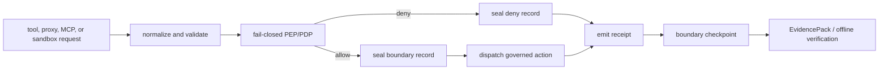

# Execution Boundary Reference

HELM OSS is the proof-bearing execution boundary for governed AI tool use. The authoritative runtime record is the HELM boundary record plus its receipt binding; telemetry, coexistence manifests, external evidence envelopes, and scanner outputs are compatibility surfaces around that native authority.

## Audience

Use this page if you build integrations that cross the HELM execution boundary, audit receipts, run MCP/sandbox surfaces, or maintain conformance tests.

## Outcome

After this page you should know the public boundary surfaces, their CLI and HTTP entry points, what durable state they produce, how fail-closed cases are recorded, and which validation commands prove the behavior.

## Boundary Flow



## Source Truth

| Surface | Source |
| --- | --- |
| CLI commands | [`core/cmd/helm/boundary_surface_cmd.go`](../../core/cmd/helm/boundary_surface_cmd.go), [`core/cmd/helm/mcp_boundary_cmd.go`](../../core/cmd/helm/mcp_boundary_cmd.go), [`core/cmd/helm/sandbox_cmd.go`](../../core/cmd/helm/sandbox_cmd.go), [`core/cmd/helm/evidence_cmd.go`](../../core/cmd/helm/evidence_cmd.go) |
| HTTP routes | [`core/cmd/helm/route_registry.go`](../../core/cmd/helm/route_registry.go), [`core/cmd/helm/contract_routes.go`](../../core/cmd/helm/contract_routes.go), [`api/openapi/helm.openapi.yaml`](../../api/openapi/helm.openapi.yaml) |
| Durable boundary state | [`core/pkg/boundary`](../../core/pkg/boundary), [`core/pkg/contracts`](../../core/pkg/contracts) |
| Receipt and evidence contracts | [`schemas/receipts`](../../schemas/receipts), [`core/pkg/receipts`](../../core/pkg/receipts), [`core/pkg/evidencepack`](../../core/pkg/evidencepack), [`core/pkg/verifier`](../../core/pkg/verifier) |
| Conformance vectors | [`core/pkg/conformance`](../../core/pkg/conformance), [`tests/conformance`](../../tests/conformance), [`protocols/conformance/v1`](../../protocols/conformance/v1) |

## Public Boundary Surfaces

| Capability | CLI | HTTP API | Authority |
| --- | --- | --- | --- |
| Boundary health and capability inventory | `helm boundary status`, `helm boundary capabilities` | `GET /api/v1/boundary/status`, `GET /api/v1/boundary/capabilities` | Runtime status and capability summaries. |
| Boundary records | `helm boundary records`, `helm boundary get`, `helm boundary verify` | `GET /api/v1/boundary/records`, `GET /api/v1/boundary/records/{record_id}`, `POST /api/v1/boundary/records/{record_id}/verify` | JCS-hashed boundary records linked to receipts. |
| Checkpoints | `helm boundary checkpoint` | `GET|POST /api/v1/boundary/checkpoints` | Tamper-evident roots over records and receipts. |
| Negative conformance vectors | `helm conform negative --json`, `helm conform vectors --json` | `GET /api/v1/conformance/negative`, `GET /api/v1/conformance/vectors` | Clean-room fail-closed behavior fixtures. |
| MCP quarantine and authorization | `helm mcp scan`, `helm mcp wrap`, `helm mcp list`, `helm mcp get`, `helm mcp approve`, `helm mcp revoke`, `helm mcp auth-profile`, `helm mcp authorize-call` | `/api/v1/mcp/*`, `/.well-known/oauth-protected-resource/mcp` | Pre-dispatch MCP firewall state and OAuth/profile bindings. |
| Sandbox grants | `helm sandbox profiles`, `helm sandbox grant`, `helm sandbox list`, `helm sandbox get`, `helm sandbox verify`, `helm sandbox preflight`, `helm sandbox inspect` | `/api/v1/sandbox/profiles`, `/api/v1/sandbox/grants`, `/api/v1/sandbox/preflight`, `/api/v1/sandbox/grants/inspect` | Grant hashes, deny-default profiles, and dispatch preflight results. |
| Authz snapshots | `helm identity agents`, `helm authz health`, `helm authz check`, `helm authz snapshots`, `helm authz get` | `/api/v1/identity/agents`, `/api/v1/authz/health`, `/api/v1/authz/check`, `/api/v1/authz/snapshots` | ReBAC snapshot hash and relationship freshness. |
| Approvals and budgets | `helm approvals *`, `helm budget *` | `/api/v1/approvals`, `/api/v1/budgets` | Local approval ceremonies and spend/tool/egress ceilings. |
| Evidence envelopes | `helm evidence export --envelope`, `helm evidence envelope *` | `/api/v1/evidence/envelopes`, `/api/v1/evidence/export`, `/api/v1/evidence/verify`, `/api/v1/replay/verify` | Native EvidencePack roots; external envelopes are wrappers. |
| Telemetry and coexistence | `helm telemetry otel-config`, `helm coexistence manifest`, `helm integrate scaffold` | `/api/v1/telemetry/otel/config`, `/api/v1/telemetry/export`, `/api/v1/coexistence/capabilities` | Non-authoritative export and integration metadata. |

## Durable State

`helm serve` persists boundary surface state in the runtime database through `boundary_surface_snapshots`. SQLite Lite Mode and Postgres use the same table contract. Standalone CLI commands use `HELM_BOUNDARY_REGISTRY_PATH` or `HELM_DATA_DIR/boundary/surfaces.json`, so records, approvals, checkpoints, envelopes, and budget changes survive separate CLI invocations.

## Fail-Closed Cases

The boundary must deny before dispatch when policy or authorization state is not trustworthy. Public conformance vectors cover at least these cases:

- missing or stale policy;
- PDP outage;
- stale relationship snapshots;
- missing credentials;
- malformed tool arguments;
- schema drift;
- direct upstream bypass;
- sandbox overgrant;
- blocked egress;
- denial receipt emission.

Deny paths are still proof paths: they produce a boundary record and receipt rather than silently dropping the action.

## Native Evidence Authority

External envelopes can help auditors and procurement teams move evidence between systems, but they do not become the source of truth. Verification starts with HELM receipts, grant or snapshot hashes, boundary record hashes, checkpoints, and the EvidencePack manifest.

## Validation

```bash
cd core
go test ./pkg/contracts ./pkg/boundary ./cmd/helm -run 'Test.*Boundary|Test.*Route|Test.*Evidence|Test.*MCP|Test.*Sandbox' -count=1
cd ../tests/conformance
go test ./...
```

## Troubleshooting

| Symptom | First check |
| --- | --- |
| A denied request has no receipt | Check the fail-closed path in the CLI/API route and conformance vector; denial should still seal a boundary record. |
| Boundary state disappears between commands | Confirm `HELM_BOUNDARY_REGISTRY_PATH` or `HELM_DATA_DIR` points at a durable location. |
| External envelope verification passes but native verification fails | Treat native HELM receipt, checkpoint, and EvidencePack roots as authoritative and repair the wrapper metadata. |
