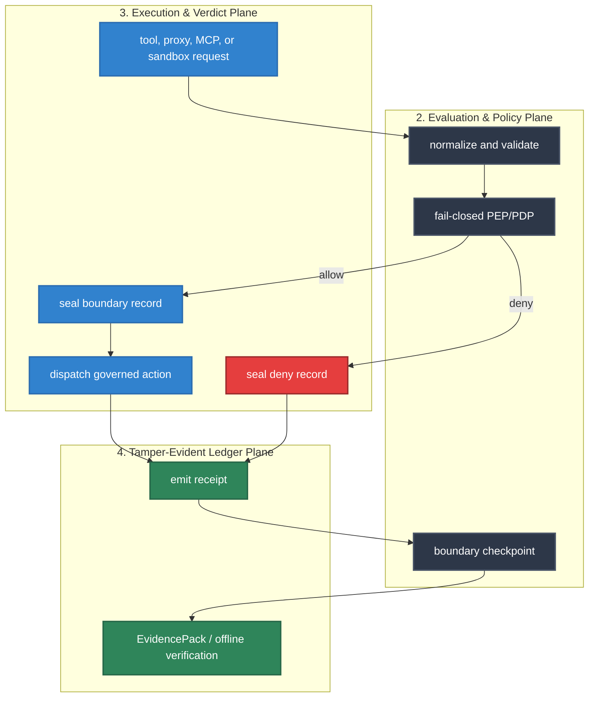

# Execution Boundary Reference

HELM AI Kernel is the proof-bearing execution boundary for governed AI tool use. The authoritative runtime record is the HELM boundary record plus its receipt binding; telemetry, coexistence manifests, external evidence envelopes, and scanner outputs are compatibility surfaces around that native authority.

## Audience

Use this page if you build integrations that cross the HELM execution boundary, audit receipts, run MCP/sandbox surfaces, or maintain conformance tests.

## Outcome

After this page you should know the public boundary surfaces, their CLI and HTTP entry points, what durable state they produce, how fail-closed cases are recorded, and which validation commands prove the behavior.

## Boundary Flow




## Source Truth

| Surface | Source |
| --- | --- |
| CLI commands | [`core/cmd/helm-ai-kernel/boundary_surface_cmd.go`](../../core/cmd/helm-ai-kernel/boundary_surface_cmd.go), [`core/cmd/helm-ai-kernel/mcp_boundary_cmd.go`](../../core/cmd/helm-ai-kernel/mcp_boundary_cmd.go), [`core/cmd/helm-ai-kernel/sandbox_cmd.go`](../../core/cmd/helm-ai-kernel/sandbox_cmd.go), [`core/cmd/helm-ai-kernel/evidence_cmd.go`](../../core/cmd/helm-ai-kernel/evidence_cmd.go) |
| HTTP routes | [`core/cmd/helm-ai-kernel/route_registry.go`](../../core/cmd/helm-ai-kernel/route_registry.go), [`core/cmd/helm-ai-kernel/contract_routes.go`](../../core/cmd/helm-ai-kernel/contract_routes.go), [`api/openapi/helm.openapi.yaml`](../../api/openapi/helm.openapi.yaml) |
| Durable boundary state | [`core/pkg/boundary`](../../core/pkg/boundary), [`core/pkg/contracts`](../../core/pkg/contracts) |
| Receipt and evidence contracts | [`schemas/receipts`](../../schemas/receipts), [`core/pkg/receipts`](../../core/pkg/receipts), [`core/pkg/evidencepack`](../../core/pkg/evidencepack), [`core/pkg/verifier`](../../core/pkg/verifier) |
| Conformance vectors | [`core/pkg/conformance`](../../core/pkg/conformance), [`tests/conformance`](../../tests/conformance), [`protocols/conformance/v1`](../../protocols/conformance/v1) |

## Public Boundary Surfaces

| Capability | CLI | HTTP API | Authority |
| --- | --- | --- | --- |
| Boundary health and capability inventory | `helm-ai-kernel boundary status`, `helm-ai-kernel boundary capabilities` | `GET /api/v1/boundary/status`, `GET /api/v1/boundary/capabilities` | Runtime status and capability summaries. |
| Boundary records | `helm-ai-kernel boundary records`, `helm-ai-kernel boundary get`, `helm-ai-kernel boundary verify` | `GET /api/v1/boundary/records`, `GET /api/v1/boundary/records/{record_id}`, `POST /api/v1/boundary/records/{record_id}/verify` | JCS-hashed boundary records linked to receipts. |
| Checkpoints | `helm-ai-kernel boundary checkpoint` | `GET|POST /api/v1/boundary/checkpoints` | Tamper-evident roots over records and receipts. |
| Negative conformance vectors | `helm-ai-kernel conform negative --json`, `helm-ai-kernel conform vectors --json` | `GET /api/v1/conformance/negative`, `GET /api/v1/conformance/vectors` | Clean-room fail-closed behavior fixtures. |
| MCP quarantine and authorization | `helm-ai-kernel mcp scan`, `helm-ai-kernel mcp wrap`, `helm-ai-kernel mcp proof`, `helm-ai-kernel mcp list`, `helm-ai-kernel mcp get`, `helm-ai-kernel mcp approve`, `helm-ai-kernel mcp revoke`, `helm-ai-kernel mcp auth-profile`, `helm-ai-kernel mcp authorize-call` | `/api/v1/mcp/*`, `/.well-known/oauth-protected-resource/mcp` | Pre-dispatch MCP firewall state, no-dispatch proof bundles, and OAuth/profile bindings. |
| Sandbox grants | `helm-ai-kernel sandbox profiles`, `helm-ai-kernel sandbox grant`, `helm-ai-kernel sandbox list`, `helm-ai-kernel sandbox get`, `helm-ai-kernel sandbox verify`, `helm-ai-kernel sandbox preflight`, `helm-ai-kernel sandbox inspect` | `/api/v1/sandbox/profiles`, `/api/v1/sandbox/grants`, `/api/v1/sandbox/preflight`, `/api/v1/sandbox/grants/inspect` | Grant hashes, deny-default profiles, and dispatch preflight results. |
| Authz snapshots | `helm-ai-kernel identity agents`, `helm-ai-kernel authz health`, `helm-ai-kernel authz check`, `helm-ai-kernel authz snapshots`, `helm-ai-kernel authz get` | `/api/v1/identity/agents`, `/api/v1/authz/health`, `/api/v1/authz/check`, `/api/v1/authz/snapshots` | ReBAC snapshot hash and relationship freshness. |
| Approvals and budgets | `helm-ai-kernel approvals *`, `helm-ai-kernel budget *` | `/api/v1/approvals`, `/api/v1/budgets` | Local approval ceremonies and spend/tool/egress ceilings. |
| Evidence envelopes | `helm-ai-kernel evidence export --envelope`, `helm-ai-kernel evidence envelope *` | `/api/v1/evidence/envelopes`, `/api/v1/evidence/export`, `/api/v1/evidence/verify`, `/api/v1/replay/verify` | Native EvidencePack roots; external envelopes are wrappers. |
| External host evidence | `helm-ai-kernel verify external-receipt --chain <path> --public-key <hex|file>`, `helm-ai-kernel evidence attach-host-chain --bundle <bundle> --chain <path> --out <bundle> --source <name>`, `helm-ai-kernel evidence correlate-host --bundle <bundle>` | none | Vendor-neutral host/network evidence import, offline verification, and Boundary Drift correlation. |
| Telemetry and coexistence | `helm-ai-kernel telemetry otel-config`, `helm-ai-kernel coexistence manifest`, `helm-ai-kernel integrate scaffold` | `/api/v1/telemetry/otel/config`, `/api/v1/telemetry/export`, `/api/v1/coexistence/capabilities` | Non-authoritative export and integration metadata. |

## Durable State

`helm-ai-kernel serve` persists boundary surface state in the runtime database through `boundary_surface_snapshots`. SQLite Lite Mode and Postgres use the same table contract. Standalone CLI commands use `HELM_BOUNDARY_REGISTRY_PATH` or `HELM_DATA_DIR/boundary/surfaces.json`, so records, approvals, checkpoints, envelopes, and budget changes survive separate CLI invocations.

## Fail-Closed Cases

The boundary must deny before dispatch when policy or authorization state is not trustworthy. Public conformance vectors cover at least these cases:

- missing or stale policy;
- PDP outage;
- stale relationship snapshots;
- missing credentials;
- malformed tool arguments;
- schema drift;
- direct upstream bypass;
- sandbox overgrant;
- blocked egress;
- denial receipt emission.

Deny paths are still proof paths: they produce a boundary record and receipt rather than silently dropping the action.

## Native Evidence Authority

External envelopes can help auditors and procurement teams move evidence between systems, but they do not become the source of truth. Verification starts with HELM receipts, grant or snapshot hashes, boundary record hashes, checkpoints, and the EvidencePack manifest.

HELM can consume and correlate external host evidence produced by independent
recorders. Imported host chains can prove that a host observed outbound network
behavior; HELM correlation then checks whether that behavior aligns with HELM
authority receipts, policy verdicts, sandbox leases, and egress ceilings. A
host event with no matching HELM intent, a host event after a HELM deny, a
destination mismatch, or a byte-volume excess is reported as Boundary Drift.

This OSS kernel does not claim eBPF, seccomp, TPM, or packet-blocking network
enforcement unless a specific code path and verifier prove it. Hardware-rooted
claims in imported host evidence are retained and structurally checked; unknown
or unsupported roots are reported as not verified.

## Validation

```bash
cd core
go test ./pkg/contracts ./pkg/boundary ./cmd/helm-ai-kernel -run 'Test.*Boundary|Test.*Route|Test.*Evidence|Test.*MCP|Test.*Sandbox' -count=1
cd ../tests/conformance
go test ./...
```

## Troubleshooting

| Symptom | First check |
| --- | --- |
| A denied request has no receipt | Check the fail-closed path in the CLI/API route and conformance vector; denial should still seal a boundary record. |
| Boundary state disappears between commands | Confirm `HELM_BOUNDARY_REGISTRY_PATH` or `HELM_DATA_DIR` points at a durable location. |
| External envelope verification passes but native verification fails | Treat native HELM receipt, checkpoint, and EvidencePack roots as authoritative and repair the wrapper metadata. |
