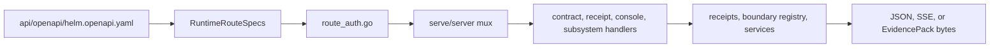

# HELM AI Kernel HTTP API Reference

The public HTTP contract is anchored in [`api/openapi/helm.openapi.yaml`](../../api/openapi/helm.openapi.yaml). Runtime route ownership is mirrored in [`core/cmd/helm-ai-kernel/route_registry.go`](../../core/cmd/helm-ai-kernel/route_registry.go), enforced by [`route_auth.go`](../../core/cmd/helm-ai-kernel/route_auth.go), and wired into the local server through [`subsystems.go`](../../core/cmd/helm-ai-kernel/subsystems.go), [`contract_routes.go`](../../core/cmd/helm-ai-kernel/contract_routes.go), [`receipt_routes.go`](../../core/cmd/helm-ai-kernel/receipt_routes.go), and [`console_routes.go`](../../core/cmd/helm-ai-kernel/console_routes.go).

## Audience

Use this page if you call HELM AI Kernel over HTTP, generate a client from OpenAPI, configure auth headers, or debug route drift between the runtime and public docs.

## Outcome

After this page you should know each public route family, its auth class, the source file that owns it, and the tests that catch route/OpenAPI drift.

## Source Truth

This page is source-backed by [`api/openapi/helm.openapi.yaml`](../../api/openapi/helm.openapi.yaml), [`core/cmd/helm-ai-kernel/route_registry.go`](../../core/cmd/helm-ai-kernel/route_registry.go), [`core/cmd/helm-ai-kernel/route_auth.go`](../../core/cmd/helm-ai-kernel/route_auth.go), [`core/cmd/helm-ai-kernel/contract_routes.go`](../../core/cmd/helm-ai-kernel/contract_routes.go), [`core/cmd/helm-ai-kernel/receipt_routes.go`](../../core/cmd/helm-ai-kernel/receipt_routes.go), [`core/cmd/helm-ai-kernel/console_routes.go`](../../core/cmd/helm-ai-kernel/console_routes.go), and route parity tests under [`core/cmd/helm-ai-kernel`](../../core/cmd/helm-ai-kernel).

## Contract Flow



## Runtime Auth Classes

| Class | Runtime behavior |
| --- | --- |
| `public` | No runtime admin credential required by `protectRuntimeHandler`. |
| `tenant_scoped` | Requires `Authorization: Bearer $HELM_ADMIN_API_KEY` and `X-Helm-Tenant-ID` or `tenant_id`. `X-Helm-Principal-ID` can narrow the principal recorded in context. |
| `admin` / `authenticated` | Requires `Authorization: Bearer $HELM_ADMIN_API_KEY`. |
| `service_internal` | Requires `Authorization: Bearer $HELM_SERVICE_API_KEY`; used for service-to-service kernel approval. |

The OpenAPI security blocks describe the external contract. `route_auth.go` is the runtime source for local OSS enforcement.

## Public Route Families

| Family | Methods and paths | Source truth |
| --- | --- | --- |
| Health and version | `GET /healthz`, `GET /version` | [`subsystems.go`](../../core/cmd/helm-ai-kernel/subsystems.go), [`route_registry.go`](../../core/cmd/helm-ai-kernel/route_registry.go), [`main.go`](../../core/cmd/helm-ai-kernel/main.go) |
| Local proof demo | `POST /api/demo/run`, `POST /api/demo/verify`, `POST /api/demo/tamper` | [`demo_routes.go`](../../core/cmd/helm-ai-kernel/demo_routes.go) |
| OpenAI-compatible boundary | `POST /v1/chat/completions` | [`subsystems.go`](../../core/cmd/helm-ai-kernel/subsystems.go), [`core/pkg/api/openai_proxy.go`](../../core/pkg/api/openai_proxy.go), [`proxy_cmd.go`](../../core/cmd/helm-ai-kernel/proxy_cmd.go) |
| Kernel approval and evaluation | `POST /api/v1/kernel/approve`, `POST /api/v1/evaluate` | [`core/pkg/api/approve_handler.go`](../../core/pkg/api/approve_handler.go), [`route_registry.go`](../../core/cmd/helm-ai-kernel/route_registry.go) |
| Receipts | `GET /api/v1/receipts`, `GET /api/v1/receipts/tail`, `GET /api/v1/receipts/{receipt_id}` | [`receipt_routes.go`](../../core/cmd/helm-ai-kernel/receipt_routes.go) |
| ProofGraph receipts | `GET /api/v1/proofgraph/sessions`, `GET /api/v1/proofgraph/sessions/{session_id}/receipts`, `GET /api/v1/proofgraph/receipts/{receipt_hash}` | [`contract_routes.go`](../../core/cmd/helm-ai-kernel/contract_routes.go) |
| Evidence and replay | `POST /api/v1/evidence/export`, `POST /api/v1/evidence/verify`, `GET|POST /api/v1/evidence/envelopes`, `GET /api/v1/evidence/envelopes/{manifest_id}`, `GET /api/v1/evidence/envelopes/{manifest_id}/payload`, `POST /api/v1/evidence/envelopes/{manifest_id}/verify`, `POST /api/v1/replay/verify` | [`contract_routes.go`](../../core/cmd/helm-ai-kernel/contract_routes.go) |
| Boundary | `GET /api/v1/boundary/status`, `GET /api/v1/boundary/capabilities`, `GET /api/v1/boundary/records`, `GET /api/v1/boundary/records/{record_id}`, `POST /api/v1/boundary/records/{record_id}/verify`, `GET|POST /api/v1/boundary/checkpoints`, `POST /api/v1/boundary/checkpoints/{checkpoint_id}/verify` | [`contract_routes.go`](../../core/cmd/helm-ai-kernel/contract_routes.go), [`core/pkg/boundary`](../../core/pkg/boundary) |
| Conformance | `POST /api/v1/conformance/run`, `GET /api/v1/conformance/reports`, `GET /api/v1/conformance/reports/{report_id}`, `GET /api/v1/conformance/vectors`, `GET /api/v1/conformance/negative` | [`contract_routes.go`](../../core/cmd/helm-ai-kernel/contract_routes.go), [`conform.go`](../../core/cmd/helm-ai-kernel/conform.go) |
| MCP and A2A runtime | `GET|POST /mcp`, `GET /.well-known/oauth-protected-resource/mcp`, `GET /.well-known/agent-card.json`, `GET /mcp/v1/capabilities`, `POST /mcp/v1/execute` | [`mcp_runtime.go`](../../core/cmd/helm-ai-kernel/mcp_runtime.go), [`mcp_cmd.go`](../../core/cmd/helm-ai-kernel/mcp_cmd.go), [`wellknown.go`](../../core/pkg/a2a/wellknown.go) |
| MCP registry and authorization | `GET|POST /api/v1/mcp/registry`, `POST /api/v1/mcp/registry/approve`, `GET /api/v1/mcp/registry/{server_id}`, `POST /api/v1/mcp/registry/{server_id}/approve`, `POST /api/v1/mcp/registry/{server_id}/revoke`, `POST /api/v1/mcp/scan`, `GET /api/v1/mcp/auth-profiles`, `PUT /api/v1/mcp/auth-profiles/{profile_id}`, `POST /api/v1/mcp/authorize-call` | [`contract_routes.go`](../../core/cmd/helm-ai-kernel/contract_routes.go), [`mcp_boundary_cmd.go`](../../core/cmd/helm-ai-kernel/mcp_boundary_cmd.go) |
| Sandbox | `GET /api/v1/sandbox/profiles`, `GET|POST /api/v1/sandbox/grants`, `GET /api/v1/sandbox/grants/{grant_id}`, `POST /api/v1/sandbox/grants/{grant_id}/verify`, `POST /api/v1/sandbox/preflight`, `GET /api/v1/sandbox/grants/inspect` | [`contract_routes.go`](../../core/cmd/helm-ai-kernel/contract_routes.go), [`sandbox_cmd.go`](../../core/cmd/helm-ai-kernel/sandbox_cmd.go) |
| Identity and authz | `GET /api/v1/identity/agents`, `GET /api/v1/authz/health`, `POST /api/v1/authz/check`, `GET /api/v1/authz/snapshots`, `GET /api/v1/authz/snapshots/{snapshot_id}` | [`contract_routes.go`](../../core/cmd/helm-ai-kernel/contract_routes.go), [`subsystems.go`](../../core/cmd/helm-ai-kernel/subsystems.go), [`core/pkg/authz`](../../core/pkg/authz) |
| Approvals and budgets | `GET|POST /api/v1/approvals`, `POST /api/v1/approvals/{approval_id}/webauthn/challenge`, `POST /api/v1/approvals/{approval_id}/webauthn/assert`, `POST /api/v1/approvals/{approval_id}/{action}`, `GET /api/v1/budgets`, `PUT /api/v1/budgets/{budget_id}` | [`contract_routes.go`](../../core/cmd/helm-ai-kernel/contract_routes.go), [`boundary_surface_cmd.go`](../../core/cmd/helm-ai-kernel/boundary_surface_cmd.go) |
| Console bootstrap | `GET /api/v1/console/bootstrap`, `GET /api/v1/console/surfaces`, `GET /api/v1/console/surfaces/{surface_id}` | [`console_routes.go`](../../core/cmd/helm-ai-kernel/console_routes.go) |
| Agent UI and AG-UI | `GET /api/v1/agent-ui/info`, `POST /api/v1/agent-ui/run`, `GET /api/ag-ui/info`, `POST /api/ag-ui/run` | [`contract_routes.go`](../../core/cmd/helm-ai-kernel/contract_routes.go), [`subsystems.go`](../../core/cmd/helm-ai-kernel/subsystems.go) |
| Trust keys | `POST /api/v1/trust/keys/add`, `POST /api/v1/trust/keys/revoke` | [`contract_routes.go`](../../core/cmd/helm-ai-kernel/contract_routes.go), [`trust_cmd.go`](../../core/cmd/helm-ai-kernel/trust_cmd.go) |
| Telemetry and coexistence | `GET /api/v1/telemetry/otel/config`, `POST /api/v1/telemetry/export`, `GET /api/v1/coexistence/capabilities` | [`contract_routes.go`](../../core/cmd/helm-ai-kernel/contract_routes.go), [`boundary_surface_cmd.go`](../../core/cmd/helm-ai-kernel/boundary_surface_cmd.go) |

`api/openapi/helm.openapi.yaml` is the public HTTP source truth. Routes mounted directly by `subsystems.go` but absent from OpenAPI are implementation or compatibility routes until they are added to the OpenAPI contract and parity tests.

`helm-ai-kernel server` runs API routes on `HELM_PORT` or `8080` by default. Its health server is separate and uses `HELM_HEALTH_PORT` or `8081` by default; `helm-ai-kernel serve` keeps the local policy boundary default at `127.0.0.1:7714`.

## Request And Response Notes

- JSON routes return HELM error envelopes through [`core/pkg/api/apierror.go`](../../core/pkg/api/apierror.go).
- `GET /api/v1/receipts/tail` is an SSE stream. The HTTP route can stream without an `agent` query; the CLI wrapper `helm-ai-kernel receipts tail` requires `--agent`.
- `POST /api/v1/evidence/export` returns EvidencePack bytes and sets `X-Helm-Evidence-Hash`.
- Boundary and evidence verification endpoints are offline-first. Online ledger checks are additive and never replace native receipts or EvidencePack roots.

## Validation

```bash
cd core
go test ./cmd/helm-ai-kernel -run 'Test.*Route|Test.*OpenAPI|Test.*Receipt|Test.*Boundary' -count=1
cd ..
make docs-truth
```

## Troubleshooting

| Symptom | First check |
| --- | --- |
| `401` or `403` on a protected route | Confirm `Authorization`, `HELM_ADMIN_API_KEY`, `HELM_SERVICE_API_KEY`, and tenant/principal headers match the route auth class. |
| A route appears in OpenAPI but not runtime | Compare `api/openapi/helm.openapi.yaml` with `core/cmd/helm-ai-kernel/route_registry.go` and run the route parity tests. |
| SSE receipt tail does not stream | Verify the runtime was started with receipt storage enabled; add an `agent` query only when you want to filter the stream. |
