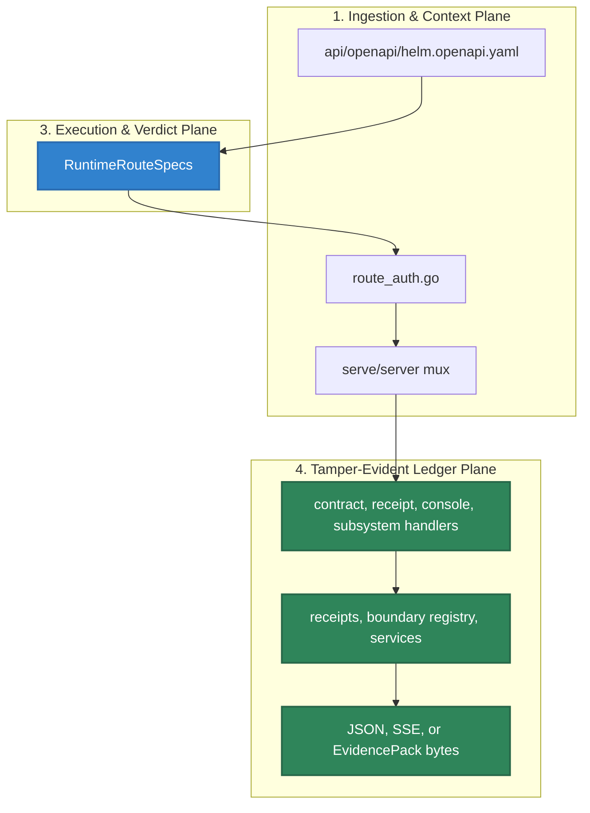

# HELM AI Kernel HTTP API Reference

The public HTTP contract is anchored in [`api/openapi/helm.openapi.yaml`](../../api/openapi/helm.openapi.yaml). Runtime route ownership is mirrored in [`core/cmd/helm-ai-kernel/route_registry.go`](../../core/cmd/helm-ai-kernel/route_registry.go), enforced by [`route_auth.go`](../../core/cmd/helm-ai-kernel/route_auth.go), and wired into the local server through [`subsystems.go`](../../core/cmd/helm-ai-kernel/subsystems.go), [`contract_routes.go`](../../core/cmd/helm-ai-kernel/contract_routes.go), [`receipt_routes.go`](../../core/cmd/helm-ai-kernel/receipt_routes.go), and [`console_routes.go`](../../core/cmd/helm-ai-kernel/console_routes.go).

## Audience

Use this page if you call HELM AI Kernel over HTTP, generate a client from OpenAPI, configure auth headers, or debug route drift between the runtime and public docs.

## Outcome

After this page you should know each public route family, its auth class, the source file that owns it, and the tests that catch route/OpenAPI drift.

## Source Truth

This page is source-backed by [`api/openapi/helm.openapi.yaml`](../../api/openapi/helm.openapi.yaml), [`core/cmd/helm-ai-kernel/route_registry.go`](../../core/cmd/helm-ai-kernel/route_registry.go), [`core/cmd/helm-ai-kernel/route_auth.go`](../../core/cmd/helm-ai-kernel/route_auth.go), [`core/cmd/helm-ai-kernel/contract_routes.go`](../../core/cmd/helm-ai-kernel/contract_routes.go), [`core/cmd/helm-ai-kernel/receipt_routes.go`](../../core/cmd/helm-ai-kernel/receipt_routes.go), [`core/cmd/helm-ai-kernel/console_routes.go`](../../core/cmd/helm-ai-kernel/console_routes.go), and route parity tests under [`core/cmd/helm-ai-kernel`](../../core/cmd/helm-ai-kernel).

## Contract Flow




## Runtime Auth Classes

| Class | Runtime behavior |
| --- | --- |
| `public` | No runtime admin credential required by `protectRuntimeHandler`. |
| `tenant_scoped` | Requires `Authorization: Bearer $HELM_ADMIN_API_KEY`. Effective tenant/principal come from `HELM_RUNTIME_TENANT_ID` and `HELM_RUNTIME_PRINCIPAL_ID` (defaulting to `default` and the system admin principal). Optional `X-Helm-Tenant-ID`, `tenant_id`, and `X-Helm-Principal-ID` values must match the server-bound identity or the request is rejected. |
| `admin` / `authenticated` | Requires `Authorization: Bearer $HELM_ADMIN_API_KEY`. |
| `service_internal` | Requires `Authorization: Bearer $HELM_SERVICE_API_KEY`; used for service-to-service kernel approval. |

The OpenAPI security blocks describe the external contract. `route_auth.go` is the runtime source for local OSS enforcement.

## Public Route Families

| Family | Methods and paths | Source truth |
| --- | --- | --- |
| Health | `GET /api/health` | [`demo_routes.go`](../../core/cmd/helm-ai-kernel/demo_routes.go), [`route_registry.go`](../../core/cmd/helm-ai-kernel/route_registry.go) |
| Local proof demo | `POST /api/demo/run`, `POST /api/demo/verify`, `POST /api/demo/tamper` | [`demo_routes.go`](../../core/cmd/helm-ai-kernel/demo_routes.go) |
| OpenAI-compatible boundary | `POST /v1/chat/completions` | [`subsystems.go`](../../core/cmd/helm-ai-kernel/subsystems.go), [`core/pkg/api/openai_proxy.go`](../../core/pkg/api/openai_proxy.go), [`proxy_cmd.go`](../../core/cmd/helm-ai-kernel/proxy_cmd.go) |
| Evaluation | `POST /api/v1/evaluate` | [`route_registry.go`](../../core/cmd/helm-ai-kernel/route_registry.go), [`contract_routes.go`](../../core/cmd/helm-ai-kernel/contract_routes.go) |
| Receipts | `GET /api/v1/receipts`, `GET /api/v1/receipts/tail`, `GET /api/v1/receipts/{receipt_id}` | [`receipt_routes.go`](../../core/cmd/helm-ai-kernel/receipt_routes.go) |
| Local onboarding proof | `GET /api/v1/onboarding/state`, `POST /api/v1/onboarding/run-step`, `GET /api/v1/onboarding/export` | [`contract_routes.go`](../../core/cmd/helm-ai-kernel/contract_routes.go) |
| Evidence | `POST /api/v1/evidence/export`, `POST /api/v1/evidence/verify` | [`contract_routes.go`](../../core/cmd/helm-ai-kernel/contract_routes.go) |
| Boundary | `GET /api/v1/boundary/status`, `GET /api/v1/boundary/capabilities`, `GET /api/v1/boundary/records`, `GET /api/v1/boundary/records/{record_id}`, `POST /api/v1/boundary/records/{record_id}/verify` | [`contract_routes.go`](../../core/cmd/helm-ai-kernel/contract_routes.go), [`core/pkg/boundary`](../../core/pkg/boundary) |
| Conformance | `POST /api/v1/conformance/run`, `GET /api/v1/conformance/reports`, `GET /api/v1/conformance/reports/{report_id}`, `GET /api/v1/conformance/vectors`, `GET /api/v1/conformance/negative` | [`contract_routes.go`](../../core/cmd/helm-ai-kernel/contract_routes.go), [`conform.go`](../../core/cmd/helm-ai-kernel/conform.go) |
| MCP transport and guarded tools | `GET|POST /mcp`, `GET /mcp/v1/capabilities`, `POST /mcp/v1/execute` | [`mcp_runtime.go`](../../core/cmd/helm-ai-kernel/mcp_runtime.go), [`mcp_cmd.go`](../../core/cmd/helm-ai-kernel/mcp_cmd.go) |
| MCP registry and authorization | `GET /api/v1/mcp/registry`, `POST /api/v1/mcp/scan`, `POST /api/v1/mcp/authorize-call` | [`contract_routes.go`](../../core/cmd/helm-ai-kernel/contract_routes.go), [`mcp_boundary_cmd.go`](../../core/cmd/helm-ai-kernel/mcp_boundary_cmd.go) |

The public docs site publishes only the route families above. Other runtime routes are implementation, protected, customer-preview, or maintainer-facing surfaces until the public docs policy, source evidence, and route-manifest gates explicitly add them.

`helm-ai-kernel server` runs API routes on `HELM_PORT` or `8080` by default. Its health server is separate and uses `HELM_HEALTH_PORT` or `8081` by default; `helm-ai-kernel serve` keeps the local policy boundary default at `127.0.0.1:7714`.

## Request And Response Notes

- JSON routes return HELM error envelopes through [`core/pkg/api/apierror.go`](../../core/pkg/api/apierror.go).
- `GET /api/v1/receipts/tail` is an SSE stream. The HTTP route can stream without an `agent` query; the CLI wrapper `helm-ai-kernel receipts tail` requires `--agent`.
- `POST /api/v1/evidence/export` returns EvidencePack bytes and sets `X-Helm-Evidence-Hash`.
- Boundary and evidence verification endpoints are offline-first. Online ledger checks are additive and never replace native receipts or EvidencePack roots.

## Validation

```bash
cd core
go test ./cmd/helm-ai-kernel -run 'Test.*Route|Test.*OpenAPI|Test.*Receipt|Test.*Boundary' -count=1
cd ..
make docs-truth
```

## Troubleshooting

| Symptom | First check |
| --- | --- |
| `401` or `403` on a protected route | Confirm `Authorization`, `HELM_ADMIN_API_KEY`, `HELM_SERVICE_API_KEY`, and that tenant/principal headers match `HELM_RUNTIME_TENANT_ID` / `HELM_RUNTIME_PRINCIPAL_ID` for tenant-scoped routes. |
| A route appears in OpenAPI but not runtime | Compare `api/openapi/helm.openapi.yaml` with `core/cmd/helm-ai-kernel/route_registry.go` and run the route parity tests. |
| SSE receipt tail does not stream | Verify the runtime was started with receipt storage enabled; add an `agent` query only when you want to filter the stream. |
