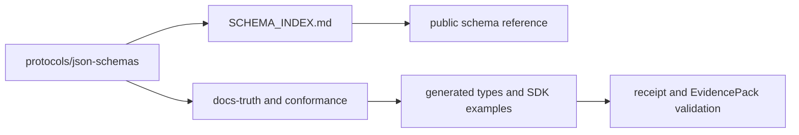

# HELM AI Kernel JSON Schema Reference

This page is for developers who need the public schema inventory before writing validators, SDK bindings, conformance tests, or receipt processors. The outcome is a concrete map from schema family to source path, validation command, and public docs surface.

## Audience

Use this page if you validate HELM JSON artifacts, generate types, add a receipt field, or need to know whether a schema family is a public contract.

## Outcome

After this page you should know where public schema files live, how schema families map to consumers, how to validate schema index freshness, and what is not yet a stable public API.

## Source Truth

The schema source is [`protocols/json-schemas`](../../protocols/json-schemas), with the generated index at [`protocols/json-schemas/SCHEMA_INDEX.md`](../../protocols/json-schemas/SCHEMA_INDEX.md). The current tree contains 187 schema-related files across the public schema families listed below. Legacy compatibility schemas under [`schemas`](../../schemas) remain source-owned and are referenced from the protocol hub when they back public receipt examples.

## Schema Family Flow



## Public Families

| Family | Source path | Primary consumers |
| --- | --- | --- |
| access | [`protocols/json-schemas/access`](../../protocols/json-schemas/access) | privileged access requests and receipts |
| audit | [`protocols/json-schemas/audit`](../../protocols/json-schemas/audit) | merged audit reports |
| certification | [`protocols/json-schemas/certification`](../../protocols/json-schemas/certification) | conformance and deploy attestations |
| cli | [`protocols/json-schemas/cli`](../../protocols/json-schemas/cli) | CLI schema snapshots |
| compliance | [`protocols/json-schemas/compliance`](../../protocols/json-schemas/compliance) | control mappings |
| core | [`protocols/json-schemas/core`](../../protocols/json-schemas/core) | envelopes, effects, EvidencePacks, receipts, and error IR |
| effects | [`protocols/json-schemas/effects`](../../protocols/json-schemas/effects) | governed action effects |
| identity | [`protocols/json-schemas/identity`](../../protocols/json-schemas/identity) | agent and principal identity envelopes |
| packs | [`protocols/json-schemas/packs`](../../protocols/json-schemas/packs) | policy and reference pack manifests |
| policy | [`protocols/json-schemas/policy`](../../protocols/json-schemas/policy) | policy bundles and rule inputs |
| receipt / receipts | [`protocols/json-schemas/receipt`](../../protocols/json-schemas/receipt), [`protocols/json-schemas/receipts`](../../protocols/json-schemas/receipts) | native HELM receipt verification |
| registry | [`protocols/json-schemas/registry`](../../protocols/json-schemas/registry) | module, connector, and pack registries |
| safety / verification | [`protocols/json-schemas/safety`](../../protocols/json-schemas/safety), [`protocols/json-schemas/verification`](../../protocols/json-schemas/verification) | fail-closed checks and verifier outputs |
| telemetry / tooling | [`protocols/json-schemas/telemetry`](../../protocols/json-schemas/telemetry), [`protocols/json-schemas/tooling`](../../protocols/json-schemas/tooling) | OpenTelemetry and tool governance exports |

Families not listed here are still indexed in `SCHEMA_INDEX.md`; they are intentionally routed through the protocol hub until they become direct public contracts.

## Validation

Run these after changing a schema, generated type, or public example:

```bash
make docs-coverage
make docs-truth
cd protocols/json-schemas
rg -n '"$schema"|"type"|"properties"' .
```

Expected output: the docs gates pass, and every public schema path referenced by this page exists in `protocols/json-schemas`.

## Troubleshooting

| Symptom | Likely cause | Fix |
| --- | --- | --- |
| A public docs page references a schema missing from `SCHEMA_INDEX.md` | schema index drift | regenerate or update `SCHEMA_INDEX.md`, then run `make docs-truth` |
| An SDK type does not match a schema field | generated type drift | update the generator or SDK type source before documenting the field |
| A receipt example validates against `schemas/receipts` but not `protocols/json-schemas` | legacy compatibility path | link both paths and explain which verifier accepts each contract |

## Not Covered

This page does not claim that every schema is a stable public API. The public contract is the subset tied to documented CLI, HTTP, receipt, EvidencePack, conformance, and SDK examples.
