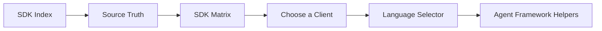

# SDK Index

## Audience

## Outcome

After this page you should know what this surface is for, which source files own the behavior, which public route or adjacent page to use next, and which validation command to run before changing the claim.

## Troubleshooting

| Symptom | First check |
| --- | --- |
| The public page and source behavior disagree | Treat the source path in `Source Truth` as canonical, then update the docs and source-inventory row in the same change. |
| A link or route is missing from the docs website | Check `docs/public-docs.manifest.json`, `llms.txt`, search, and the per-page Markdown export before changing navigation. |
| A claim is not backed by code or tests | Remove the claim or add the missing code, example, schema, or validation command before publishing. |

## Diagram

This scheme maps the main sections of SDK Index in reading order.



HELM OSS retains public SDK surfaces for developers who want typed clients instead of raw HTTP calls. The supported SDKs are Python SDK, TypeScript SDK, JavaScript through the TypeScript package, Go SDK, Rust SDK, and Java SDK. Every supported SDK row below maps to package metadata, source files, local tests, and at least one example or README path.

## Source Truth

This page is backed by:

- `api/openapi/helm.openapi.yaml`
- `sdk/go/`
- `sdk/python/`
- `sdk/ts/`
- `sdk/rust/`
- `sdk/java/`
- `examples/go_client/`
- `examples/java_client/`
- `examples/rust_client/`
- `examples/python_openai_baseurl/`
- `examples/ts_openai_baseurl/`
- `examples/js_openai_baseurl/`
- `docs/developer-coverage.manifest.json`

## SDK Matrix

| Language | Package | Source | Example | Validation |
| --- | --- | --- | --- | --- |
| Python | `helm-sdk` | `sdk/python/helm_sdk/client.py` | `sdk/python/README.md`, `examples/python_openai_baseurl/` | `make test-sdk-py` |
| TypeScript | `@mindburn/helm` | `sdk/ts/src/client.ts` | `sdk/ts/README.md`, `examples/ts_openai_baseurl/` | `make test-sdk-ts` |
| JavaScript | `@mindburn/helm` or OpenAI base URL client | `sdk/ts/src/client.ts` | `examples/js_openai_baseurl/` | `make test-sdk-ts` |
| Go | repository module at current source | `sdk/go/client/client.go` | `examples/go_client/` | `cd sdk/go && go test ./...` |
| Rust | `helm-sdk` | `sdk/rust/src/client.rs` | `examples/rust_client/` | `make test-sdk-rust` |
| Java | Maven workflow: `com.github.Mindburn-Labs:helm-sdk`; JitPack: `com.github.mindburn-labs:helm-oss:0.4.0` | `sdk/java/pom.xml` | `examples/java_client/` | `make test-sdk-java` |

## Choose a Client

- Use Python for notebooks, smoke tests, and quick verifier scripts.
- Use TypeScript or JavaScript for web apps, CI scripts, and agent framework adapter work.
- Use Go for services that need a small, stable client.
- Use Rust for strongly typed infrastructure and low-level verification paths.
- Use Java for JVM services and enterprise integration harnesses.
- Use raw HTTP when you need to inspect the OpenAPI contract directly.

## Language Selector

:::selector language
### Python

Install:

```bash
pip install helm-sdk
```

Local validation:

```bash
cd sdk/python
python -m pip install '.[dev]'
pytest -v --tb=short
```

Minimal client:

This client targets `helm server`, whose API default is `http://port 3000`.
For the local policy-boundary path started with `helm serve --policy <file>`, set
the base URL to `http://localhost:7714` unless you passed a custom `--port`.

```python
from helm_sdk import HelmApiError, HelmClient, ChatCompletionRequest, ChatMessage

client = HelmClient(base_url="http://port 3000")

try:
    result = client.chat_completions(
        ChatCompletionRequest(
            model="gpt-4",
            messages=[ChatMessage(role="user", content="hello through HELM")],
        )
    )
    print(result.choices[0].message.content)
except HelmApiError as err:
    print(err.reason_code)
```

Receipt behavior is available when the boundary returns `X-Helm-*` metadata. Handle `HelmApiError.reason_code` as a policy result, not as a retryable network failure.

### TypeScript / JavaScript

Install:

```bash
npm install @mindburn/helm
```

Local validation:

```bash
cd sdk/ts
npm ci
npm test -- --run
npm run build
```

Minimal client:

This client targets `helm server`, whose API default is `http://port 3000`.
For `helm serve`, use `http://localhost:7714`; for `helm proxy`, use the
OpenAI-compatible proxy default `http://localhost:9090/v1`.

```ts
import { HelmApiError, HelmClient } from "@mindburn/helm";

const client = new HelmClient({ baseUrl: "http://port 3000" });

try {
  const result = await client.chatCompletions({
    model: "gpt-4",
    messages: [{ role: "user", content: "hello through HELM" }],
  });
  console.log(result.choices[0]?.message?.content);
} catch (error) {
  if (error instanceof HelmApiError) {
    console.log(error.reasonCode);
  }
}
```

For existing JavaScript OpenAI clients, use the OpenAI-compatible proxy instead of rewriting code around the SDK.

### Go

Install:

```bash
go get github.com/Mindburn-Labs/helm-oss/sdk/go@main
```

Local validation:

```bash
cd sdk/go
go test ./...
```

Minimal client:

```go
package main

import (
	"fmt"
	"log"

	helm "github.com/Mindburn-Labs/helm-oss/sdk/go/client"
)

func main() {
	client := helm.New("http://port 3000")
	res, err := client.ChatCompletions(helm.ChatCompletionRequest{
		Model: "gpt-4",
		Messages: []helm.ChatMessage{{
			Role: "user", Content: "hello through HELM",
		}},
	})
	if err != nil {
		if apiErr, ok := err.(*helm.HelmApiError); ok {
			fmt.Println(apiErr.ReasonCode)
			return
		}
		log.Fatal(err)
	}
	fmt.Println(res.Choices[0].Message.Content)
}
```

### Rust

Install:

```toml
helm-sdk = "0.4.0"
```

Local validation:

```bash
cd sdk/rust
cargo test
```

Minimal client:

```rust
use helm_sdk::{ChatCompletionRequest, ChatCompletionRequestMessagesInner, HelmClient, Role};

fn main() -> Result<(), Box<dyn std::error::Error>> {
    let client = HelmClient::new("http://port 3000");
    let result = client.chat_completions(&ChatCompletionRequest::new(
        "gpt-4".to_string(),
        vec![ChatCompletionRequestMessagesInner::new(
            Role::User,
            "hello through HELM".to_string(),
        )],
    ))?;
    println!("{:?}", result);
    Ok(())
}
```

### Java

Coordinate:

```xml
<dependency>
  <groupId>com.github.Mindburn-Labs</groupId>
  <artifactId>helm-sdk</artifactId>
  <version>0.4.0</version>
</dependency>
```

Local validation:

```bash
cd sdk/java
mvn -q test
```

Minimal client:

```java
import labs.mindburn.helm.HelmClient;
import labs.mindburn.helm.TypesGen.ChatCompletionRequest;
import labs.mindburn.helm.TypesGen.ChatCompletionRequestMessagesInner;

import java.util.List;

class Example {
  public static void main(String[] args) {
    HelmClient client = new HelmClient("http://port 3000");
    ChatCompletionRequest req = new ChatCompletionRequest()
        .model("gpt-4")
        .messages(List.of(new ChatCompletionRequestMessagesInner()
            .role(ChatCompletionRequestMessagesInner.RoleEnum.USER)
            .content("hello through HELM")));
    System.out.println(client.chatCompletions(req));
  }
}
```
:::

## Agent Framework Helpers

The TypeScript SDK includes adapter helpers for LangGraph, CrewAI, OpenAI Agents SDK, PydanticAI, and LlamaIndex tool-call events. The helpers normalize framework events into a HELM governance request and submit it through `chatCompletionsWithReceipt`, preserving the kernel receipt returned in `X-Helm-*` headers.

Validation:

```bash
make test-sdk-ts
```

Source truth:

- `sdk/ts/src/adapters/agent-frameworks.ts`
- `sdk/ts/src/adapters/agent-frameworks.test.ts`
- `sdk/ts/README.md`

These helpers do not add vendor framework packages as HELM dependencies and do not claim vendor certification.

## Error Handling

| Condition | Developer behavior |
| --- | --- |
| policy denial | treat as a final authorization result and surface the reason code |
| network failure | retry according to client policy only when no HELM decision was returned |
| malformed request | fix the request shape against the OpenAPI types |
| missing receipt metadata | verify the app is calling the HELM boundary, not the upstream provider |
| SDK drift | rerun generated-type checks and update code plus docs together |

## Quality Bar

Every SDK example should show the server URL, auth or policy assumptions, one allowed request, one denied request, receipt or verifier behavior, and the command that proves the example. Do not publish SDK claims that are not backed by generated types, tests, or example output.
