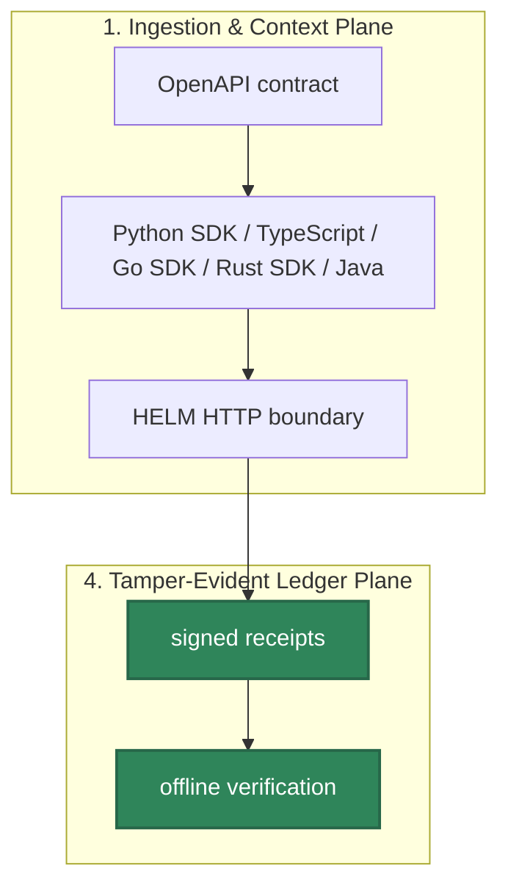

# SDK Index

HELM AI Kernel retains typed SDK surfaces for developers who want clients over the HTTP API instead of raw requests. Package publication status must be proven separately from source availability.

## Audience

This page is for developers who need a typed client for the HELM AI Kernel HTTP API and reviewers auditing whether a language SDK is source-only, locally buildable, or published under a verified package identity.

## Outcome

You should leave with the current SDK matrix, local validation command for each language, and the right base URL for direct HELM boundary calls versus the OpenAI-compatible proxy.




## Source Truth

- `api/openapi/helm.openapi.yaml`
- `sdk/go/`
- `sdk/python/`
- `sdk/ts/`
- `sdk/rust/`
- `sdk/java/`
- `examples/go_client/`
- `examples/java_client/`
- `examples/rust_client/`
- `examples/python_openai_baseurl/`
- `examples/ts_openai_baseurl/`
- `examples/js_openai_baseurl/`
- `docs/developer-coverage.manifest.json`

SDK documentation should separate three facts: source exists, local tests pass,
and a package is published under a public registry identity. Source availability
is proven by this repository. Local behavior is proven by the validation command
listed in the matrix. Registry publication must be verified independently before
docs claim that an install command fetches a released package. This prevents the
SDK docs from turning generated clients or local examples into unsupported
distribution promises.

## SDK Matrix

| Language | Public package status | Source | Validation |
| --- | --- | --- | --- |
| Python SDK | Package name `helm-sdk`; source manifest follows the repository `VERSION` (`0.5.14` for this release). Verify `version-status.json` or `make version-drift-published` before publishing pinned install claims. | `sdk/python/helm_sdk/client.py` | `make test-sdk-py` |
| TypeScript | Package name `@mindburn/helm-ai-kernel`; source manifest follows the repository `VERSION` (`0.5.14` for this release). Verify `version-status.json` or `make version-drift-published` before publishing pinned install claims. | `sdk/ts/src/client.ts` | `make test-sdk-ts` |
| JavaScript | Uses `@mindburn/helm-ai-kernel` or raw HTTP/fetch | `sdk/ts/src/client.ts`, `examples/js_openai_baseurl/` | `make test-sdk-ts` |
| Go SDK | Module path `github.com/Mindburn-Labs/helm-ai-kernel/sdk/go@v0.5.14`; released by the subdirectory tag `sdk/go/v0.5.14` | `sdk/go/client/client.go` | `cd sdk/go && go test ./...` |
| Rust SDK | Package name `helm-sdk`; source manifest follows the repository `VERSION` (`0.5.14` for this release). Verify `version-status.json` or `make version-drift-published` before publishing pinned install claims. | `sdk/rust/src/client.rs` | `make test-sdk-rust` |
| Java SDK | Maven Central coordinate `io.github.mindburnlabs:helm-sdk:0.5.14`; verified by remote Maven resolution and repo1 artifacts. | `sdk/java/pom.xml` | `make test-sdk-java` |

Use `http://127.0.0.1:7714` for the local `helm-ai-kernel serve --policy` quickstart, `http://localhost:8080` for `helm-ai-kernel server` or the current Docker Compose mapping, and `http://localhost:9090/v1` only for the OpenAI-compatible proxy.

## Python

```bash
pip install helm-sdk
cd sdk/python
python -m pip install '.[dev]'
pytest -v --tb=short
```

```python
from helm_sdk import HelmApiError, HelmClient, ChatCompletionRequest, ChatMessage

client = HelmClient(base_url="http://127.0.0.1:7714")
```

## TypeScript / JavaScript

```bash
npm install @mindburn/helm-ai-kernel
cd sdk/ts
npm ci
npm test -- --run
npm run build
```

```ts
import { HelmApiError, HelmClient } from "@mindburn/helm-ai-kernel";

const client = new HelmClient({ baseUrl: "http://127.0.0.1:7714" });
```

Use the OpenAI-compatible proxy instead of the SDK when an existing OpenAI-style client can set `base_url` or `baseURL`.

## Go

```bash
go get github.com/Mindburn-Labs/helm-ai-kernel/sdk/go@v0.5.14
cd sdk/go
go test ./...
```

```go
client := helm.New("http://127.0.0.1:7714")
```

## Rust

```bash
cargo add helm-sdk
```

```bash
cd sdk/rust
cargo test
```

```rust
let client = HelmClient::new("http://127.0.0.1:7714");
```

## Java

Use the verified Maven Central coordinate:

```xml
<dependency>
  <groupId>io.github.mindburnlabs</groupId>
  <artifactId>helm-sdk</artifactId>
  <version>0.5.14</version>
</dependency>
```

Use a local Maven build when editing this repository:

```bash
cd sdk/java
mvn -q test
```

```java
HelmClient client = new HelmClient("http://127.0.0.1:7714");
```

## Agent Framework Helpers

The TypeScript SDK includes adapter helpers for LangGraph, CrewAI, OpenAI Agents SDK, PydanticAI, and LlamaIndex tool-call events. The helpers normalize framework events into a HELM governance request and submit it through `chatCompletionsWithReceipt`, preserving the kernel receipt returned in `X-Helm-*` headers.

```bash
make test-sdk-ts
```

These helpers do not add vendor framework packages as HELM dependencies and do not claim vendor certification.

## Troubleshooting

| Condition | Developer behavior |
| --- | --- |
| policy denial | treat as a final authorization result and surface the reason code |
| network failure | retry only when no HELM decision was returned |
| malformed request | fix the request shape against the OpenAPI types |
| missing receipt metadata | verify the app is calling the HELM boundary |
| SDK drift | rerun generated-type checks and update code plus docs together |

If registry state and source manifests disagree, treat the repository source as buildable code and do not publish an install claim until the registry package can be verified independently.
