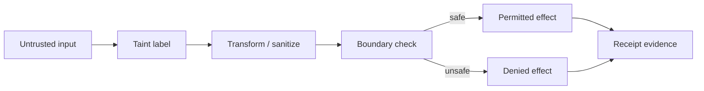

# ClawGuard Taint Tracking Prototype

## Audience

## Outcome

After this page you should know what this surface is for, which source files own the behavior, which public route or adjacent page to use next, and which validation command to run before changing the claim.

## Source Truth

- Public route: `helm-oss/security/clawguard-taint-tracking`
- Source document: `helm-oss/docs/security/clawguard-taint-tracking.md`
- Public manifest: `helm-oss/docs/public-docs.manifest.json`
- Source inventory: `helm-oss/docs/source-inventory.manifest.json`
- Validation: `make docs-coverage`, `make docs-truth`, and `npm run coverage:inventory` from `docs-platform`

Do not expand this page with unsupported product, SDK, deployment, compliance, or integration claims unless the inventory manifest points to code, schemas, tests, examples, or an owner doc that proves the claim.

## Troubleshooting

| Symptom | First check |
| --- | --- |
| The public page and source behavior disagree | Treat the source path in `Source Truth` as canonical, then update the docs and source-inventory row in the same change. |
| A link or route is missing from the docs website | Check `docs/public-docs.manifest.json`, `llms.txt`, search, and the per-page Markdown export before changing navigation. |
| A claim is not backed by code or tests | Remove the claim or add the missing code, example, schema, or validation command before publishing. |

Source: Wei Zhao, Zhe Li, Peixin Zhang, and Jun Sun, "ClawGuard: A Runtime Security Framework for Tool-Augmented LLM Agents Against Indirect Prompt Injection", arXiv:2604.11790.

ClawGuard's core operational move is deterministic enforcement at every tool-call boundary. HELM OSS maps that into the existing Guardian and PRG surfaces:

| ClawGuard concept | HELM OSS implementation |
| --- | --- |
| Task/tool boundary rule set | PRG/CEL requirements evaluated by Guardian |
| Taint on tool-returned or external content | `Effect.Taint` and `AuthorizedExecutionIntent.Taint` |
| Deterministic tool-call interception | Feature-flagged Guardian tainted-egress gate |
| Auditable enforcement | signed `DecisionRecord`, intent taint binding, TLA invariant |

## Runtime Contract

Callers may attach taint labels through `DecisionRequest.Context`:

```json
{
  "destination": "https://external.example/upload",
  "taint": ["pii", "tool_output"]
}
```

When `HELM_TAINT_TRACKING=1`, Guardian denies outbound egress carrying sensitive taint (`pii`, `credential`, or `secret`) unless the context explicitly contains:

```json
{
  "allow_tainted_egress": true
}
```

The decision remains fail-closed: denial uses `TAINTED_DATA_EGRESS_DENY`, and issued execution intents copy normalized taint labels from the effect they authorize.

## CEL Helper

PRG requirements can use either explicit or shorthand forms:

```cel
taint_contains(input.taint, "pii")
taint_contains("pii")
```

The shorthand is rewritten to the explicit form inside the PRG evaluator. Policy-pack validation supports the same shorthand against the top-level `taint` variable.

## Diagram



<!-- docs-depth-final-pass -->

## Security Review Checklist

A taint-tracking claim is publishable only when the source channel, propagation rule, egress decision, and receipt evidence are all visible to a reviewer. Keep examples concrete: user input, tool output, retrieved document, browser observation, and connector payloads should be classified separately. The expected failure mode is an explicit deny or escalation, not silent sanitization. If a new adapter bypasses taint metadata, document the gap as unsupported until the adapter attaches source channel and destination context. Reviewers should be able to reproduce the deny path, inspect the receipt, and verify the bundle offline.

<!-- docs-depth-final-pass-extra -->
 Record the specific adapter and policy bundle used for each reproduced deny path so a verifier can distinguish taint propagation from a generic policy denial.
