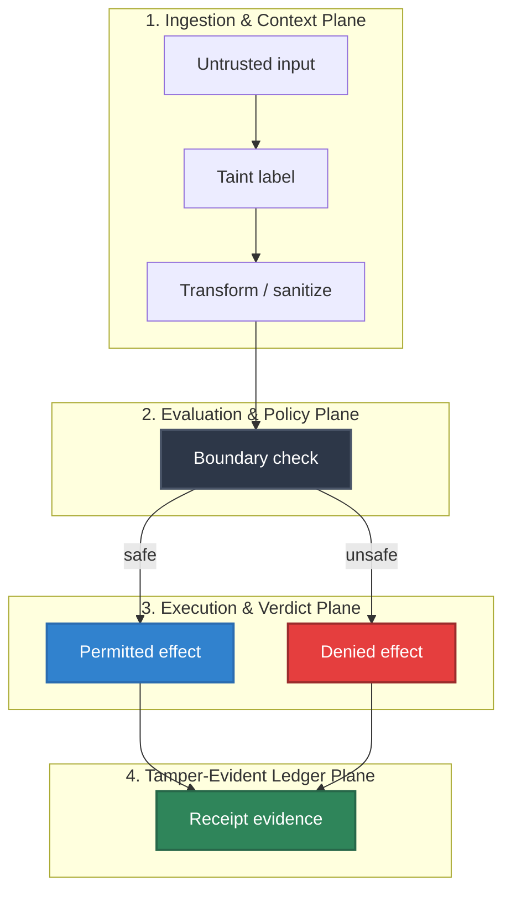

# ClawGuard Taint Tracking Prototype

## Audience

Security researchers and maintainers reviewing the source-backed ClawGuard taint-tracking mapping for HELM AI Kernel.

## Outcome

After this page you should know what this surface is for, which source files own the behavior, which public route or adjacent page to use next, and which validation command to run before changing the claim.

## Source Truth

- Public route: `security/clawguard-taint-tracking`
- Source document: `helm-ai-kernel/docs/security/clawguard-taint-tracking.md`
- Public manifest: `helm-ai-kernel/docs/public-docs.manifest.json`
- Source inventory: `helm-ai-kernel/docs/source-inventory.manifest.json`
- Validation: `make docs-coverage`, `make docs-truth`, and `npm run coverage:inventory` from `docs-platform`

Do not expand this page with unsupported product, SDK, deployment, compliance, or integration claims unless the inventory manifest points to code, schemas, tests, examples, or an owner doc that proves the claim.

Source: Wei Zhao, Zhe Li, Peixin Zhang, and Jun Sun, "ClawGuard: A Runtime Security Framework for Tool-Augmented LLM Agents Against Indirect Prompt Injection", arXiv:2604.11790.

ClawGuard's core operational move is deterministic enforcement at every tool-call boundary. HELM AI Kernel maps that into the existing Guardian and PRG surfaces:

| ClawGuard concept | HELM AI Kernel implementation |
| --- | --- |
| Task/tool boundary rule set | PRG/CEL requirements evaluated by Guardian |
| Taint on tool-returned or external content | `Effect.Taint` and `AuthorizedExecutionIntent.Taint` |
| Deterministic tool-call interception | Guardian tainted-egress gate (enforced by default) |
| Auditable enforcement | signed `DecisionRecord`, intent taint binding, TLA invariant |

## Runtime Contract

Callers may attach taint labels through `DecisionRequest.Context`:

```json
{
  "destination": "https://external.example/upload",
  "taint": ["pii", "tool_output"]
}
```

Guardian denies outbound egress carrying sensitive taint (`pii`, `credential`, or `secret`) unless the context explicitly contains:

```json
{
  "allow_tainted_egress": true
}
```

and that context was bound by a trusted transport boundary. `allow_tainted_egress`
is a reserved security-context key (`IsReservedSecurityContextKey`), so a transport
that forwards caller arguments — the MCP server, for example — rejects it at the
boundary rather than copying it into the decision context. Without that, an agent
could pass the flag as a tool argument and self-approve its own egress on any
transport that marks its context trusted.

The decision remains fail-closed: denial uses `TAINTED_DATA_EGRESS_DENY`, and issued execution intents copy normalized taint labels from the effect they authorize.

### Enforcement default

Enforcement is **on by default**. `proofs/GuardianPipeline.tla` states `TaintSafeEgress`
unconditionally and model-checks it on every PR, so a non-enforcing default left the
implementation weaker than its own proof.

`HELM_TAINT_TRACKING` now acts as an **opt-out**, intended for incident response:

| Value | Enforcement |
| --- | --- |
| unset, `1`, `true`, or anything unrecognized | **enforced** |
| `0` or `false` | disabled |

An unrecognized value enforces so a typo cannot silently open the boundary. When
enforcement is disabled, Guardian logs a warning once at construction naming the
proof invariant it contradicts — a disabled security boundary is never silent.

Taint *labelling* is unconditional and unaffected by this variable: labels are always
propagated into `DecisionRequest.Context["taint"]` and the CEL input, so PRG rules can
act on taint even where the built-in deny is disabled.

## CEL Helper

PRG requirements can use either explicit or shorthand forms:

```cel
taint_contains(input.taint, "pii")
taint_contains("pii")
```

The shorthand is rewritten to the explicit form inside the PRG evaluator. Policy-pack validation supports the same shorthand against the top-level `taint` variable.

## Troubleshooting

| Symptom | First check |
| --- | --- |
| Published output is stale or incomplete | Run `npm run helm-public:accuracy` in `docs-platform`, then check the source path and public manifest row for this page. |
| A claim needs implementation backing | Check the Source Truth files above and update the implementation, manifest, source inventory, or page in the same change. |

## Diagram




<!-- docs-depth-final-pass -->

## Security Review Checklist

A taint-tracking claim is publishable only when the source channel, propagation rule, egress decision, and receipt evidence are all visible to a reviewer. Keep examples concrete: user input, tool output, retrieved document, browser observation, and connector payloads should be classified separately. The expected failure mode is an explicit deny or escalation, not silent sanitization. If a new adapter bypasses taint metadata, document the gap as unsupported until the adapter attaches source channel and destination context. Reviewers should be able to reproduce the deny path, inspect the receipt, and verify the bundle offline.

<!-- docs-depth-final-pass-extra -->
 Record the specific adapter and policy bundle used for each reproduced deny path so a verifier can distinguish taint propagation from a generic policy denial.
