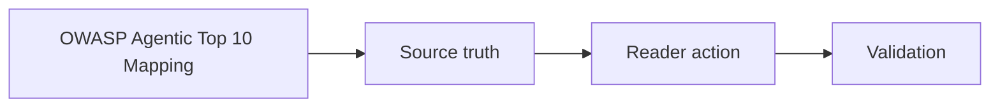

# OWASP Agentic Top 10 Mapping

## Audience

## Outcome

After this page you should know what this surface is for, which source files own the behavior, which public route or adjacent page to use next, and which validation command to run before changing the claim.

## Source Truth

- Public route: `helm-oss/security/owasp-agentic-top10-mapping`
- Source document: `helm-oss/docs/security/owasp-agentic-top10-coverage.md`
- Public manifest: `helm-oss/docs/public-docs.manifest.json`
- Source inventory: `helm-oss/docs/source-inventory.manifest.json`
- Validation: `make docs-coverage`, `make docs-truth`, and `npm run coverage:inventory` from `docs-platform`

Do not expand this page with unsupported product, SDK, deployment, compliance, or integration claims unless the inventory manifest points to code, schemas, tests, examples, or an owner doc that proves the claim.

## Troubleshooting

| Symptom | First check |
| --- | --- |
| The public page and source behavior disagree | Treat the source path in `Source Truth` as canonical, then update the docs and source-inventory row in the same change. |
| A link or route is missing from the docs website | Check `docs/public-docs.manifest.json`, `llms.txt`, search, and the per-page Markdown export before changing navigation. |
| A claim is not backed by code or tests | Remove the claim or add the missing code, example, schema, or validation command before publishing. |

## Diagram

This scheme maps the main sections of OWASP Agentic Top 10 Mapping in reading order.

This file is a code-oriented inventory of retained control points in the OSS kernel.

| OWASP Category | Repository Control Points |
| --- | --- |
| ASI-01 Prompt Injection | `core/pkg/threatscan/`, guarded execution boundary |
| ASI-02 Tool Poisoning | contract validation, firewall, connector validation |
| ASI-03 Excessive Permission | policy and effect-boundary packages |
| ASI-04 Insufficient Validation | guardian, manifest, schema, and policy packages |
| ASI-05 Improper Output Handling | evidence, receipts, and verification flow |
| ASI-06 Resource Overuse | budget and execution-control packages |
| ASI-07 Cascading Effects | proof graph and effect tracking |
| ASI-08 Sensitive Data Exposure | firewall, policy, and receipt material |
| ASI-09 Insecure Tool Integration | MCP, connector, and schema surfaces |
| ASI-10 Insufficient Monitoring | evidence export, proof graph, and verification commands |

Use this page as an implementation map. Validation still depends on the code, tests, and verification commands in the repository.
