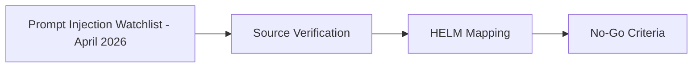

# Prompt Injection Watchlist - April 2026

## Audience

## Outcome

After this page you should know what this surface is for, which source files own the behavior, which public route or adjacent page to use next, and which validation command to run before changing the claim.

## Source Truth

- Public route: `helm-oss/security/prompt-injection-watchlist-2026-04`
- Source document: `helm-oss/docs/security/prompt-injection-watchlist-2026-04.md`
- Public manifest: `helm-oss/docs/public-docs.manifest.json`
- Source inventory: `helm-oss/docs/source-inventory.manifest.json`
- Validation: `make docs-coverage`, `make docs-truth`, and `npm run coverage:inventory` from `docs-platform`

Do not expand this page with unsupported product, SDK, deployment, compliance, or integration claims unless the inventory manifest points to code, schemas, tests, examples, or an owner doc that proves the claim.

## Troubleshooting

| Symptom | First check |
| --- | --- |
| The public page and source behavior disagree | Treat the source path in `Source Truth` as canonical, then update the docs and source-inventory row in the same change. |
| A link or route is missing from the docs website | Check `docs/public-docs.manifest.json`, `llms.txt`, search, and the per-page Markdown export before changing navigation. |
| A claim is not backed by code or tests | Remove the claim or add the missing code, example, schema, or validation command before publishing. |

## Diagram

This scheme maps the main sections of Prompt Injection Watchlist - April 2026 in reading order.

This note records the source verification and implementation decision for the April 2026 HOSS radar items on upstream prompt-injection defenses. It is not a production commitment; HELM remains the deterministic downstream execution boundary.

## Source Verification

| Linear | Source | Verification | Decision |
| --- | --- | --- | --- |
| `MIN-237` | [AgentWatcher: A Rule-based Prompt Injection Monitor](https://arxiv.org/abs/2604.01194v1) | arXiv record exists, submitted April 1, 2026; title and authors match the radar text | Keep as watchlist/prototype material |
| `MIN-238` | [ICON: Indirect Prompt Injection Defense for Agents based on Inference-Time Correction](https://arxiv.org/abs/2602.20708v1) | arXiv record exists, submitted February 24, 2026; title and authors match the radar text | Keep as watchlist/prototype material |

## HELM Mapping

AgentWatcher is useful to evaluate because its rule-oriented framing can provide an explainable pre-filter before requests reach Guardian. A production implementation should live behind a policy toggle and emit evidence about which rule, source segment, and confidence threshold caused a short-circuit.

ICON is an inference-time defense. It is complementary to HELM, not a replacement for HELM: the model-layer probe may reduce compromised plans before they are proposed, while HELM still governs the downstream action boundary with policy, effect, delegation, and receipt evidence.

## No-Go Criteria

Do not merge either approach into the default path until:

- the implementation can run deterministically or preserve a deterministic evidence envelope around model-assisted decisions;
- benchmark fixtures show the false-positive impact on benign tool-use workflows;
- policy authors can disable the pre-filter without weakening HELM's existing Guardian gate;
- emitted evidence can be replayed or independently inspected during incident review.

<!-- docs-depth-final-pass -->

## Review Cadence

Keep this watchlist tied to dated examples, affected adapters, and the receipt fields that expose attempted injection.
