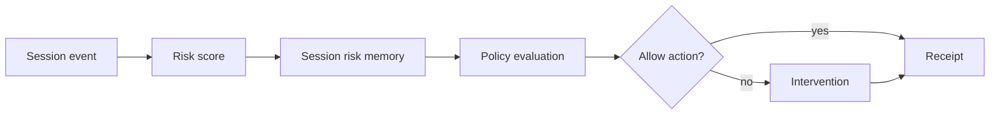

# Session Risk Memory

## Audience

## Outcome

After this page you should know what this surface is for, which source files own the behavior, which public route or adjacent page to use next, and which validation command to run before changing the claim.

## Source Truth

- Public route: `helm-oss/security/session-risk-memory`
- Source document: `helm-oss/docs/security/session-risk-memory.md`
- Public manifest: `helm-oss/docs/public-docs.manifest.json`
- Source inventory: `helm-oss/docs/source-inventory.manifest.json`
- Validation: `make docs-coverage`, `make docs-truth`, and `npm run coverage:inventory` from `docs-platform`

Do not expand this page with unsupported product, SDK, deployment, compliance, or integration claims unless the inventory manifest points to code, schemas, tests, examples, or an owner doc that proves the claim.

## Troubleshooting

| Symptom | First check |
| --- | --- |
| The public page and source behavior disagree | Treat the source path in `Source Truth` as canonical, then update the docs and source-inventory row in the same change. |
| A link or route is missing from the docs website | Check `docs/public-docs.manifest.json`, `llms.txt`, search, and the per-page Markdown export before changing navigation. |
| A claim is not backed by code or tests | Remove the claim or add the missing code, example, schema, or validation command before publishing. |

Source: Florin Adrian Chitan, "Session Risk Memory (SRM): Temporal Authorization for Deterministic Pre-Execution Safety Gates", arXiv:2603.22350.

Session Risk Memory adds a trajectory gate after Guardian's existing pre-PDP checks:

1. Freeze and kill-switch checks.
2. Context, identity, egress, taint, threat, and delegation gates.
3. Session-history enrichment.
4. Session Risk Memory trajectory scoring.
5. Behavioral trust, privilege, PRG, temporal, compliance, and signing.

The implementation is deterministic and offline. It does not call an embedding model or classifier. Instead, it derives a compact three-axis semantic centroid from action/resource/context signals:

| Axis | Signals |
| --- | --- |
| Exfiltration | credential, token, PII, customer data, export/upload/webhook/external destinations |
| Privilege | sudo/admin/root, policy changes, write/delete/deploy/publish/exec operations |
| Compliance drift | HIPAA, GDPR, SOX, PCI, audit, regulated-data markers |

For each turn, Guardian computes a bounded risk signal, subtracts a baseline, and updates an exponential moving average. The signed `DecisionRecord` carries:

- `trajectory_risk_score`
- `session_centroid_hash`
- `risk_accumulation_window`

If the trajectory score crosses the configured threshold across at least two turns, Guardian returns `DENY` with `SESSION_RISK_MEMORY_DENY`. The centroid itself is not stored in the decision record; only a deterministic SHA-256 hash is emitted for audit correlation.

## Configuration

```go
srm := guardian.NewSessionRiskMemory(
    guardian.WithSessionRiskThreshold(0.38),
    guardian.WithSessionRiskWindow(8),
)
g := guardian.NewGuardian(signer, graph, registry, guardian.WithSessionRiskMemory(srm))
```

Use `session_id` or `delegation_session_id` in `DecisionRequest.Context` to scope SRM state. If neither is present, Guardian falls back to the principal ID.

## Diagram


