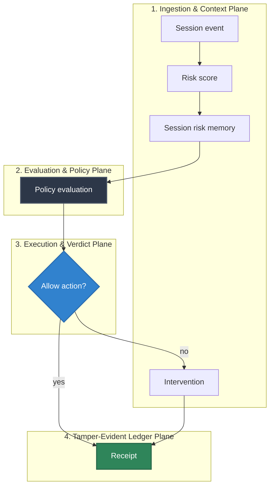

# Session Risk Memory

## Audience

Security reviewers and maintainers checking session-risk memory assumptions against current HELM AI Kernel evidence behavior.

## Outcome

After this page you should know what this surface is for, which source files own the behavior, which public route or adjacent page to use next, and which validation command to run before changing the claim.

## Source Truth

- Public route: `security/session-risk-memory`
- Source document: `helm-ai-kernel/docs/security/session-risk-memory.md`
- Public manifest: `helm-ai-kernel/docs/public-docs.manifest.json`
- Source inventory: `helm-ai-kernel/docs/source-inventory.manifest.json`
- Validation: `make docs-coverage`, `make docs-truth`, and `npm run coverage:inventory` from `docs-platform`

Do not expand this page with unsupported product, SDK, deployment, compliance, or integration claims unless the inventory manifest points to code, schemas, tests, examples, or an owner doc that proves the claim.

Source: Florin Adrian Chitan, "Session Risk Memory (SRM): Temporal Authorization for Deterministic Pre-Execution Safety Gates", arXiv:2603.22350.

Session Risk Memory adds a trajectory gate after Guardian's existing pre-PDP checks:

1. Freeze and kill-switch checks.
2. Context, identity, egress, taint, threat, and delegation gates.
3. Session-history enrichment.
4. Session Risk Memory trajectory scoring.
5. Behavioral trust, privilege, PRG, temporal, compliance, and signing.

The implementation is deterministic and offline. It does not call an embedding model or classifier. Instead, it derives a compact three-axis semantic centroid from action/resource/context signals:

| Axis | Signals |
| --- | --- |
| Exfiltration | credential, token, PII, customer data, export/upload/webhook/external destinations |
| Privilege | sudo/admin/root, policy changes, write/delete/deploy/publish/exec operations |
| Compliance drift | HIPAA, GDPR, SOX, PCI, audit, regulated-data markers |

For each turn, Guardian computes a bounded risk signal, subtracts a baseline, and updates an exponential moving average. The signed `DecisionRecord` carries:

- `trajectory_risk_score`
- `session_centroid_hash`
- `risk_accumulation_window`

If the trajectory score crosses the configured threshold across at least two turns, Guardian returns `DENY` with `SESSION_RISK_MEMORY_DENY`. The centroid itself is not stored in the decision record; only a deterministic SHA-256 hash is emitted for audit correlation.

## Configuration

```go
srm := guardian.NewSessionRiskMemory(
    guardian.WithSessionRiskThreshold(0.38),
    guardian.WithSessionRiskWindow(8),
)
g := guardian.NewGuardian(signer, graph, registry, guardian.WithSessionRiskMemory(srm))
```

Use `session_id` or `delegation_session_id` in `DecisionRequest.Context` to scope SRM state. If neither is present, Guardian falls back to the principal ID.

## Troubleshooting

| Symptom | First check |
| --- | --- |
| Published output is stale or incomplete | Run `npm run helm-public:accuracy` in `docs-platform`, then check the source path and public manifest row for this page. |
| A claim needs implementation backing | Check the Source Truth files above and update the implementation, manifest, source inventory, or page in the same change. |

## Diagram




<!-- docs-depth-final-pass -->

## Session Risk Evidence

Session-risk memory should explain what is remembered, why it changes policy, and how a developer proves the change occurred. Keep examples scoped to metadata and risk state, not raw secrets or private browser sessions. A complete update names the storage key or schema, the event that raises risk, the event that lowers or expires it, and the receipt fields that record the decision. If a deployment stores richer session state, that detail belongs in protected operator docs; public docs should describe the OSS contract and verification path only.
